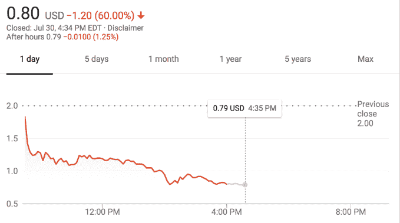

# MoviePass 又宕机了

> 原文：<https://web.archive.org/web/https://techcrunch.com/2018/07/30/moviepass-is-down-again/>

上周，MoviePass 借了 500 万美元来维持其服务的正常运行，事情看起来并不乐观。

[包括我在内的 MoviePass](https://web.archive.org/web/20230307140341/https://techcrunch.com/tag/moviepass/) 订户在周一遇到了一个空白屏幕，他们应该选择放映的地方。在几十家影院之间导航只会显示一条信息:“今天这家影院没有放映了。”

[Twitter 也注意到了](https://web.archive.org/web/20230307140341/https://twitter.com/search?f=tweets&vertical=news&q=moviepass%20down&src=typd)，人们开始为陷入困境的每月电影订阅服务敲响丧钟。Twitter 用户称，一些提供电子票务的影院似乎仍有可用的放映场次[，但似乎并非所有影院都是如此。](https://web.archive.org/web/20230307140341/https://twitter.com/mpinchera/status/1024023863389302784?s=21)

许多公司都失败了，但很少有公司在失败前如此公开地抨击。MoviePass 已经把它的用户拖上了它自己明显的金融过山车之旅，以[奇怪的频率](https://web.archive.org/web/20230307140341/https://techcrunch.com/2018/05/02/moviepass-brings-back-unlimited-movie-subscription-plan/)、[增加意外费用](https://web.archive.org/web/20230307140341/https://techcrunch.com/2018/07/05/moviepass-peak-pricing/)和遭受[反复中断来改变定价方案。](https://web.archive.org/web/20230307140341/https://techcrunch.com/2018/07/07/moviepass-offers-ticket-refund-after-friday-night-outage/)

周一，MoviePass 母公司 Helios and Matheson Analytics(HMNY)的股票暴跌了 60%，令人沮丧。

来自 Sinemia 和 AMC 的竞争服务正在进入一个看起来不那么注定失败的商业模式领域，所以对于经常看电影的人来说，这是值得一看的。不幸的是，从 MoviePass 跳槽说起来容易做起来难，因为许多用户都报告了取消服务的问题。(声明一下，我刚刚试图通过 Android 应用程序取消我的订阅，而我自己的取消不会成功。)

鉴于这项服务的不可靠性和[明显的](https://web.archive.org/web/20230307140341/https://twitter.com/ErinESchaefer/status/1024034815492931584) [见不得人的](https://web.archive.org/web/20230307140341/https://twitter.com/adhdproductions/status/1024009222848163840)取消做法，听到联邦贸易委员会和其他消费者保护团体参与进来也就不足为奇了。

结束了吗？MoviePass [是否已经耗尽了最后一点现金？这真的只是电影院的一个受欢迎的日子吗？该公司尚未发布推文或提供任何官方更新，但如果这不是结束，那么它肯定很近了。](https://web.archive.org/web/20230307140341/https://techcrunch.com/2018/07/02/moviepass-parent-says-it-may-sell-up-to-1-2b-in-equity-and-debt-to-finance-operations-and-growth/)

