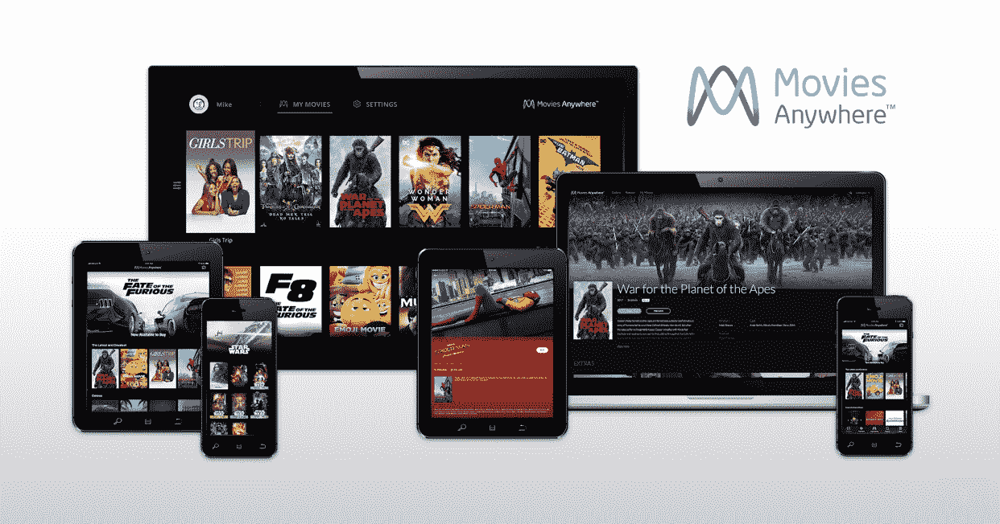

# 随处电影将您在亚马逊、Google Play 和 iTunes 上的电影整合到一个应用程序 中

> 原文：<https://web.archive.org/web/https://techcrunch.com/2017/10/11/movies-anywhere-brings-movies-from-amazon-google-play-and-itunes-into-one-app/>

# “随处电影”将来自亚马逊、Google Play 和 iTunes 的电影整合到一个应用程序中

能够通过 Google Play 或 iTunes 或亚马逊等网站在一秒钟内购买一部电影的数字副本是非常棒的。

然而，记录你在哪里买的每部电影是非常糟糕的。当你根据哪里最便宜或者你正在看的设备来购买时，很容易导致一堆电影被放在一堆不同的商店门口。事情不应该是这样的……看起来大牌们终于同意了。

一些大电影公司的电影现在可以通过一个名为[的应用在任何地方](https://web.archive.org/web/20230317210319/http://www.moviesanywhere.com/)观看，不管你是从 Google Play、iTunes、亚马逊还是 VUDU 购买的。而且是免费的！( ***更新:**“电影无处不在”网站目前似乎有点瘫痪，可能是由于发布日的原因。如果它对你不起作用，明天再来检查。*)

这个项目是从几年前推出的迪斯尼电影《无处不在》演变而来的，但仅限于迪斯尼、漫威、星球大战和皮克斯电影。现在只是“电影无处不在”，它还将包括索尼、20 世纪福克斯、环球和华纳兄弟的电影。

当然，这意味着它可能没有你在各个商店购买的所有电影，尤其是在第一次购买时。我被告知，电影无处不在将支持大约 7，300 部电影。相比之下，整个 iTunes 的目录中大约有 65，000 部电影。随着更多电影公司的加入(狮门影业和派拉蒙目前明显缺席)，以及现有合作伙伴变得舒适，将会有更多电影加入……但是，乍一看，这似乎是朝着正确方向迈出的一大步。我真的希望他们不要搞砸了。

也许最棒的是，特别是对于家里有各种设备的人来说:这应该会大大提高你的库的兼容性。在 iTunes 上买的，想在 Android 上看？如果它在任何地方的电影上，它应该工作。在亚马逊上买的，想要 Chromecast 它，而不需要像铸造整个屏幕这样的不可靠的技巧？那应该也可以。

哦！他们为[准备了一个促销活动](https://web.archive.org/web/20230317210319/http://www.moviesanywhere.com/launchoffer)来庆祝发布。将两个或更多帐户链接到任何地方的电影，您将获得五部电影的免费副本，每部电影来自一家大型工作室合作伙伴:

*   大英雄 6(迪士尼)
*   捉鬼敢死队(索尼)
*   冰河世纪(20 世纪福克斯)
*   杰森·伯恩(环球)
*   乐高电影(WB)