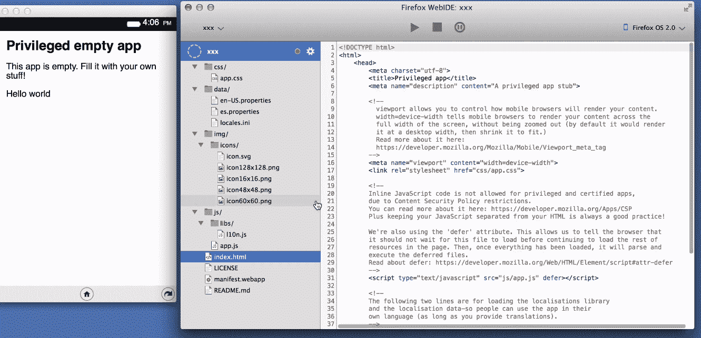
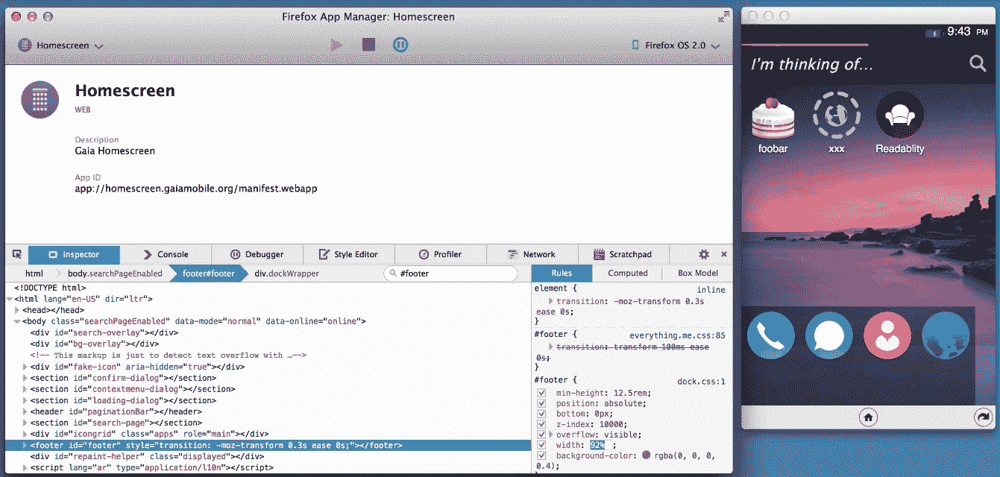

# Mozilla 为 Firefox TechCrunch 推出内置 HTML5 应用开发环境

> 原文：<https://web.archive.org/web/https://techcrunch.com/2014/06/23/mozilla-brings-built-in-html5-development-environment-to-firefox-nightly/>

从今天开始，夜间发布频道[的火狐用户可以开始测试 WebIDE](https://web.archive.org/web/20221006073023/https://hacks.mozilla.org/2014/06/webide-lands-in-nightly/) ，这是一个 HTML5 应用的开发环境，现在已经内置在浏览器中。

如果你关注 Firefox 足够长的时间，你可能还记得一个有点类似的项目，叫做 [Bespin](https://web.archive.org/web/20221006073023/https://blog.mozilla.org/labs/2009/02/introducing-bespin/) 。这也是在浏览器中构建代码编辑器的努力。然而，这些努力并没有取得成功，这个项目后来被剥离出来，现在形成了 Cloud9 IDE 的核心。然而，与 WebIDE 相比，Bespin 的野心相当有限。

Mozilla 的主要开发者传道者 Christian Heilmann 上周告诉我，对于 WebIDE，Mozilla 不仅仅是在浏览器中内置了一个代码编辑器——尽管这也是一个不错的额外好处——而是创建了一个完整的工具链，用于为桌面和移动设备创建响应性应用。不出所料，Firefox OS 受到了高度重视，它内置了一个模拟器和工具，可以在设备上进行测试，但没有什么可以阻止你用它来为任何现代浏览器构建应用程序。

WebIDE 为[提供了一个样例应用](https://web.archive.org/web/20221006073023/https://github.com/mozilla/mortar)，它为开发者提供了一个工作的起点。有了它，只需点击几下，就可以在浏览器中启动一个新的网络应用程序。示例应用程序为新用户提供了他们需要的所有代码，每次他们有机会重新加载应用程序时，WebIDE 都会自动验证并重新打包应用程序。

Heilmann 认为，今天许多最流行的 ide 都不是为编写 web 应用程序而设置的，要为这种任务配置它们需要做大量的工作。对于初学者来说，这可能是一个障碍，但有了 WebIDE，您需要开始的一切都已经内置到浏览器中了。

正如 Mozilla 开发工具的工程总监 David Camp 在我与 Heilmann 通话时强调的那样，需要注意的是，虽然基于 [CodeMirror](https://web.archive.org/web/20221006073023/http://codemirror.net/) 和 [tern.js](https://web.archive.org/web/20221006073023/http://ternjs.net/) 代码分析框架的代码编辑器是这项工作的核心部分，但开发人员也可以绕过它，继续使用他们熟悉的任何其他编辑器。

即使关闭了编辑器，开发人员仍然可以利用服务的接口来管理运行时和验证应用程序。将有三种方式来访问这些功能:WebIDE 可以简单地观察 director 的变化，开发人员可以使用即将发布的命令行 API，其他 IDE 和代码编辑器供应商可以使用这些 API 将 Mozilla 的服务集成到他们自己的应用程序中。

Heilmann 和 Camp 告诉我，展望未来，该团队还在努力将 WebIDE 与 Firefox [远程调试协议](https://web.archive.org/web/20221006073023/https://wiki.mozilla.org/Remote_Debugging_Protocol)集成。这里的想法是允许开发者在移动浏览器中轻松测试他们在桌面上编写的应用程序，而不需要仿真器。目前，这适用于桌面和 Android 上的 Firefox，以及 Firefox OS 应用程序。然而，这个想法是[创建一个协议适配器](https://web.archive.org/web/20221006073023/https://github.com/campd/fxdt-adapters)，它也将支持 Android 和 iOS 上 Safari 的 Chrome。据我所知，这是以前没有做过的，但 Camp 告诉我，该团队非常乐观，它可以在未来几个月内完成这项工作，并且该团队已经解决了许多更复杂的问题。

目前，这项功能仍将隐藏在交换机之间，但如果你想尝试一下，只需安装 [Firefox Nightly](https://web.archive.org/web/20221006073023/http://nightly.mozilla.org/) ，前往 [about:config](config) ，并将 devtools.webide.enabled 设置为“true”Mozilla 预计将在几周内默认启用它，然后在接下来的几个月内通过 Firefox 的常规发布渠道发布。