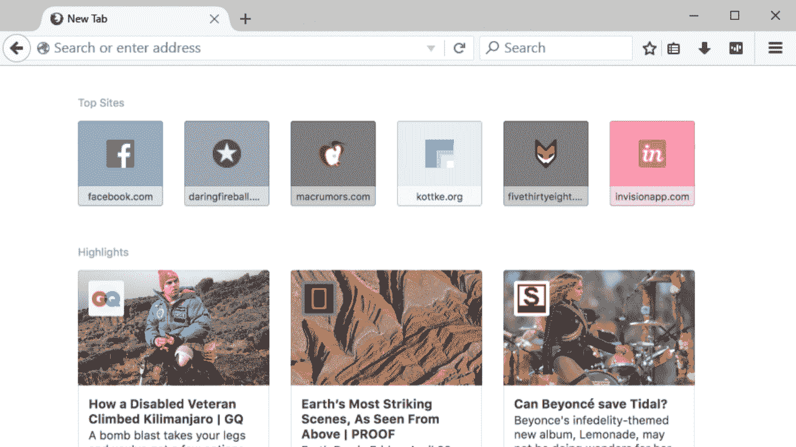
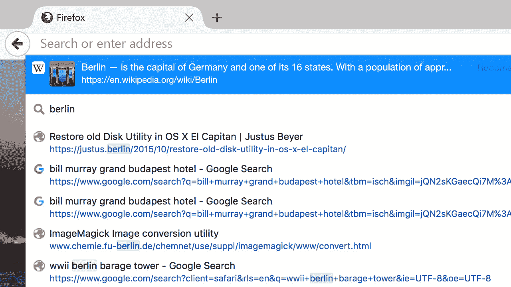

# Mozilla 重新推出 Firefox 测试版，尝试侧标签等新功能 

> 原文：<https://web.archive.org/web/https://techcrunch.com/2016/05/10/mozilla-relaunches-firefox-test-pilot-to-experiment-with-new-features-like-side-tabs/>

# Mozilla 重新推出 Firefox 测试版，尝试侧标签等新功能

Mozilla 为 Firefox 带回了它的[测试项目](https://web.archive.org/web/20221127053725/https://testpilot.firefox.com/experiments)。Test Pilot 背后的想法是让用户——以及 Mozilla 的工程师——在进入浏览器之前测试实验性的浏览器功能。

第一个版本的 Test Pilot 早在 2009 年就首次推出，但它的重点是研究用户如何与浏览器互动，而不是测试新功能。

与几年前相比，Mozilla 现在在一个非常不同的竞争环境中工作，重新推出它来测试组织[所说的](https://web.archive.org/web/20221127053725/https://wiki.mozilla.org/Test_Pilot)“粗略概念”

通过 Test Pilot，Mozilla 正在结合原型和用户研究来快速评估这些概念——该组织肯定希望这将使其能够更好地与谷歌 Chrome 和微软的 Edge 浏览器竞争。

重新启动目前有三个实验:一个新的尝试是把标签放在浏览器的左侧，而不是窗口的顶部；一个活动流，包含你的浏览历史和最近加入书签的网站的[时间轴；以及一个](https://web.archive.org/web/20221127053725/https://wiki.mozilla.org/Firefox/Activity_Stream)[改进的牛逼栏](https://web.archive.org/web/20221127053725/https://wiki.mozilla.org/Firefox/Universal_Search)(火狐的通用搜索/网址栏)。

其中一些，比如把标签放在边上，已经作为第三方插件存在，但是这些都没有给 Mozilla 任何遥测它们是如何被使用的。

该团队已经开始着手将更多的实验引入试播。

Mozilla 认为，它的试验品豚鼠将是那种“有意识地选择使用 Firefox”的用户，他们不害怕尝试新事物，并希望成为一个独特社区的一部分。

鉴于拥有数百万用户的浏览器开发者很难尝试实验性功能，即使在其早期发布渠道上也是如此，该项目允许 Mozilla 在不打扰用户的情况下尝试新事物，并给其铁杆粉丝提供了一个在构建这些新功能时发表意见的机会。

