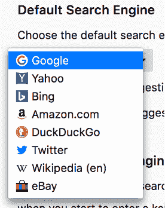

# Mozilla 终止与雅虎的交易，让谷歌再次成为火狐浏览器的默认用户 

> 原文：<https://web.archive.org/web/https://techcrunch.com/2017/11/14/mozilla-terminates-its-deal-with-yahoo-and-makes-google-the-default-in-firefox-again/>

随着 Firefox Quantum 的推出，Mozilla 发布了可能是其浏览器近年来最重要的更新。它更快，更轻，你应该试一试。当你这么做的时候，你会注意到另一个变化:谷歌现在再次成为默认的搜索引擎——至少如果你生活在美国、加拿大、香港和台湾。

2014 年，Mozilla [与雅虎](https://web.archive.org/web/20221212123757/https://beta.techcrunch.com/2014/11/19/mozilla-partners-with-yahoo-which-will-become-the-default-search-engine-in-firefox-next-month/)达成协议，使其成为美国用户的默认搜索引擎提供商，谷歌、必应、DuckDuckGo 和其他搜索引擎也是其选择。虽然这是一个小变化，但它是让用户反对火狐的一系列举措的一部分，因为它并不总是觉得 Mozilla 考虑到了用户的最佳利益。Firefox Quantum(又名 Firefox 57)是该公司纠正错误的努力，很高兴看到谷歌回到了默认位置(*免责声明* : TechCrunch 是 Oath 的一部分，威瑞森的 AOL 和雅虎的合并，尽管我知道 TechCrunch 没有人愿意使用雅虎搜索)。

当 Mozilla 在 2014 年宣布与雅虎的交易时，它说这是一项为期五年的交易。这五年显然还没有结束。我们向 Mozilla 询问了更多关于这里发生的事情的信息。

“我们行使了我们的合同权利，终止了我们与雅虎的协议！基于许多因素，包括做对我们的品牌最有利的事情，我们努力提供高质量的网络搜索，以及为我们的用户提供更广泛的内容体验。我们相信在搜索之外还有机会与 Oath 和威瑞森合作，”Mozilla 首席商务和法律官 Denelle Dixon 在一份声明中说。“作为我们关注 Firefox Quantum 用户体验和性能的一部分，谷歌也将成为我们在美国、加拿大、香港和台湾的新默认搜索提供商。Firefox 在 90 多种语言版本中预装了 60 多个搜索引擎作为默认选项或第二选项，因此在搜索引擎方面比其他任何浏览器都有更多的选择。”

正如 Recode [去年](https://web.archive.org/web/20221212123757/https://www.recode.net/2016/7/7/12116296/marissa-mayer-deal-mozilla-yahoo-payment)报道的，Mozilla 交易中有一个条款，如果 Mozilla 不想与买家合作，潜在的雅虎收购者将在 2019 年前每年支付 3.75 亿美元。这一条款也允许 Mozilla 自行决定退出。我们不知道 Mozilla 是否援引了这一条款来终止协议，但似乎很有可能。

这一举措使得谷歌 Mozilla 在全球大部分地区成为默认搜索引擎，只有中国例外，中国默认为百度，俄罗斯、土耳其、白俄罗斯和哈萨克斯坦默认为 Yandex。

从历史上看，搜索引擎版税一直是 Mozilla 的主要收入来源。早在 2014 年，谷歌交易的最后一年，该协议为基金会带来了 3.23 亿美元的总收入。谷歌和 Mozilla 都没有讨论这项新交易的财务细节，尽管一旦 Mozilla 发布其年度财务报表，我们会对它有更好的了解。