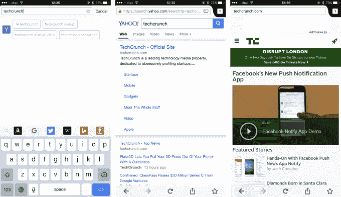

# Mozilla 的 iOS 版 Firefox 浏览器应用终于可以在所有 TechCrunch 上使用了

> 原文：<https://web.archive.org/web/https://techcrunch.com/2015/11/11/mozillas-firefox-browser-app-for-ios-is-finally-available-to-all/>

自 9 月份以来，Mozilla 一直在测试其广受欢迎的网络浏览器的 iOS 版本，现在，任何拥有 iPhone、iPad 或 iPod Touch 的人都可以公开使用面向 iOS 的 [Firefox。](https://web.archive.org/web/20221209073004/https://itunes.apple.com/nz/app/firefox-web-browser/id989804926?mt=8)

Mozilla 软件总是使用测试阶段迭代发布，因此毫不奇怪，该公司的首款 iOS 浏览器的可用性在很长一段时间内慢慢扩大，重点放在获取用户反馈和做出改变上。

去年 12 月，[我们报道了致力于保持互联网开放的非营利性浏览器制造商](https://web.archive.org/web/20221209073004/https://beta.techcrunch.com/2014/12/02/firefox-could-soon-come-to-ios/)，将改变其长期以来反对为 App Store 开发软件的立场。不久之后，[iOS 版火狐浏览器的早期版本](https://web.archive.org/web/20221209073004/https://beta.techcrunch.com/2015/05/21/firefox-for-ios-begins-its-beta-testing-program/#.c8ubks:knhO)在 5 月份面向有限数量的测试人员推出。第一个公开测试版于 9 月登陆，快进到今天，最终版本已经上线。

这个领域已经有很多竞争了。苹果自己的 Safari 预装在 iOS 设备上，并且是大多数应用程序的默认设置，而网络上最受欢迎的浏览器谷歌 Chrome 是首选。此外，还有像 Opera 这样的强有力竞争者——因其数据压缩技术而在新兴市场广受欢迎——以及一系列广告拦截专家，[如 Adblock Plus](https://web.archive.org/web/20221209073004/https://beta.techcrunch.com/2015/09/08/adblock-plus-browser-apps/) ，当 iOS 9 推出广告拦截功能时[在现场](https://web.archive.org/web/20221209073004/https://beta.techcrunch.com/2015/09/17/a-day-after-ios-9s-launch-ad-blockers-top-the-app-store/)爆发。

那么，Mozilla 的应用有什么值得宣扬的呢？

嗯，它主要针对支持 Firefox 帐户的 Mozilla 用户，这使得现有的 Mozilla 忠实用户可以将他们保存的书签、浏览历史、标签和密码带到移动设备上。然而，Mozilla 希望搜索预测、可视化标签管理系统和匿名浏览等功能也能吸引其他用户。

我试用了 iOS 版 Firefox，发现它速度非常快，非常漂亮，但最终在大多数浏览器上的功能差异很小。选择往往归结于设计，小调整或方便。

就这一点而言，作为一个已经在 Chrome 上投入了大量资金、拥有个性化书签、扩展等功能的人，当性能相差无几时，我很难切换到 Firefox。

让这款应用获得成功当然是一项艰巨的任务，特别是因为它在这么晚的时间才进入应用商店，但 Mozilla 至少最终通过这次发布填补了移动领域的空白。

如果你的苹果设备运行的是 iOS 8.2 或更新版本，[你可以在这里](https://web.archive.org/web/20221209073004/https://itunes.apple.com/nz/app/firefox-web-browser/id989804926?mt=8)下载火狐 iOS 版。