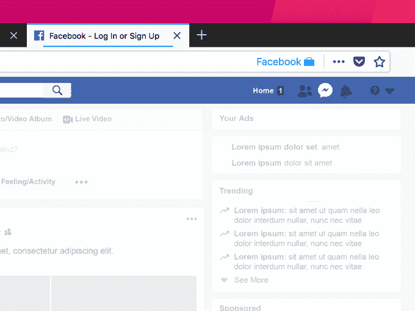

# Mozilla 新的 Firefox 扩展将你的脸书数据隔离在社交网络之外

> 原文：<https://web.archive.org/web/https://techcrunch.com/2018/03/27/mozillas-new-extension-keeps-your-facebook-data-isolated-to-the-social-network-itself/>

Mozilla 今天早上发布了 Firefox 浏览器插件，针对那些不愿意删除脸书账户，但又想控制脸书可以访问多少数据的用户。新的扩展被称为“[脸书容器](https://web.archive.org/web/20230216050736/https://addons.mozilla.org/en-US/firefox/addon/facebook-container/)，它将你的脸书身份与网络的其他部分隔离开来。这意味着脸书将无法使用你的其他网络活动来发送你的定向广告。

需要澄清的是，这种扩展不会像在[剑桥分析公司丑闻](https://web.archive.org/web/20230216050736/https://techcrunch.com/story/facebook-responds-to-data-misuse/)中那样保护用户的数据不被泄露；这并不能阻止脸书的广告商在你浏览脸书时，潜入你的个人资料和社交网络上的活动，以便向你投放广告。

然而，它旨在通过为用户提供一种方式，阻止脸书获得更多在其服务之外收集的数据，来堵塞脸书渗漏大坝的至少一个漏洞。

Firefox 产品负责人 Jeff Griffiths 解释说:“容器是 Firefox 平台内置的一项功能，它将用户 cookie 和网站数据分离到不同的 cookie jars 中。“特别是对于脸书容器，这意味着用户应该只能登录脸书容器。他说:“脸书 cookies 和识别用户身份的网站数据只能在那个容器中使用，只有脸书可以在那个容器中打开。”。

当你安装新的扩展时，它会删除你的脸书 cookies，并让你退出社交网络。下次你打开脸书时，你会发现它已经在一个蓝色的“容器”标签中被打开了。

在该选项卡中，您可以继续正常使用脸书。然而，如果你点击一个链接，将带你到脸书以外的网页，它会加载容器外的网址。同样，如果你在脸书之外点击任何脸书分享按钮，它会将这些按钮载入脸书容器。(但应该注意的是，这将向脸书发送关于你分享它们的网站的信息。)

此外，你可能无法使用你的脸书凭据登录第三方应用程序，你在网络上看到的嵌入式脸书评论和喜欢按钮也将无法使用。

Firefox Frontier 博客解释道[这可以防止脸书将你在脸书以外的网站上的活动信息与你的脸书身份联系起来。"所以它看起来可能和你习惯看到的不一样."](https://web.archive.org/web/20230216050736/https://blog.mozilla.org/firefox/facebook-container-extension/)

事实上，你可能会惊讶地发现，在社交网络之外，你对脸书的使用有多广泛。

脸书的[平台](https://web.archive.org/web/20230216050736/https://www.eff.org/deeplinks/2018/03/how-change-your-facebook-settings-opt-out-platform-api-sharing)及其场外[广告网络](https://web.archive.org/web/20230216050736/https://www.facebook.com/business/products/audience-network)允许其他网站和应用访问用户的脸书数据，即使用户不在脸书。脸书并不是唯一一个这样做的公司。但它正因数据处理不当而成为头条新闻，这意味着这是 Mozilla 利用消费者的担忧分享他们关注数据隐私的信息和工具的好时机。

Mozilla 表示，由于消费者对隐私和安全管理工具的需求不断增加，它加快了脸书容器插件的开发工作，该插件基于过去几年来一直在开发的技术。

如今也有其他[工具](https://web.archive.org/web/20230216050736/https://www.epic.org/privacy/tools.html)可以帮助消费者解决这些问题，包括现在由 Cliqz 拥有的 [Ghostery](https://web.archive.org/web/20230216050736/https://www.ghostery.com/) 反跟踪扩展[，广告](https://web.archive.org/web/20230216050736/https://techcrunch.com/2017/02/15/private-search-browser-cliqz-buys-ghostery-ad-tracker-tool/)[拦截器](https://web.archive.org/web/20230216050736/https://techcrunch.com/2018/01/23/duckduckgo-adds-tracker-blocking-to-help-curb-the-wider-surveillance-web/)(包括那些与 [Safari](https://web.archive.org/web/20230216050736/https://techcrunch.com/2017/06/05/apple-adds-a-tracker-blocker-to-desktop-safari/) 等浏览器捆绑在一起的工具)，等等。

然而，像这样的专用工具是有用的，因为它们允许人们限制一些数据共享活动，而不必采取删除脸书的激烈措施。

[脸书集装箱扩展在此处可用](https://web.archive.org/web/20230216050736/https://addons.mozilla.org/en-US/firefox/addon/facebook-container/)。