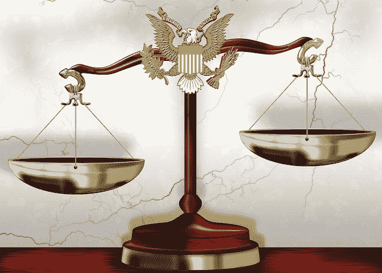
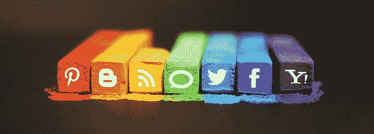
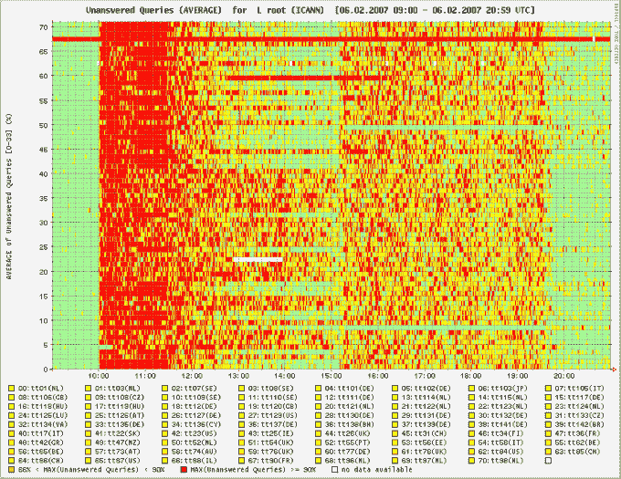

# 奥巴马先生，拆掉这个责任屏障 

> 原文：<https://web.archive.org/web/https://techcrunch.com/2015/09/29/mr-obama-tear-down-this-liability-shield/>

[Arthur Chu](https://web.archive.org/web/20221224144610/http://arthur-chu.com/)

是一个终生的极客，他在 2014 年因“入侵”游戏节目 Jeopardy 而声名狼藉！从那以后一直在评论数字时代的书呆子文化。

More posts by this contributor

在这场我们称之为 GamerGate 的关于“新闻道德”的奇怪而琐碎的小战争中，网络流氓发起了又一轮攻击。

安妮塔·萨基西安和佐伊·奎因是长期的巨魔目标，她们向联合国证明了网上骚扰的有害影响以及对此采取措施的必要性，从而导致了最新的升级。

结果，我们看到了一波奇怪的、歇斯底里的[阴谋论](https://web.archive.org/web/20221224144610/http://wehuntedthemammoth.com/2015/09/28/the-13-most-ridiculous-things-gamergaters-have-said-about-anita-and-zoes-un-visit-reddit-edition/)声称互联网将很快成为由联合国审查者铁腕统治的集中服务。(这在逻辑上、技术上和法律上都是不可能的——即使有可能，也不会因为 GamerGate 而在一夜之间突然发生。)

更糟糕的是，联合国在起草一份文件来解决网络骚扰问题上的能力明显不足。

Sarkeesian 和 Quinn 在专家组会议上说的大部分有用的东西都被与它一起提交的一份[草率且考虑不周的报告](https://web.archive.org/web/20221224144610/http://nymag.com/scienceofus/2015/09/uns-cyberharassment-report-is-really-bad.html)破坏了。

同样，认为美国政府——或任何其他政府——有法律权力充当中央“许可委员会”并有权关闭他们认为滥用的网站的想法在法律上和道德上都令人不安，更重要的是，完全不可行。

几乎不可能将 FCC 监管“公共电波”的逻辑应用于互联网服务，这些服务存在于私有服务器和客户端上，通过私有电缆、电话线和光纤进行通信。

> 几乎不可能将 FCC 监管“公共电波”的逻辑应用于互联网服务，这些服务存在于私有服务器和客户端上，通过私有电缆、电话线和光纤进行通信。

在[联邦政府已经对我们的数据采取了不正当行动](https://web.archive.org/web/20221224144610/https://en.wikipedia.org/wiki/PRISM_(surveillance_program))之后，我怀疑我们中的任何一个人都不急于授予联邦政府直接权力来控制哪些网站保持开放，哪些网站关闭。

但是通过在我上面链接的文章中攻击这个过于激进的提议，华盛顿邮报的凯特琳·杜威混淆了两个不同的问题。与像维基解密这样的言论自由绝对主义组织声称的相反，我们并不面临创建一个中央监管机构和耸耸肩说现代互联网这个自由放任的粪坑与我们无关之间的二元选择。

在美国这里，我们有一个系统，通过这个系统，受害方可以向伤害他们的人和那些故意伤害他们的人寻求补偿，而不受政府官僚的主动控制。即使是狂热的自由主义者也认为这是他们理想的“小政府”运作方式的一部分。这是一个高度美国化的传统:自 T2·亚历西斯·德·托克维尔时代起，它就被认为是美国文化的核心。

当然，我说的是诉讼。民事诉讼。请律师来。

现在，你不能起诉数字平台对他们的服务进行骚扰，即使他们通过公然、故意的忽视进行骚扰。如果你的骚扰者能够采取相当基本的措施让自己匿名——如果他选择的平台允许并强制匿名——那么你或政府实际上什么也做不了，即使他的行为上升到像谋杀未遂这样的重大犯罪水平。

与其他交流方式相比，堵住这个漏洞并不需要给予互联网“特殊待遇”。这也不需要对大多数发达国家尊重的言论自由标准进行突然的重大偏离。

它需要的恰恰是相反的东西——它需要美国取消一项法律，该法律专门要求对互联网服务提供商和平台给予其他通信媒体所没有的特殊待遇。

这远不会把我们变成中国或朝鲜，而是会让美国与世界上所有其他发达国家步调一致，包括我们的亲密盟友加拿大和英国。这将消除大多数社交媒体公司留在美国的竞争优势，尽管其他国家拥有人才和资本。这种优势是使我们成为责任避风港的法则。

> 随着 Web 2.0 的快速、大规模扩展，社交媒体公司已经决定，只要他们不会被起诉，执行他们的服务条款的成本就会超过收益。

这项法律被称为《通信体面法案》第 230 条。它是在 1996 年通过的，当时互联网对几乎所有美国人来说还是一个新事物，而不是商业和日常交流的一个组成部分。它是在“doxing”和“swatting”事实上以前发生过的时候通过的，但由于这种做法只与一小群自我认定的书呆子有关，所以还不知道这些名字。

早就该废除了。

自相矛盾的是，CDA 的第 230 条最初是为了鼓励在线平台主动过滤、屏蔽和净化内容而存在的。

它是针对[过去的一个法院案例](https://web.archive.org/web/20221224144610/https://en.wikipedia.org/wiki/Stratton_Oakmont,_Inc._v._Prodigy_Services_Co.)起草的，在该案例中，在线服务神童被发现符合“发布者”的定义，因为他们有能力删除特定的留言板帖子，并且过去也这样做过——因此他们被认为对他们未能删除的诽谤帖子负有责任。

第 230 条被添加到 CDA 中，作为 CDA 总体目标的一部分，以“清除”互联网上的淫秽材料。通过让在线服务变得“安全”,能够过滤或屏蔽网站上发布的所有内容，而不产生法律责任，他们希望刺激内容过滤技术的进步，理由是让不良内容远离网站从长远来看只会对业务有益。

具有极大历史讽刺意味的是，CDA 的大部分被推翻为违宪，而剩下的部分，第 230 条，扮演了阻止在线服务清理其内容的角色。因为，事实证明，骚扰性、破坏性的内容是有利可图的。随着 Web 2.0 的快速、大规模扩展，社交媒体公司已经决定，只要他们不会被起诉，执行他们的服务条款的成本就会超过收益。

1996 年没有人预测到 2000 年将会出现定义 Web 2.0 的“用户生成内容”的大量涌入。没有人预见到一种商业模式的难以置信的盈利能力，这种模式的基础是不创造任何你自己的内容，而是通过点击你的用户相互交谈来赚钱。

我敢肯定，判决泽兰诉美国在线案的法官从未料到泽兰先生的故事会很快成为 2010 年代生活中的一个普遍现象。

一个巨魔通过诽谤和欺诈对一个随机的个体进行大规模骚扰，而 AOL 显然故意疏忽拒绝对巨魔做任何积极的事情，仅仅因为他们没有花时间或精力去追踪匿名巨魔并禁用他的帐户。

当时，这可能看起来像是那些怪异、古怪的“只在互联网上”的故事之一，作为一个警示故事，人们不应该“上互联网”，除非他们“精通互联网”。当时，维护第 230 条的原则似乎很重要。

现在，人们每天都在遭受恐怖袭击，特警队每天都被武器化，以破坏财产并危及人们的生命。

现在,“不要上网”就像 1996 年的“不要使用电话”或 1916 年的“不要使用邮件”一样荒谬——断绝自己的互联网服务意味着断绝自己与大多数社会交往和经济活动发生的地方的联系。

> 社交媒体公司，无论他们的营销部门如何指导他们谈论反虐待的大游戏，都有实际反虐待的积极财政抑制因素。

我们有一些公司，不管他们最初的意图是什么，都发现吸引投资者大笔资金的方法是尽可能早、尽可能快地展示用户的指数级增长。这意味着，与在线服务通过直接让用户付费来赚钱的时代不同，更多的帖子、更多的推文、更多的点击——更多的“参与”——对社交媒体公司来说是直接有利可图的，无论参与的性质是什么。

只要诉讼的可能性不存在，滥用永远不会有直接的直接成本，真正强大的反滥用举措打破了科技初创公司是指数印钞机的神话。

一旦你有了严肃的反滥用措施，编写一点点代码并获得大量“参与”作为回报的美妙“可扩展性”就会崩溃，因为不幸的是，反滥用政策仍然只能由真正的人来做。因此,“社区管理”变成了一份人手不足、报酬过低的工作，公司有理由认为这是他们可以逃避的。

现在我们清楚地看到，骚扰具有反歧视律师所说的“[完全不同的影响](https://web.archive.org/web/20221224144610/https://en.wikipedia.org/wiki/Disparate_impact)

当内容监管更多的是保持表面现象，而不是避免真正的责任时，它可以像你希望的那样肤浅——因此，名人脸书或 Twitter 用户的投诉得到解决的响应时间与普通人相比相差甚远。

白人男性在 1996 年构成了大部分可见用户群，他们带着一种内在的归属感进入了 Web 2.0 相比之下，女性和少数族裔被视为局外人，因为直言不讳而受到更严重的骚扰，并且在抱怨时更有可能被拒绝。

借用《反歧视法》中的另一句话，对于花时间上网的女性和少数族裔来说，互联网从根本上来说是一个充满敌意的工作环境，但没有实体可以对此负责。

处理虐待成为隐性税收的一部分，任何试图以非白人身份在媒体和技术领域工作的人最终都要付出时间和精力。回到技术术语，在线虐待已经成为一系列无休止的拒绝服务攻击，目标是人类而不是机器，尤其是女性。(更不用说字面上的拒绝服务攻击。)

我记得在 2007 年看到了第一个高调的针对“现代”互联网上匿名巨魔的骚扰诉讼——匿名巨魔委员会 AutoAdmit 迎合了法律学生的观众，主要针对女性法律学生进行骚扰。

这个论坛臭名昭著，因为它是巨魔聚集和谈论他们选择作为目标的人的地方，其明显的目的是破坏他们的名誉和生活。管理员已经被明确告知并清楚地意识到滥用帖子造成的损害，但拒绝删除它们，并且在寻求揭示滥用者假名背后的真实身份方面完全不合作。

如果在案例法中有任何将第 230 条解释为无所不包的责任保护的“例外”的可能性，那就是现在了。但这并没有发生。第 230 条仍然有效。管理员从诉讼中被撤销。后来，这场诉讼基本上不了了之，因为当你所知道的仅仅是有人在“[希特勒希特勒](https://web.archive.org/web/20221224144610/http://archive.wired.com/politics/law/news/2008/07/autoadmit)”这个名字下发帖的时候，很难将他告上法庭

从那以后，人们变得越来越大胆。

我们现在有像 8chan 这样的网站——为那些觉得即使是臭名昭著的 4chan 对他们来说也太挑剔的人提供避难所——这些网站[公开为反对联邦法官](https://web.archive.org/web/20221224144610/http://arstechnica.com/security/2015/02/notorious-8chan-subboard-has-history-wiped-after-federal-judges-doxing/)的用户提供掩护。我们有像 ISIS[这样的暴力恐怖组织公开使用互联网作为招募工具](https://web.archive.org/web/20221224144610/http://www.csmonitor.com/USA/USA-Update/2014/1022/ISIS-excels-at-recruiting-American-teens-Here-are-four-reasons-why-video)。我们有像 Reddit 这样的主要网站自豪地宣称，他们不仅仅缺乏任何法律义务，也没有任何道德义务不参与性犯罪。

不能再这样下去了。EFF，一个我普遍尊重的组织，在 2012 年提出了一个对 230 条款的激烈辩护，说如果没有 230 条款，那些美妙的病毒式增长的服务，如脸书、推特和 YouTube，就不能以它们目前的形式存在。它接着说，个人博客受第 230 条保护，免于为他们的评论部分承担责任。

它忽视了脸书、推特和 YouTube 是跟踪、骚扰、诽谤和各种伤害的绝佳工具，忽视了由于不负责任的用户使用不负责任的平台而造成的生命损失、事业破坏和金钱浪费。它忽略了不受约束的评论区的整个不容置疑的“传统”已经导致了一种套话、尖酸刻薄和谎言的传统，这种传统使互联网成为一个更糟糕的地方，并使博客主变得更糟糕。

EFF 警告我们，如果我们不得不在社交媒体初创公司生命周期的最开始就支付律师、内容经理和过滤工具的费用，以防止潜在的致命诉讼，互联网的成本会有多高。他们提出了一个充满“免费”内容的 Web 2.0 的广阔仙境的幽灵，被订阅费或微交易所取代。

> 现有的网络已经非常昂贵。成本主要由科技界不认为特别有价值的人承担。

我会回答说，目前存在的网络已经非常昂贵了。成本主要由科技界不认为特别有价值的人承担——被胁迫自杀的青少年； [激进分子胁迫并被迫逃离她的家](https://web.archive.org/web/20221224144610/https://www.bostonglobe.com/lifestyle/style/2014/10/29/threatening-video-gaming-industry-movement-grows-arlington-game-developer-forced-flee-her-home/BRHwDSGjMsSnHquH9jYQIJ/story.html)；[被诽谤毁了职业声誉的律师](https://web.archive.org/web/20221224144610/http://www.thedailybeast.com/articles/2015/09/11/terrorist-troll-pretended-to-be-isis-white-supremacist-and-jewish-lawyer.html)；这位理想主义的技术梦想家放弃了自己的职业，因为日常的情感折磨最终让她无法承受。

第 230 条无非是政府的一个公开声明，即不幸和脆弱的用户不得不承担这些成本，并且——不同于任何其他类型的出版商，不同于印刷书籍或印刷报纸或电视节目的人——那些有权在网上即时发布任何他们想要的东西的人不应该承担任何责任或风险。即使是复仇色情，即使是电话号码或地址，即使是公开的死亡或强奸威胁。

我不是自由主义者，但我被告知自由主义的核心价值观是“个人责任”，即授权个人通过法院或市场寻求对伤害他们的人的补偿，而不是依赖政府监管机构先发制人地保护他们的安全。

我不是在呼吁通过一项新的法律或创建一个新的机构。我呼吁废除一项法律。我不是在呼吁把互联网用户挑出来。我呼吁不要挑出互联网，因为互联网和“真实世界”之间的人为和愚蠢的屏障使互联网成为一个无律师区，从而成为一个巨大的不负责任的滥用下水道被拆除。

现在是 2015 年，十多年来，情况越来越糟。在我们采取行动之前他们还要变得多糟？

奥巴马:拆掉这个盾牌。