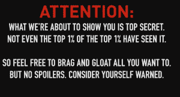
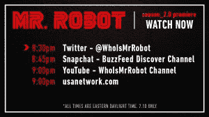

# 美国刚刚在社交媒体 上取消了《机器人先生》第二季首播

> 原文：<https://web.archive.org/web/https://techcrunch.com/2016/07/10/mr-robot-season-2_0/>

# 美国刚刚在社交媒体上取消了《机器人先生》第二季的首播

美国电视网 [USA](https://web.archive.org/web/20230324214127/http://www.usanetwork.com/mrrobot) 为其[获奖电视节目](https://web.archive.org/web/20230324214127/http://www.imdb.com/title/tt4158110/awards?ref_=tt_ql_4)机器人先生的粉丝准备了所有惊喜之母。在完全没有宣布的情况下，该网络在脸书 Q & A 的中间部分在社交媒体上发布了第二季第一集的前 40 多分钟。预览版在大约一个小时前发布——比计划在电视上播出的时间提前了整整三天。

脸书直播节目中的“黑客”半开玩笑地邀请你对这 0.01%幸灾乐祸。

也许，一个关于一个变节的电脑黑客的电视节目“泄露”到网络上作为一个这样的挑逗，甚至作为一个营销噱头是有道理的——在脸书直播的一个问答环节开始大约 25 分钟后，广播被一条消息打断。

“为什么要在无意义的猜测上浪费更多的时间，”屏幕上的蒙面人说道，打断了问答环节。“你值得一些新的，意想不到的，你从来没有见过的东西”，在滚动前 40 分钟的一集。

预告片在各种社交网络上出现并过期。跟上！

电视网让它的粉丝们在网上疯狂追逐以继续观看这一集，因为它“过期”了，所以从它的各种账户中删除了它。([提示这篇文章](https://web.archive.org/web/20230324214127/https://techcrunch.com/wp-content/uploads/2016/07/mr-robot-on-twitter.png)的推文，比如[现在没了](https://web.archive.org/web/20230324214127/https://mobile.twitter.com/whoismrrobot/status/752298872823697408)。太棒了。)

毫无疑问，这是一个完全的公关噱头，但鉴于它与该剧的核心主题联系如此紧密，我很高兴看到像 USA 这样的老牌电视网络拥抱社交媒体，以激起其粉丝的狂热。它新鲜、有趣、看起来真实——有助于在流媒体服务处处紧追不舍的世界里保持网络的相关性和脉搏。