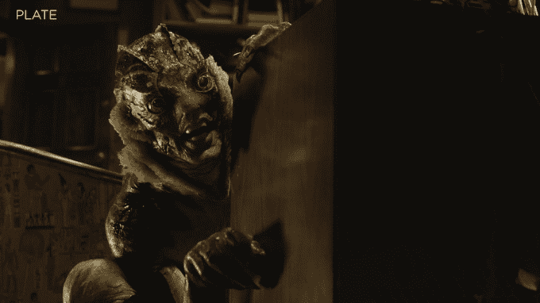
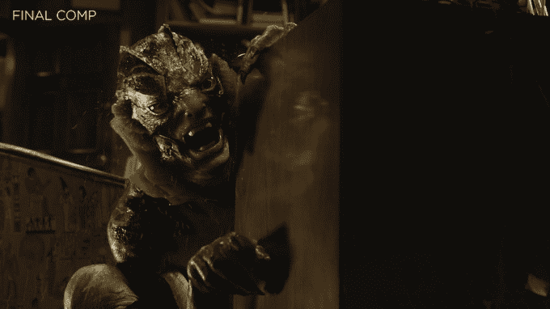

# 视觉特效工作室 X 先生如何帮助创造“水的形状”和它可爱的鱼人

> 原文：<https://web.archive.org/web/https://techcrunch.com/2018/01/28/mr-x-shape-of-water/>

起初，我对*水的形状*的视觉效果没有什么印象。

对于一部其特效已经获得多项[提名](https://web.archive.org/web/20230328183314/http://www.imdb.com/title/tt5580390/awards)的电影来说，这似乎是一件奇怪的事情(尽管不是奥斯卡，尽管这部电影获得了 [13 项提名](https://web.archive.org/web/20230328183314/https://techcrunch.com/2018/01/23/netflixs-mudbound-scores-four-oscar-nominations/))。我的意思是:当我在看的时候，我从来没有想过鱼人背后的技术——这个时而怪异、时而美丽的水生角色的灵感来自于来自黑湖的*生物*。

我知道道格·琼斯(他曾长期为导演吉尔莫·德尔·托罗扮演怪物)是这个角色的主角，每当我看到《鱼人》时，我都以为琼斯真的在片场，当他扮演的角色在政府实验室里被迈克尔·香农的斯特里克兰上校折磨时，或者当他与莎莉·霍金斯扮演的善良、沉默的看门人伊莉莎建立关系时，他都穿着这套服装。

事实证明，琼斯令人印象深刻的服装和化妆(以及他同样令人印象深刻的表演)只是我们在屏幕上看到的一部分。视觉特效公司的 CG 主管 Trey Harrell 告诉我，“电影中你看到这个生物的每一个镜头都是视觉特效镜头。”

毕竟，哈雷尔说，虽然“道格是一个了不起的演员”，但他的脸也藏在“~~一英寸半~~半英寸的泡沫乳胶下面。”所以至少，X 先生必须创造出鱼人的眼睛和面部动作。在其他情况下，比如有人看到鱼人在实验室的太空舱里游泳，X 先生要对整个生物负责。

X 的作品可能没那么引人注目，因为哈勒尔说，他“想让人们相信”它是琼斯的表演和实际效果的结合，而不是 CG。

“我们不是要拍一个超真实的 CG 生物，”他说。“我们希望它看起来像泡沫乳胶和硅假肢，一场可以在当天拍摄的表演。”

这意味着要小心鱼人是如何移动的。事实上，哈勒尔说，他的团队对琼斯进行了“数百次扫描”，创建了一个“道格·琼斯动画装置”——所以每当他们为鱼人设计 CG 动作时，他们都可以使用该装置来看看这个动作对穿着服装的演员来说是否可信。

哈勒尔也参与了德尔托罗的项目《紧张局势》和《T2 深红峰》，他说“尽可能多地用摄像机捕捉”是导演风格的一部分，而不是依赖绿屏和 CG。

“你知道，我们这些到了一定年龄的人，我们的眼睛更适应这一点，”他补充道。“我们只是觉得这种风格更具美感。”

这并不意味着哈雷尔总是喜欢实用的或看起来实用的效果:“你开始看到更小、更个性化的项目两全其美。我个人认为不是二元论证。我也有实用假肢和化妆的背景。我喜欢拥有一个大工具箱。”

【YouTube https://www.youtube.com/watch?v=z8GwtzmoP0Y]

除了增加鱼人，哈勒尔说，其他效果挑战包括为开幕序列和其他场景创建水效果，这些场景是在“[干湿](https://web.archive.org/web/20230328183314/https://en.wikipedia.org/wiki/Dry_for_wet)”拍摄的(换句话说，他们实际上并没有在水下)，并增加对一辆老爷车的损坏。

X 先生是唯一一个为这部电影工作的视觉特效公司——也许是必要的，因为*水的形状*相对较小，[低于 2000 万美元](https://web.archive.org/web/20230328183314/http://www.slashfilm.com/how-guillermo-del-toro-made-the-shape-of-water/)的预算，但哈雷尔说他“非常喜欢”这部电影的工作，因为这意味着“你和导演之间没有公司基础设施。”

“我喜欢让我有感觉的小电影，”他补充道。