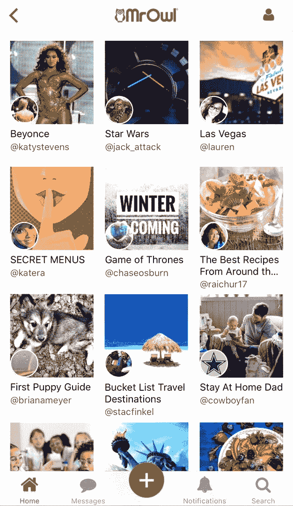

# MrOwl 希望成为你的新分享平台

> 原文：<https://web.archive.org/web/https://techcrunch.com/2017/10/24/mrowl-wants-to-be-your-new-sharing-platform/>

# MrOwl 希望成为你新的分享平台

MrOwl 是 Arvind 和 Becky Raichur 开发的一款新应用，可以让你存储、分类和分享数据。什么样的数据？所有的一切。

如果一个社交网络有了 Evernote 的宝宝，这个应用程序就会发生什么。用户可以创建公共或私人的数据存储库——[这是我关于劳力士的分支](https://web.archive.org/web/20230323141144/https://www.mrowl.com/user/john_biggs/rolex)——并放入图像、文本和链接。有像[这种关于秘密菜单](https://web.archive.org/web/20230323141144/https://www.mrowl.com/user/katera/secret_menus)的流行分支，你可以为自己创建私人菜单。

我发现这个应用很有趣，虽然现在有点安静。随着用户数量的增加，它可能会成为一个充满活力的信息共享场所。

Arvind 说:“协作是一种新的强大方式的关键，用户可以添加多个编辑，并决定是否只向他们合作的群体公开或保密信息。”“这是一种与您选择的社区分享您的知识和资源的好方法。”

显然，这个世界现在需要的是另一个社交媒体游戏，就像我们都需要一个脑袋上的洞一样，但我在 MrOwl 中看到了一些效用，因为它使选择和与朋友和追随者分享大块数据变得容易。它在印度越来越受欢迎，已经有 7500 名每日活跃用户和 70 万次会话。它筹集了 600 万美元的资金。

“描述 MrOwl 的最佳方式是我们的用户如何描述它，即 MrOwl 是谷歌、维基百科和 Pinterest 之间的桥梁。它允许人们寻找、创造、协作和分享他们最感兴趣的东西。”