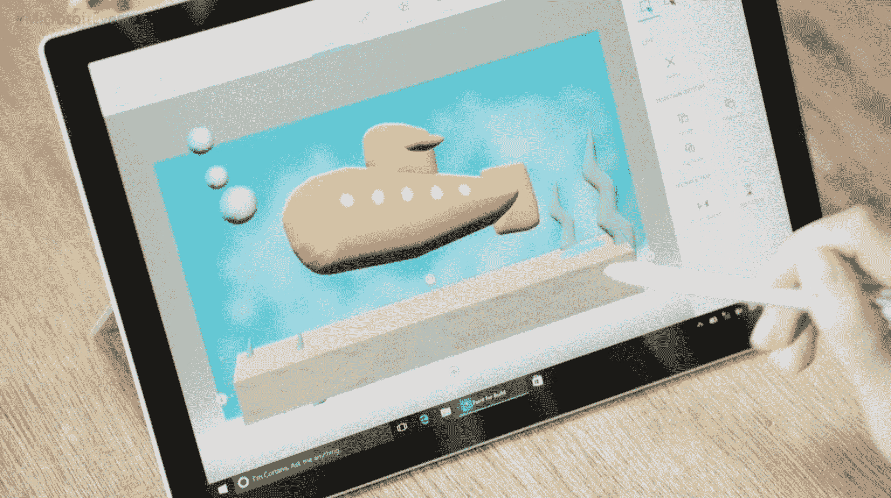

# 微软的 Paint 3D 是初级 3D 建模的简单入门

> 原文：<https://web.archive.org/web/https://techcrunch.com/2016/10/26/ms-paint-hands-on/>

# 微软的 Paint 3D 是初级 3D 建模的简单入门

听起来很奇怪，微软画图再次成为 Windows 的焦点。在推出第一个版本的操作系统 31 年后，这家软件巨头对该应用程序进行了最大的修改，将其置于 3D 内容生态系统的中心，该生态系统将在未来的硬件和软件产品中发挥关键作用。

当你有机会坐下来与最新版本的操作系统在所有硬件荣耀的[表面工作室](https://web.archive.org/web/20230321024754/https://techcrunch.com/2016/10/26/surface-studio-hands/)时，重要的是要记住，油漆 3D，因为它的所有演示派头仍然是油漆。这意味着我们正在处理一个入门级的图形编辑应用程序——尽管它现在可以做 3D。

任何使用过旧版应用程序的人都会对这些工具很熟悉(有人认为，这份清单包括了所有接触过 Windows 机器的人)，但现在有了一个额外的点击功能，可以让你用手指或手写笔创建的基本图像增加一些深度。

正如广告所说，它很容易上手。给图像添加额外的维度就像按一个按钮一样简单。一旦你做到了这一点，你就可以通过在下面的访问上滑动手指来浏览图片——这类似于你在零售网站上看到的 360 度产品滑块。

当然，绘画的问题还是一如既往——它不会让你成为一名优秀的艺术家。因此，虽然你的涂鸦是 3D 的，但它们的质量取决于你能做出什么。对于简单的图像有一些解决方法——你可以通过选择一个工具并将其拖动到你喜欢的大小来创建完美的形状。微软还提供来自 3D 派对的 3D 模型，你可以拖放进去，让另一个艺术家来做繁重的工作。

一旦你在屏幕上看到一个物体，你就可以把贴纸放在上面——简单的邮票可以给 3D 物体添加二维细节，比如说，我在演示中制作的表情符号的微笑。你也可以使用标准的颜色工具，比如笔刷和填充——尽管事先警告你，它对第三方的复杂 3D 图像不太好用(尽管我表情符号上的圆顶礼帽可能不想变成红色)。

这款应用也遭遇了其他基本 3D 建模软件的命运，因为在 2D 平面上很难获得物体的良好深度感，从而很难对齐物体。当然，这是一个非常简单的应用程序，所以对于已经了解 CAD 软件的人来说，这里真的没有太多内容。相反，微软的玩法是引起人们对这种形式的兴趣——应用程序的混合社交元素可能会在这方面有所帮助。