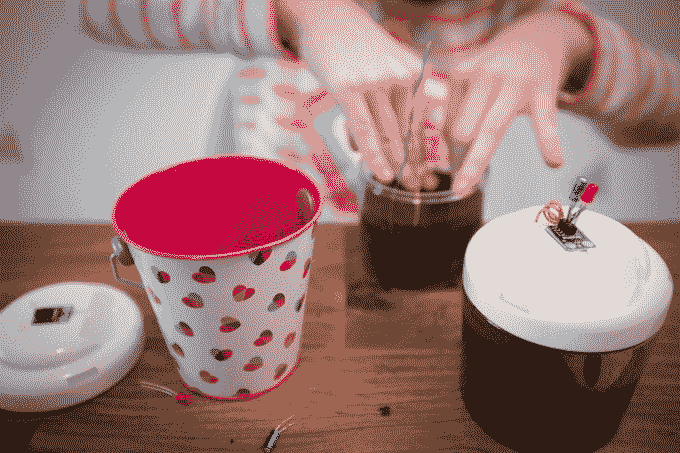
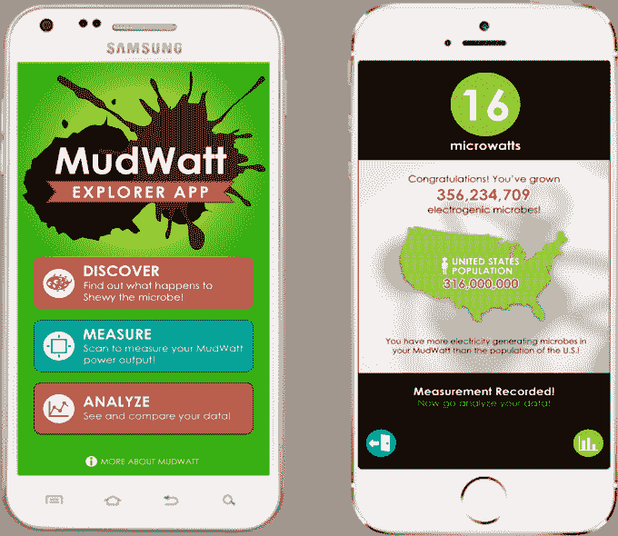

# MudWatt 让孩子们制造在泥浆上运行的电池 

> 原文：<https://web.archive.org/web/http://techcrunch.com/2015/04/08/mudwatt-lets-kids-build-batteries-that-run-on-mud/>

一家希望鼓励孩子们对科学和工程感兴趣的初创公司 [MudWatt](https://web.archive.org/web/20230131051840/https://www.kickstarter.com/projects/1073149387/mudwatt-build-your-own-battery-that-runs-on-mud) ，现在正通过 Kickstarter 出售一种负担得起的、有趣的(是的，有点乱)科学套件[，它允许孩子们只用泥土和电极发电。当细菌在泥浆中繁殖后，该套件可用于为简单的电子设备供电，包括时钟、温度计和蜂鸣器，MudWatt 还提供了选择套件。](https://web.archive.org/web/20230131051840/https://www.kickstarter.com/projects/1073149387/mudwatt-build-your-own-battery-that-runs-on-mud)

这家公司比 Kickstarter 上的其他公司走得更远，因为它实际上已经发展了好几年。最近，该团队参加了斯坦福的 StartX 孵化器，联合创始人在那里更多地了解了玩具行业的总体情况。

联合创始人 Keegan Cooke 解释说，MudWatt 的想法最初是在他作为一名研究科学家在一家名为 Trophos Energy 的小型初创公司工作时产生的，该公司于 2010 年被收购。在那里，他正在开发海底微生物燃料电池系统的原型，该系统使用海洋沉积物作为电源，而不是电池。在此期间，Cooke 还参加了许多教育活动，向学校的孩子们展示他正在研究的东西，并很快发现孩子们对技术演示真正感兴趣并参与其中。

在朋友兼联合创始人凯文·兰德(Kevin Rand)的帮助下，两人开始在几年的业余时间里建造后来成为 MudWatt 的东西，同时还从事其他工作，并完成了研究生学业。但是，他们从工具包的早期用户那里获得的反馈越多，他们就越意识到，这个产品可能有潜力超越仅仅是一个有趣的附带项目。

到目前为止，创始人已经卖出了 6000 套他们的老式装备，现在以每月 200 套的速度卖出。

“这是一个伟大的里程碑，因为我们实际上从未试图出售它。我们从未做过任何广告或其他事情，”库克解释道。“但我们现在看到这只是杯水车薪，我们可以把它变成一项合法的业务，”他补充道。

在 Kickstarter 上，该团队推出了最新版本的 MudWatt 套件，其中包括几项改进，包括可堆肥包装和升级的组件。根据你选择的套件包，它将包括两个石墨电极，一个带 LED 灯的电路板，一个容器，说明书，以及 iOS 和 Android 的 MudWatt Explorer 移动应用程序。

要使用 MudWatt，孩子们可以从他们自己的后院或从花园商店买的袋子里加入泥浆，然后加入他们自己的燃料——通常是指冰箱里的东西。孩子们被鼓励去思考细菌喜欢吃什么，然后倒入他们认为会增加泥浆比重的任何东西——无论是佳得乐还是番茄酱或其他东西。

几天后，LED 灯将开始闪烁，这表明容器中的泥浆现在含有特殊细菌的菌落，这些细菌正在发电。通过以不同的方式维持菌落，MudWatt 可以用于进行其他实验。

随着你制造更多的细菌，闪烁的频率会随着时间的推移而增加，然后孩子们可以将不同的东西连接到套件，比如蜂鸣器、时钟、温度计或他们自己的设备，比如液晶计算器。

与此同时，手机应用程序能够检测眨眼频率，这与你培养了多少细菌有关，然后告诉孩子们他们有多少细菌，他们产生了多少能量。该应用还解锁了一本漫画书，该书讲述了一个英雄——一种电动微生物——穿越他的泥泞世界。

库克说，最终，更大的目标——不仅仅是让孩子们对科学细节本身感到兴奋——是培养他们对脚下复杂世界的兴趣和欣赏。

此外，他说，“我们正看到一股基于探究的教育和开放式调查的趋势，在这种情况下，孩子们可以提出自己的问题，设计自己的实验，”库克解释道。“这是我们希望孩子们通过我们的套件学习的另一个核心主题。”

现在，创始人们正在考虑创造更多像 MudWatt 这样专注于这些更大概念的套件，比如使用“沼泽粘液”(藻类)的生物燃料套件。

[MudWatt DeepDig 工具包是 59 美元](https://web.archive.org/web/20230131051840/https://www.kickstarter.com/projects/1073149387/mudwatt-build-your-own-battery-that-runs-on-mud)，虽然你可以提供自己的容器和额外的小工具，把价格降到 29 美元。对于学校来说，也有一个包含 10 个工具包的教室包，售价 350 美元。

截至本文撰写之时，该公司已经筹集了超过 26，300 美元的 Kickstarter 目标资金。