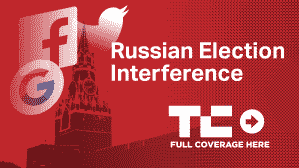

# 特别顾问罗伯特·穆勒指控俄罗斯机器人农场干预选举

> 原文：<https://web.archive.org/web/https://techcrunch.com/2018/02/16/mueller-indictment-internet-research-agency-russia/>

# 特别顾问罗伯特·穆勒指控俄罗斯机器人农场干预选举

特别顾问罗伯特·穆勒刚刚宣布了一系列起诉，指控 13 名俄罗斯公民和三个俄罗斯组织从 2014 年开始干预美国总统选举。

起诉书称，互联网研究机构，一个位于圣彼得堡的机器人农场和虚假信息运营机构，是旨在制造美国社会分裂的虚假账户的来源之一。这些账户在脸书、Twitter 和 Instagram 上非常活跃，起诉书提到了这些科技公司提交给国会的内部审查结果中的具体例子。

【T2

国会对这些广告和帮助它们传播的公司非常感兴趣，去年 10 月，国会传唤脸书、谷歌和推特的负责人到参议院司法委员会作证。众议院和参议院情报委员会都在对选举干预进行平行调查，调查这些虚假账户的内容以及导致其传播的情况。

穆勒正在带头对干预 2016 年美国总统大选进行影响深远的调查。虽然这些早期指控是针对俄罗斯国民的，但穆勒也对特朗普竞选团队的前成员产生了浓厚的兴趣，包括被指控洗钱的前特朗普竞选团队主席保罗·马纳福特(Paul Manafort)。

新的起诉主要是指控那些被点名的人违反了禁止外国实体捐款影响美国联邦选举的法律。这些俄罗斯人面临多项指控，包括一项阴谋欺诈美国的指控，一项阴谋实施电信欺诈和银行欺诈的指控，以及六项严重的身份盗窃指控。

你可以阅读起诉书全文，嵌在下面。

[scribd id = 371674609 key = key-mxt 3 eyjhoibcpagfakmh mode = scroll]