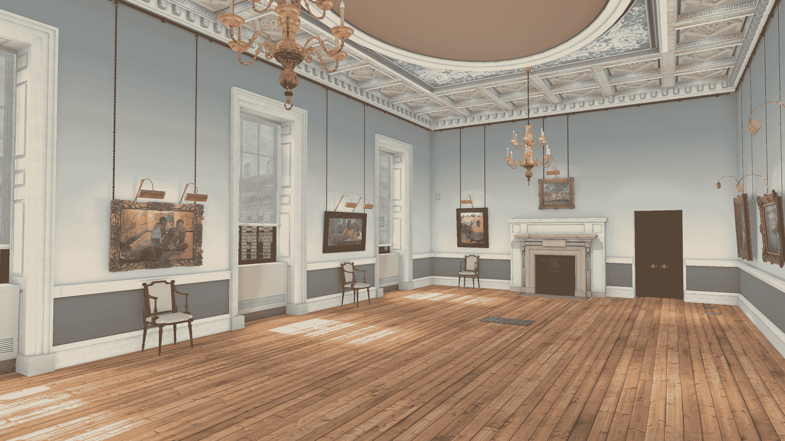
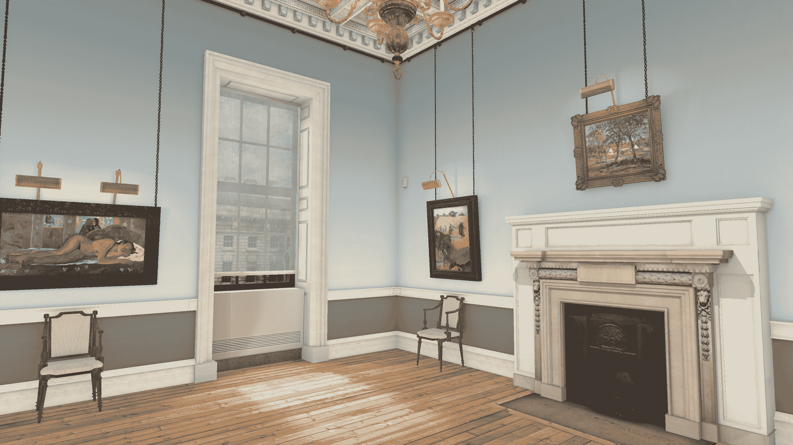
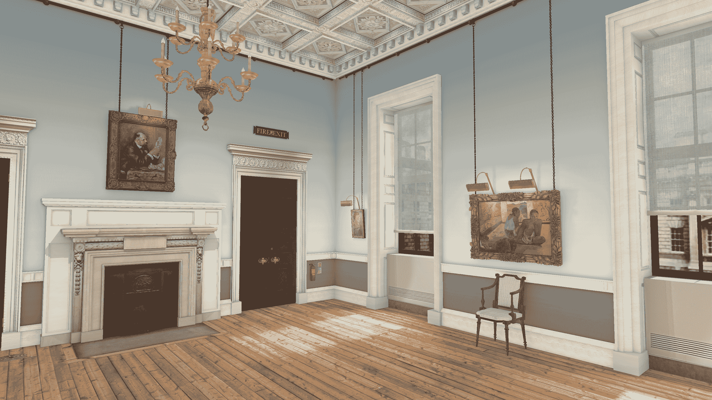

# 随着三星 Gear TechCrunch 的 Woofbert VR 应用程序的推出，博物馆藏品进入了虚拟现实

> 原文：<https://web.archive.org/web/http://techcrunch.com/2015/11/17/museum-collections-enter-vr-with-the-launch-of-the-woofbert-vr-app-for-samsung-gear/>

随着新 WoofbertVR 应用程序的发布，博物馆和画廊世界正在进入虚拟现实的第一步，该应用程序于今天在由 Oculus 支持的三星 Gear VR 上发布

.

该公司有一个令人惊叹的应用程序，很快就可以带用户参观几个拥有世界上最好的艺术和文物收藏的大型博物馆。

该公司首次向下载该应用的用户提供免费参观 [Courtauld Gallery](https://web.archive.org/web/20230116194130/http://courtauld.ac.uk/gallery) 最著名房间的机会，该画廊收藏了伦敦最著名的艺术藏品之一。

该画廊位于滑铁卢桥附近泰晤士河以北的一个弯道上，收藏了印象派和后印象派的杰作，包括高更、雷诺阿、马奈和莫奈的作品。

通过应用程序上的第一项服务，用户可以获得由作者[尼尔·盖曼](https://web.archive.org/web/20230116194130/http://www.neilgaiman.com/)(Woofbert 的投资者)讲述的房间画作的语音导游。

## 第一笔

两年半前，该公司的联合创始人兼首席执行官罗伯特·汉姆威(Robert Hamwee)在复活节假期与家人一起参观华盛顿国家美术馆(National Gallery)失败后，萌生了创立 Woofbert 的想法。

在一个寒冷的复活节下午，他的两个孩子在博物馆排队等候，为了平息他们的抗议，Hamwee 取消了旅行，他想知道虚拟现实是否可以解决他的审美问题。

该公司的联合创始人一直在阅读 [Ready Player One](https://web.archive.org/web/20230116194130/http://readyplayerone.com/) ,并对虚拟现实可能为艺术教育和欣赏带来的机会感兴趣……并为那些可能永远不会看到这些艺术世界宝藏的人开放世界上最伟大的博物馆。

通过关系，Hamwee 认识了公司的联合创始人兼首席运营官 Elizabeth L. Reede，她曾在纽约的[现代艺术博物馆](https://web.archive.org/web/20230116194130/http://www.moma.org/)担任助理馆长。

2014 年期间，两人开始接触艺术界和虚拟现实开发领域的联系人。里德联系了她在苏富比等拍卖行和博物馆的朋友和同事，包括[巴恩斯基金会](https://web.archive.org/web/20230116194130/http://www.barnesfoundation.org/)、大都会艺术博物馆、泰特美术馆[、史密森尼博物馆](https://web.archive.org/web/20230116194130/http://www.tate.org.uk/)和国家美术馆。

Hamwee 说，虽然所有这些机构都希望将他们的收藏带入虚拟现实，但他们缺乏运营预算和员工来实现这一目标。

“每个人都说了同样的话，”里德回忆起她与画廊老板和策展人的第一次会面；“这太不可思议了，我们很想看看它将如何与博物馆合作。”

在早期，Reede 将 Oculus 的早期黑匣子版本从其第一个开发工具包拖到世界各地的博物馆和会议室……无论她去哪里，都会引起机场安检的注意。

## 处理画布

从与咨询提供商开发的早期内部原型开始，Reede 和 Hamwee 联系了三星和脸书，看看他们是否可以将项目推向下一个阶段。

这两位虚拟现实先锋在洛杉机的 [Reload Studio](https://web.archive.org/web/20230116194130/http://reload-studios.com/) s 向团队介绍了该公司。据两位创始人称，通过使用他们的虚拟现实开发实验室(被称为 Rascal ), Hamwee 和 Reede 能够进一步完善他们的技术平台，同时为 Reload 首席执行官 James Chung 提供了进入博物馆和艺术世界的机会。

Hamwee 说:“博物馆最感兴趣的是开放。"很快，一个拥有智能手机的印度小孩就可以游览卢浮宫了."

该团队设想与虚拟现实空间中的其他玩家合作，如 [Altspace](https://web.archive.org/web/20230116194130/http://altvr.com/) 或 [DiscoverVR](https://web.archive.org/web/20230116194130/http://www.discoveryvr.com/) ，最终将讲解员实时带入这个虚拟环境，提供博物馆藏品的教程。

到目前为止，该公司只是在 Courtauld Gallery 提供 Wolfson Room 供观众娱乐，但 Reede 表示，每隔 4 到 6 周就会有新的内容出现在网站上，该公司已经在与大约 85 家博物馆和画廊洽谈，将他们的收藏带入虚拟现实。

## 销售的艺术

Hamwee 拿出了自己的大部分财富来资助公司，但 Woofbert 确实从朋友和家人那里筹集了额外的 300 万美元种子资金(如盖曼和奥斯卡奖得主凯文·史派西)。

最终，Hamwee 和 Reede 设想 Woofbert 从许多不同的渠道获得收入。可能会有应用程序内购买艺术品、用户付费的导游服务，甚至可能会有一个新艺术家出售虚拟现实作品的市场。

Spacey 是 Woofbert 公司管理团队之外的最大股东，也是创意顾问。

该公司的价值主张不仅仅是画廊导游。Woofbert 正在开发一整套教育产品，它将提供给学校和那些想更多地了解世界伟大艺术作品的临时用户。

“我们现在正在开发货币化平台，我们将检查何时有意义打开，”里德说。

除了钱，伍夫伯特还想为用户提供一系列新功能，包括进入画作并从画布内部观察他们的世界的能力(我将该功能与黑泽明梦里的场景进行了比较，在那里他进入了一系列梵高的画作)。

[https://web.archive.org/web/20230116194130if_/https://www.youtube.com/embed/TgSIRjyQOgA?feature=oembed](https://web.archive.org/web/20230116194130if_/https://www.youtube.com/embed/TgSIRjyQOgA?feature=oembed)

视频

“策展人希望能够解释这个故事以及他们试图讲述的内容，”里德说。“画廊的每个元素都经过精心设计:离地面的高度，画作之间的间距；在现代艺术博物馆，有 15 种色调的现代艺术博物馆白。[谷歌文化学院](https://web.archive.org/web/20230116194130/https://www.google.com/culturalinstitute/)很棒，但是他们不能给用户这种体验。我们想把它放在外面。博物馆和文化组织对此感到兴奋。”