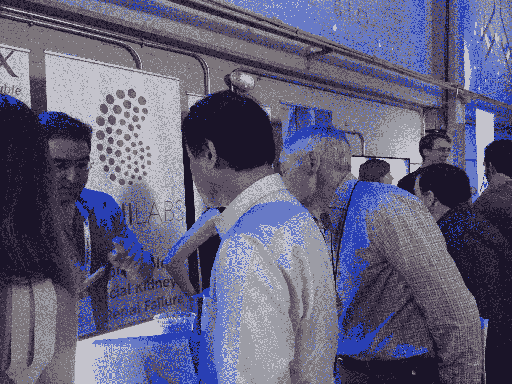
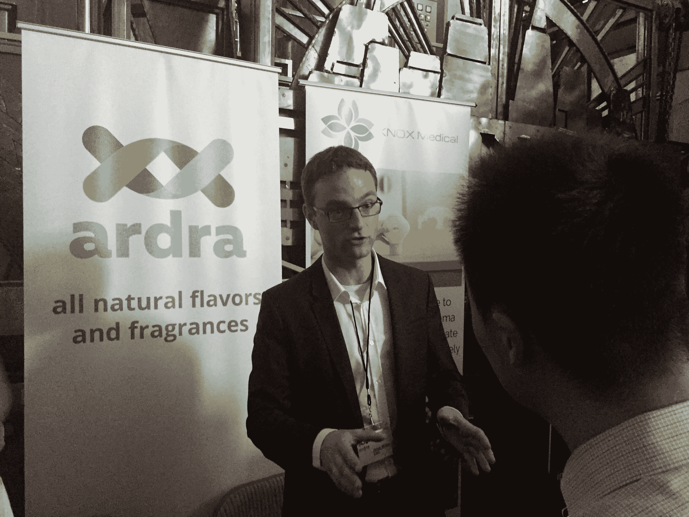

# 蘑菇皮革、微型寨卡病毒探测器和实验室制造的母乳在 IndieBio 的第三个演示日首次亮相 

> 原文：<https://web.archive.org/web/https://techcrunch.com/2016/07/14/mushroom-leather-tiny-zika-detectors-and-lab-made-breast-milk-debut-at-indiebios-third-demo-day/>

今天下午，旧金山市中心的福尔松街铸造厂挤满了人，人们涌入参观 Indibio 第三次展示日的最新创新。

加速器的演示日增长如此之快，我们现在[在 TechCrunch](https://web.archive.org/web/20221006033828/https://beta.techcrunch.com/2016/07/12/watch-the-indiebio-demo-day-here/?ncid=rss&utm_source=feedburner&utm_medium=feed&utm_campaign=Feed%3A+Techcrunch+%28TechCrunch%29&sr_share=twitter) 上直播。

但就在几年前，SOS Ventures 推出了唯一的纯生物技术加速器。从那时起，许多加速器和风险公司开始对这个领域产生浓厚的兴趣，但 Indiebio 仍然是业内许多人期待的怪异和有趣的想法，如 3D 打印动物器官和制造更好啤酒的生物反应器。

第三场活动也不例外，初创公司在舞台上展示了更多大胆的想法，包括蘑菇皮衣、一种口香糖大小的寨卡检测工具和实验室制造的人类母乳。

在这里，我们向您展示了 IndieBio 第三批中的所有 15 家创业公司:

[myco works](https://web.archive.org/web/20221006033828/http://www.mycoworks.com/)——myco works 利用蘑菇创造皮革的天然替代品。他们的材料是性能工程，无动物，可持续，成本有竞争力，该公司表示，它在鞋类和时装方面有三个合作伙伴。在展示日，他们展示了他们的奶牛大小的“my cornel”，在三周内长出相当于一整张牛皮的东西。

[SyntheX Labs](https://web.archive.org/web/20221006033828/http://www.synthexlabs.com/)——SyntheX 使用一种叫做“合成致命性”的东西来治疗目前无法治愈的癌症。这家初创公司声称，其平台可以在一个培养皿中测试超过 100 亿种蛋白质变体，以创造新的治疗方法。SynthX 表示，它正在与多家制药公司洽谈，并拥有有希望的数据，包括一种新的进化的抗癌机制，他们希望在未来几个月内发表。

[艾娃实验室](https://web.archive.org/web/20221006033828/http://www.avawinery.com/)——艾娃承诺不用葡萄克隆高端葡萄酒。它通过分析精选葡萄酒的分子特征，并将其重建为与更昂贵葡萄酒的生物识别匹配，如 11，000 美元的 1973 年 Montelena Chardonnay。艾娃的克隆葡萄酒预售一空，已经筹集了 250 万美元，并计划在六个月内开始向他们的第一批客户运送葡萄酒。

[诺克斯医学诊断](https://web.archive.org/web/20221006033828/http://knox.co/)——诺克斯希望在孩子开始哮喘发作之前就预防他们。它创造了一个医院级别的哮喘管理工具，可以在家里提供预测性的见解。到目前为止，他们对 80 名哮喘患者进行了研究，并开始对 500 名 UCSF 患者进行研究，他们计划在 2017 年春天之前，在 FDA 批准后，随着他们的产品推出。

[阿斯特罗纳生物技术公司](https://web.archive.org/web/20221006033828/http://www.astronabio.com/)–食物中毒是当今严重的全球性问题，每年有超过六分之一的人食物中毒。AstRoNA 发明了一种手持式检测器，用于检测可能被污染的食品，可以在食品生产的每个阶段现场使用。他们说你可以使用这个工具“从田间到餐桌”，在一个小时内给实验室准确的结果。AstroNA 还与四家食品公司建立了试点项目。它希望在年底前为首次大规模销售筹集 170 万英镑。

——bio nascent 正在为非母乳喂养的婴儿制造他们所说的生物同一性母乳配方。它通过制造在人类母乳中发现的蛋白质来做到这一点，他们希望这可以为基于乳制品的婴儿配方奶粉提供一种替代品。他们说，他们已经与供应商建立了关系，可以推出他们的第一款产品，重点是实验室研究市场，随后计划在三年内获得 FDA 的批准。

[朱顶红](https://web.archive.org/web/20221006033828/http://amaryllisnucleics.com/)——朱顶红希望通过加速 RNA 的发现来帮助研究人员。孤挺花说，它可以将 RNA 测序的时间减半，成本降低 8 倍，以加快癌症诊断、药物开发和食品安全。孤挺花说，到目前为止，它已经完成了超过 25 万美元的销售，目标是明年在国际上销售。

[MiraculeX](https://web.archive.org/web/20221006033828/http://miraculex.co/)–MiraculeX 希望通过促进植物生产这些甜味剂来培育下一代健康美味的蛋白质甜味剂。这家初创公司背后的团队表示，其天然蛋白质没有卡路里，没有苦味，味道比糖更好。MiraculeX 计划在今年年底推出其首款蛋白质甜味剂，并希望在明年推出更多的蛋白质甜味剂。

OneSkin Technologies——OneSkin 已经在实验室开发出据称是真实的人类皮肤。OneSkin 表示，它可以按照种族和年龄复制皮肤，以开发一系列个性化的护肤品。这家初创公司还声称已经与一家大型化妆品公司建立了第一个客户关系，它的目标是在一年内推出自己的抗衰老化妆品系列，实现个性化护肤。

[柳叶杯](https://web.archive.org/web/20221006033828/http://willowcup.com/)——柳叶杯从拿铁泡沫开始，正在打造一系列植物性牛奶产品。这家初创公司希望利用获得专利的植物蛋白库来颠覆以植物为基础的牛奶行业。它还表示，到目前为止，它已经与旧金山的 10 家经销商建立了关系并开展销售，正在寻求进军全国市场。

[Endura Bio](https://web.archive.org/web/20221006033828/http://www.endurabio.com/)——加州还在干旱中，水在金州是珍贵的。Endura 正在创造一种农业喷雾，以激活作物的抗旱能力，从而减少 33%的用水量，目前正在加利福尼亚州进行实地试验，以测试这项技术。

[Ardra](https://web.archive.org/web/20221006033828/http://www.ardrabio.com/)–天然香精香料是全球价值超过 230 亿美元的市场中增长最快的类别。Ardra 声称，其酶技术使他们能够以比任何其他天然替代品更低的成本和更高的利润生产香料。Ardra 表示，他们能够在第一个产品的头四个月内达到商业产量数字，从而缩短了产品开发周期数年。

[mFluidX](https://web.archive.org/web/20221006033828/http://mfluidx.com/)–寨卡是一种可怕的疾病，与母亲在怀孕期间感染的婴儿的小头症有关。巴西是一个疾病高发的国家，因为今年八月世界将在那里举办夏季奥运会。mFluidX 创造了一种口香糖大小的诊断芯片，以取代庞大的实验室仪器进行 DNA / RNA 分析，并声称它可以在实地检测寨卡病毒。mFluidX 表示，其免电力一次性芯片的成本比当前技术低 1000 倍，可以快速部署到任何地方诊断传染病。它的第一个合作伙伴是在巴西发现寨卡病毒的病毒学家。

[jung la](https://web.archive.org/web/20221006033828/http://jungla.bio/)——jung la 自称是世界上对基因组中未知意义的变异的最佳预测者，从癌症开始，通过结合机器学习和专有的蛋白质功能图谱。这家初创公司表示，它与一家知名测序公司、一家领先的基因组诊断公司和美国最大的心脏病医院建立了合作伙伴关系

[qid ni Labs](https://web.archive.org/web/20221006033828/http://qidni.com/)–qid ni 是一种植入式人工肾。这家初创公司刚刚在猪身上完成了首次成功的临床前试验，并计划明年完成临床前试验，并在未来五年内上市。