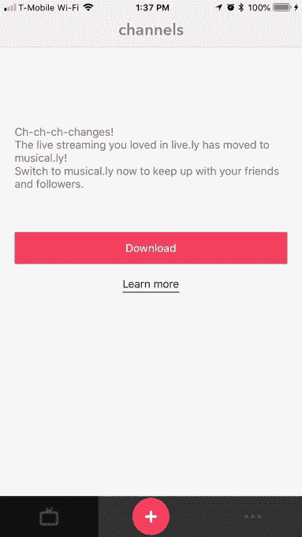
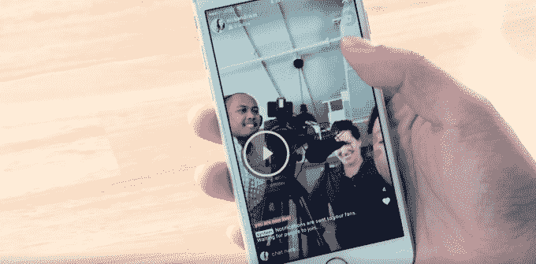

# Musical.ly 终止其独立直播应用 Live.ly 

> 原文：<https://web.archive.org/web/https://techcrunch.com/2018/06/13/musical-ly-kills-its-standalone-live-streaming-app-live-ly/>

Musical.ly 正在将其两年前的直播平台 Live.ly 的功能合并到其主应用程序中，并在过渡过程中禁用了 Live.ly 的独立应用程序。该公司向 TechCrunch 证实，Live.ly 应用程序最终将从 App Store 和 Google Play 下架。Live.ly 用户无法上线，而是收到一条关于这些变化的消息，通知他们直播现已转移到 Musical.ly。

这一变化也通过 Live.ly 的应用商店更新文本得到了证实，其中写道:

> Live.ly 正在成为 musical.ly 的一部分！
> –您现在就可以在 musical.ly 上直播了！那里有大量的实时内容！

Live.ly [于 2016 年 5 月首次推出，](https://web.archive.org/web/20230320220333/https://techcrunch.com/2016/05/27/musical-ly-launches-live-ly-for-livestreaming/)为 Musical.ly 用户提供了一个直播平台，用户可以直接在 Musical.ly 上以及 Live.ly 移动应用程序中观看流媒体。

当视频创建者流式播放时，他们会看到有多少人在观看，当观众“喜欢”他们的内容时，他们会看到心在屏幕上浮动——这种体验与 Twitter/Periscope 和脸书直播非常相似。观众还可以与流媒体工具聊天，进行实时对话。

不幸的是，对于 Live.ly 用户来说，几乎没有关于关闭的警告，而且似乎对一些人来说，Musical.ly 上的直播没有像预期的那样工作。

一名 Live.ly 的常规用户[在 YouTube 上发布了关于关闭](https://web.archive.org/web/20230320220333/https://www.youtube.com/watch?v=e_1hR8ahS4w)的帖子，抱怨说在她按照指示切换到 Musical.ly 进行直播后，没有人在线观看，也没有出现喜欢和评论。这似乎是某种故障，因为观众、喜欢、评论和其他 Live.ly 核心功能正在向其他已经过渡到基于 Musical.ly 的直播体验的人显示。

不是每个人都可以直接在 Musical.ly 上直播，因为直播支持的增加是分阶段推出的。

然而，该公司表示，尽管 Live.ly 被关闭，但仍致力于投资直播功能。我们被告知，大部分直播观众已经在 Musical.ly 的主要应用程序上观看了，因此该公司将直播视频与 Musical.ly 以其闻名的其他短的对口型视频整合在一起是有意义的。

Live.ly 的关闭是 Musical.ly 产品在 2017 年 11 月被中国媒体公司 Bytedance 以高达 10 亿美元的价格收购[后的第一次重大变化之一。](https://web.archive.org/web/20230320220333/https://techcrunch.com/2017/11/09/chinas-toutiao-is-buying-musical-ly-in-a-deal-worth-800m-1b/)

在其新的所有权下，Musical.ly [启动了一项 5000 万美元的基金](https://web.archive.org/web/20230320220333/https://techcrunch.com/2017/12/19/musical-ly-launches-50-million-creator-fund-build-out-its-community/)来帮助建立其创作者社区，但也面临着[批评](https://web.archive.org/web/20230320220333/https://www.buzzfeed.com/katienotopoulos/musically-blocked-tags-related-to-self-harm-and-eating?utm_term=.yma7NoY91#.thVxQrO94)内容审核[能力差](https://web.archive.org/web/20230320220333/https://medium.com/s/parenting-stories/porn-is-not-the-worst-thing-on-musical-ly-5df07ab842af)——鉴于其大部分观众是儿童，这一点尤其令人担忧。

它现在也面临着一个新的威胁:这个月，[脸书开始测试 Musical.ly 的竞争对手](https://web.archive.org/web/20230320220333/https://techcrunch.com/2018/06/05/facebook-lip-sync-live/)的对口型现场演唱。

加剧的竞争可能是 Musical.ly 整合资源的一个原因，以便专注于其旗舰应用程序，而不是其衍生产品。

据报道，主要的 Musical.ly 应用程序拥有 2 亿注册用户，其中 6000 万人每月活跃。

到目前为止，Live.ly 已经被下载了 2600 万次，其中 87%是在 iOS 上下载的。根据 Sensor Tower 的数据，美国占了大约 70%的安装量。