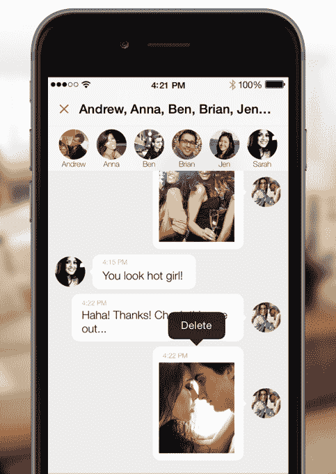

# Mustbin 的新应用程序将安全私人消息与云存储相结合技术崩溃

> 原文：<https://web.archive.org/web/https://techcrunch.com/2015/03/05/mustbins-new-app-blends-secure-private-messaging-with-cloud-storage/>

[Mustbin](https://web.archive.org/web/20221202151245/http://mustbin.com/) 是一款移动应用程序，最初是智能手机摄像头捕捉到的个人文档和其他信息的安全组织者，如今随着 [Mustbin 2.0](https://web.archive.org/web/20221202151245/http://mustbin.com/) 的发布，该应用程序在私人移动信息领域的竞争迈出了更大的步伐。这款新应用现在提供了许多让它有别于许多竞争对手的功能，包括“取消发送”信息、拍摄和存储从未出现在手机相机胶卷中的照片的能力，以及从 Mustbin 提供的云存储服务中快速获取私人文档的能力等等。

该公司[去年首次在其应用程序](https://web.archive.org/web/20221202151245/https://beta.techcrunch.com/2014/05/28/personal-data-organizer-mustbin-raises-1-5-million-more-adds-secure-messaging/)中引入了消息传递组件，同时增加了 150 万美元的资金，使其总筹资达到 600 万美元。

最初，该公司的想法是提供移动第一的安全存储服务，其中包括“箱子”——意思是文件夹——在那里您可以存储个人数据，如账单、发票、钱包里的卡片副本、健康信息、银行对账单、收据等。该应用包括各种工作流程，帮助您捕获、记录和共享各种类型的文件。

如今，许多用户使用手机摄像头记录这类纸质物品，但这并不是一个理想的解决方案，因为照片可能很难组织起来，以后也很难在你的相机中找到，而且它们最终可能会同步到云服务，比如苹果的 iCloud，事实证明它很容易受到黑客攻击。

[gallery id = " 1127916，1127915，1127914，1127913，1127912，1127911"]

虽然很有用，但是仅仅依靠 Mustbin 的安全存储服务可能还不足以保持该应用与谷歌硬盘或 Dropbox 等大型云服务的竞争力。这就是为什么添加安全消息功能很有意义，它允许用户对他们的安全文件做更多的事情——比如通过端到端加密与他人共享这些文件。

现在，该公司在安全信息方面加倍努力，引入了一些相关功能，如“打开查看”和“拿回来”。前者通过推送通知的方式保护你的私人信息内容不被他人看到——相反，该应用程序只是告诉你，你收到了一条安全的信息。要查看它，你必须打开应用程序并输入你的个人识别码。与此同时，“收回”作为“短暂”信息的替代功能，允许用户收回他们已经发送的信息，以便从其他人的设备上删除。

另一个选项“秘密相机”可以让你拍下从未出现在手机相机胶卷中的照片——这可以用于捕捉数据和文件，但当然也可以用于拍摄更私人的照片。

此外，用户现在可以更轻松地共享他们已经存储在 Mustbin 上的个人照片或文件，而不必与另一个用户共享整个文件夹(“bin”)。也支持群聊。

这些新功能推出之际，一些更受欢迎的移动通讯应用的安全性出现了问题，包括最近被黑客攻击的的 [Whatsapp，以及也被证明容易受到安全漏洞](https://web.archive.org/web/20221202151245/http://techcabal.com/2015/02/25/whatsspy-goodbye-whatsapp-privacy/)影响的 [Telegram。](https://web.archive.org/web/20221202151245/http://www.csmonitor.com/World/Passcode/2015/0224/Private-chat-app-Telegram-may-not-be-as-secretive-as-advertised)

Mustbin 首席执行官 Satyender Mahajan 指出，除了使用端到端加密，Mustbin 还可以在设备本身上加密内容。“[客户端加密]一直是我们的标志……因此，即使有人得到了你的设备，你的数据也不会泄露，”他说。

但他解释说，Mustbin 正试图以一种不会让它看起来像一个“沉闷”的平台的方式来提供这种级别的安全性。

“我们正试图为隐私带来一种更常识性的方法，”他说，并指出今天的一些应用程序似乎是为极端偏执的人设计的。“我们认为应该有更多的灵活性——人们会希望回顾对话。他们会希望回顾内容…但同时，我们希望在你的手机中创建一个安全的飞地，”Mahajan 补充道。

未来，该应用还将包括更多“有趣”的信息功能，如支持贴纸、表情符号、gif 和视频等。这些也可以帮助该公司产生收入——今天该应用程序提供 8 GB 的免费存储空间，但在某些时候它也可能对额外的存储空间收费。

Mahajan 说，尽管它转向了消息传递，但存储组件不会消失。“存储提供了明显的差异化。他说:“没有多少人拥有这种混合信息和云平台。”

Mustbin 已经发展到近 10 万用户，可以免费下载 iOS 和安卓系统。