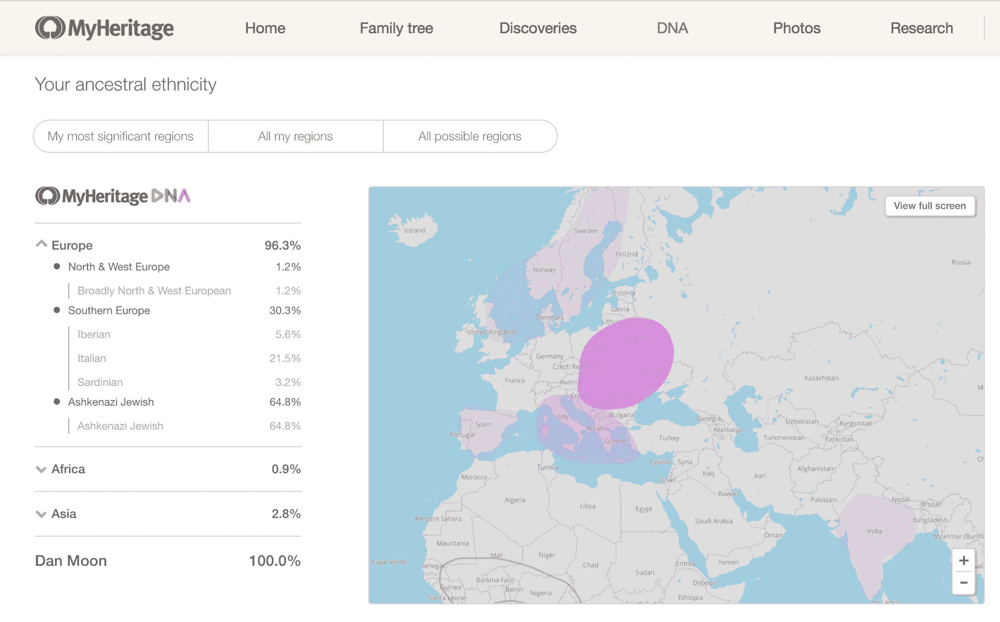
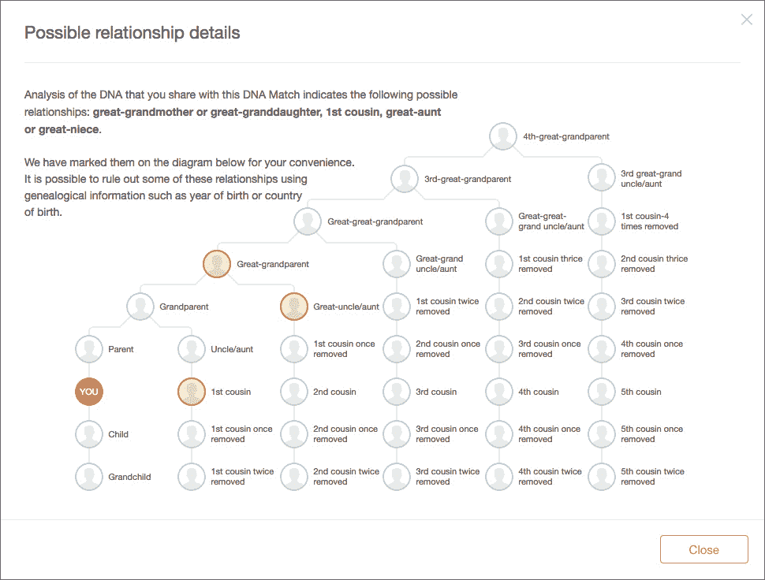

# MyHeritage 推出 DNA 测试服务，帮助你揭开家族历史

> 原文：<https://web.archive.org/web/https://techcrunch.com/2016/11/07/myheritage-launches-dna-testing-service-to-help-you-uncover-your-familys-history/>

流行的在线家谱服务 [MyHeritage](https://web.archive.org/web/20230326023647/http://www.myheritage.com/) 今天宣布推出其 [MyHeritage DNA](https://web.archive.org/web/20230326023647/http://www.myheritagedna.com/) 服务，以帮助其用户发现更多关于其家族历史和种族的信息。目前这项测试的费用为 79 美元(外加运费)，参加测试的用户将获得一份详细的种族报告，该报告将绘制他们家庭的种族和地理来源，如果可以的话，该报告还将显示潜在的 DNA 匹配，以便在该服务上寻找亲属。

正如 MyHeritage 首席执行官兼创始人吉拉德·贾菲特告诉我的那样，他认为 DNA 测试是家族史的未来。他说，测试本身是基于一个简单的刮脸颊测试，不应该超过一两分钟。不过，得到结果需要更长的时间。该公司位于美国的实验室大约需要三到四周的时间才能将结果反馈给用户。

目前，该公司的报告包括 25 个种族，但计划将这一数字迅速增加到 100 多个种族(随着 MyHeritage 收集更多数据，它也将使用这些新的更详细的信息更新旧的 DNA 报告)。为了给 DNA 数据库播种，MyHeritage 正在运行它所谓的“创始人群体项目”作为其中的一部分，它已经向世界各地的现有会员发送了 5000 套免费的 DNA 试剂盒。

MyHeritage 拥有来自 8500 万注册用户的 21 亿份资料和 70 亿份历史记录的庞大数据库，已经拥有大量数据，可以让这些新的 DNA 信息变得更有价值。多亏了这些混合的数据，Japhet 希望这些测试很快不仅能告诉你你的血统是部分希腊和部分意大利的，还能告诉你你的家庭过去可能生活在希腊的哪个岛上。“你喜欢寒冷的夜晚和下雪的日子，却没有人知道为什么？，”贾菲特说。“我们发现你有 15%的芬兰血统——也许这可以解释这一点！人们总是想更多地了解自己，而 DNA 在这方面非常棒。”

MyHeritage 预计，其 DNA 研究将能够提供比竞争对手更高的分辨率(想想[血统](https://web.archive.org/web/20230326023647/https://www.ancestry.com/dna)和[23 和我](https://web.archive.org/web/20230326023647/https://www.23andme.com/dna-ancestry/?utm_source=google&utm_medium=cpc&utm_campaign=Search-Branded&utm_content=23c_Search_Paid_Brand&gclid=Cj0KEQjwqfvABRC6gJ3T_4mwspoBEiQAyoQPkdtvqDTBxJ3Y3u81STHGPrXQSyTLCxOXy0AJLKSZIwcaAomV8P8HAQ))，但对于已经参加竞争测试的用户，该公司将允许他们将数据导入 MyHeritage 的数据库，并获得免费报告。

正如贾菲特所强调的，MyHeritage 将自己视为一家科技公司。到目前为止，MyHeritage 已经筹集了 4900 万美元的风险投资，Japhet 告诉我，该公司目前的年收入在 5000 万至 1 亿美元之间。正如贾菲特告诉我的那样，该公司能够以比竞争对手更低的价格提供其 DNA 试剂盒，因为它希望能够随着时间的推移将一些客户转化为 MyHeritage 的付费用户——凭借数百万现有用户的数据库，它也已经有了大量的潜在客户进行 DNA 测试，所以它也不需要投入大量的市场营销。

“DNA 对我们目前的用户很有吸引力，他们希望了解更多关于他们的家族史，”他说。“但这也吸引了一个全新的人群:年轻人，他们对能从自己的 DNA 中学到什么感到好奇。它给了他们毫不费力的答案，关于他们的种族和家族历史。我们认为这将吸引大量的新顾客到家族历史。DNA 和我们现有业务之间的协同作用是巨大的，这使我们拥有追加销售的能力，并比许多竞争对手更具优势。”

