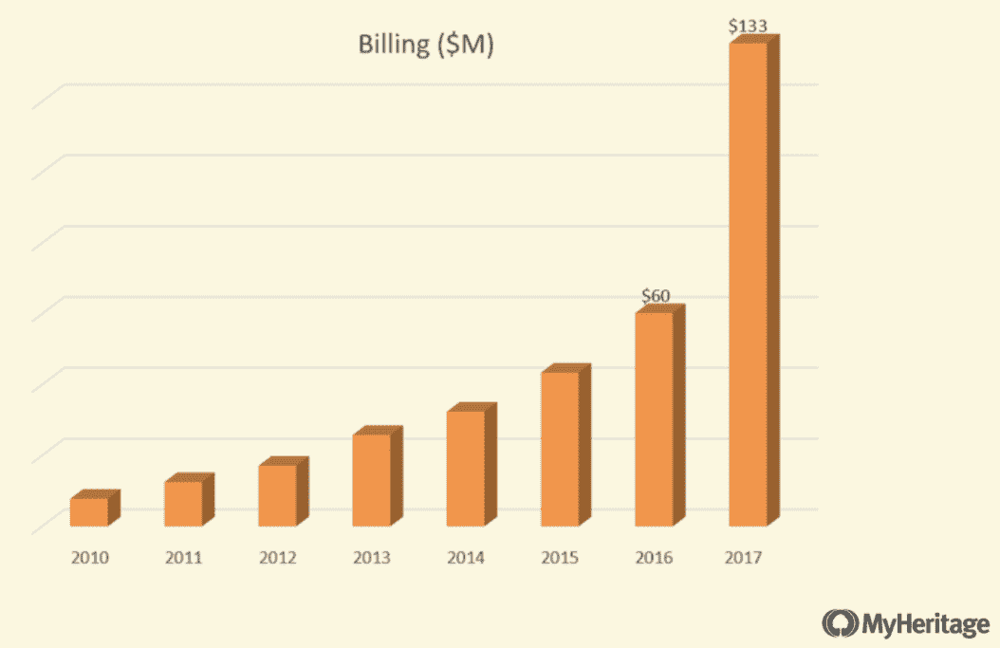
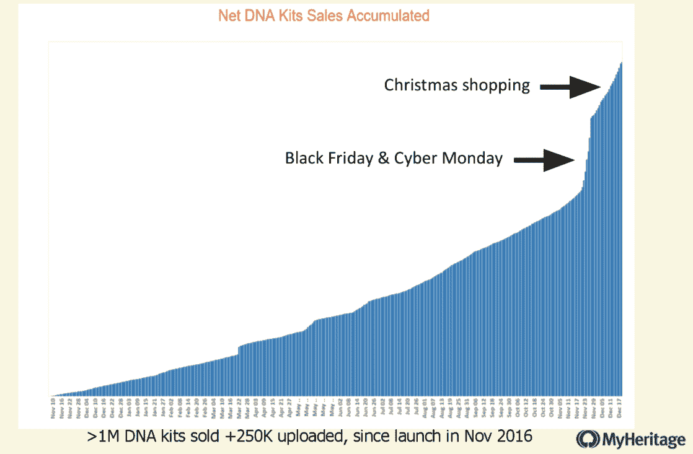
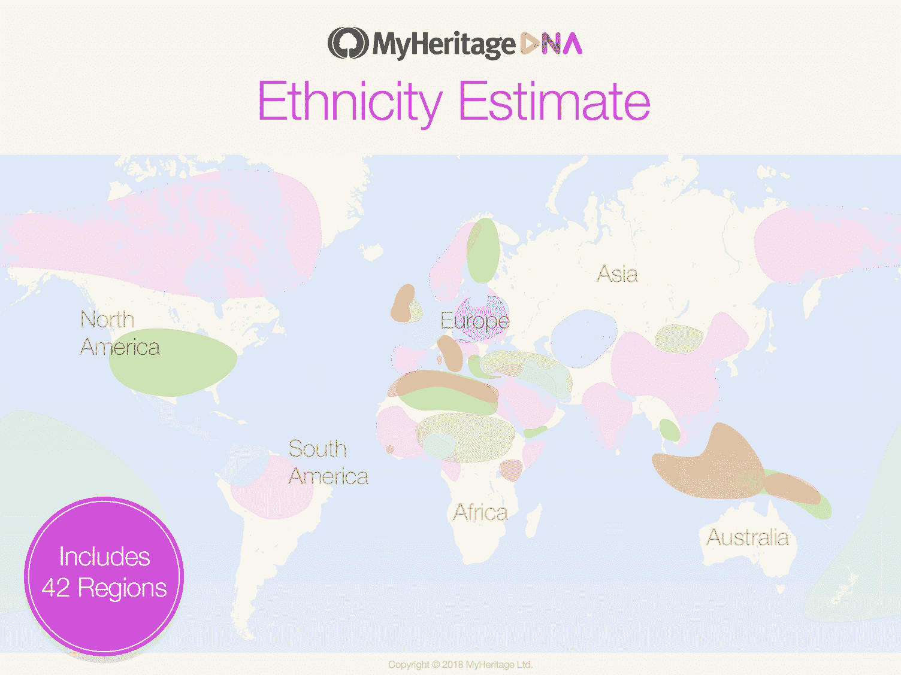
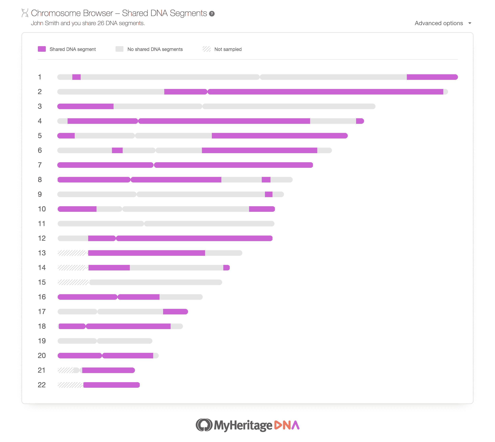

# MyHeritage 表示，去年售出了超过 100 万套 DNA 试剂盒，年收入增长至 1 . 33 亿美元

> 原文：<https://web.archive.org/web/https://techcrunch.com/2018/01/22/myheritage-says-it-sold-over-1m-dna-kits-last-year-annual-revenue-grew-to-133m/>

乍看之下，家谱似乎是你退休后的一个安静爱好，但它也是一个大行业，像 Ancestry、MyHeritage、Helix 等都在争夺新用户。你可能会认为这些公司没有什么可以真正区分彼此的，但他们都在构建家谱的核心主题上提供了稍微不同的旋转。

在过去的几年里，Ancestry 和 MyHeritage 也通过 DNA 测试服务扩展了他们的业务——不是帮助你发现潜在的健康问题，而是帮助你找到你的亲戚，告诉你你的家人来自哪里。不出所料，这为这些公司创造了许多新的商机。

本月早些时候， [MyHeritage](https://web.archive.org/web/20230404173220/https://www.myheritage.com/) 首席执行官吉拉德·贾菲特(上图)向我们展示了他的公司的财务状况和[其 DNA 服务](https://web.archive.org/web/20230404173220/https://www.myheritage.com/dna)的成功，该服务在 2016 年假日购物季之前推出。

该工具包经过处理后，可以让用户详细了解他们的种族，目前可以细分为大约 42 个地区，随着公司从用户那里收集更多数据，计划中还会有更多。MyHeritage 还可以使用这些数据来发现其他也参加了测试的亲戚，他们可能你甚至都不认识。

在过去的一年中，MyHeritage 售出了超过 100 万套 DNA 试剂盒，DNA 销售收入为 5800 万美元。加上 MyHeritage 更传统的家谱业务的 7500 万美元订阅收入——该业务现在有超过 50 万付费订户(平均每年支付 150 美元)——该公司 2017 年的总收入为 1.33 亿美元。这一数字高于 2016 年的 6000 多万美元。该公司 2017 年的利润为 1810 万美元。

仅在假期期间，MyHeritage 就售出了 40 万套 DNA 试剂盒，而 2016 年 11 月和 12 月仅售出 3.6 万套。

“你不能把订阅放在圣诞树下，”贾菲特开玩笑说，并补充说，平均用户目前购买不到两个套件——他希望这个数字在未来会达到 3 到 4 个。

虽然 DNA 销售是该公司最近增长的主要原因，但值得注意的是，该公司的订阅业务也在逐年增长 30%至 40%，保留率超过 75%。

鉴于购买 DNA 试剂盒的人通常会转变为 MyHeritage 的付费用户，并且因为 my heritage 现有的用户群包括对使用该公司的试剂盒最感兴趣的人，这两种产品还会相互加强。贾菲特告诉我，目前 DNA 试剂盒使用者的转化率是两位数——这是有意义的，因为你需要一个家谱来充分利用这些数据。

当该公司在 2016 年推出 DNA 服务时，它面临着一个先有鸡还是先有蛋的问题。毕竟，除非你已经有了大量数据，否则你无法真正告诉人们他们的祖先来自哪里——但除非你能做到这一点，否则你的用户不太可能对产品满意。因此，为了启动这一进程，MyHeritage 允许用户上传现有的测试，该公司还向一些现有用户发送了免费的 DNA 工具包。

贾菲特解释说:“我们创建了一个创始人群体项目，在这个项目中，我们使用家谱来识别看起来像是在同一个地区居住了很长时间的家庭。”正是 DNA 数据和家谱数据的结合，让该公司的数据科学家能够建立一种模型，告诉你你的家人是从英国还是西欧的其他地方搬到美国的。

贾菲特公开承认，最初的结果并不太好，因为尽管公司可以为你匹配直系亲属，但一旦你找到了第四代表兄弟姐妹和类似的远亲，就会出现问题。此外，该服务仍然没有那么多的数据，也没有投资建立自己的 DNA 和数据科学团队。

从那时起，该公司在去年从 310 名员工增加到 420 名，其中许多人是公司科学团队的一部分。“DNA 很难，它吸引了优秀的人才，”贾菲特告诉我。“我们建立了一个非常强大的科学团队，目的是创新和构建算法。”

现在这个团队已经就位，它也在致力于开发新产品。例如，最近，MyHeritage 已经开始进行调查，这将允许该公司将其 DNA 数据与其他特征联系起来，如一个人的眼睛颜色或他们是左撇子还是右撇子。它的用户已经回答了超过 400 万个问题。

“你需要一个庞大的、信任的用户群，你需要确保你尊重这种信任，永远不要滥用它，”贾菲特说。

随着时间的推移，这里的想法是利用 DNA 结果为你建立尽可能多的家谱。“一些系谱学家不想要银弹，如果不花 40 年的努力，这是不值得的，”贾菲特说。“但是越多的人被吸引进来，它的价值就越大。我们让每个人都更容易了解家族历史，包括年轻人。”

除了 DNA 项目，MyHeritage 还希望在未来收购更多公司。Japhet 指出，他认为家谱的 DNA 市场可能会整合成三个强大的参与者(不出所料，他认为 MyHeritage 将是其中之一)。

Japhet 认为，新公司推出 DNA 试剂盒的大门几乎已经关闭，但要继续增长——并在地理上增长——赢家必须进行收购。“很难跨越别人已经涉足的领域，”他告诉我。MyHeritage 已经进行了九次收购；很可能十分之一即将到来。

大多数公司不像 MyHeritage 那样分享大量的内部财务数据。他告诉我，在过去的几个月里，他意识到公司没有什么好隐瞒的。

“我不能假装破产，那样会削弱我在谈判中的地位，”他说。“但人们知道我们一直在做什么，知道我们有雄心勃勃的目标，这也很好。”从该公司与我们分享的数据来看，它也有办法实现这些目标。