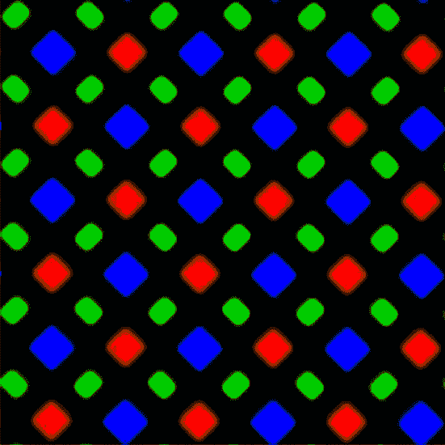

# 神秘的“死亡绿线”出现在一些 iPhone X 显示屏上 

> 原文：<https://web.archive.org/web/https://techcrunch.com/2017/11/10/mysterious-green-line-of-death-appears-on-some-iphone-x-displays/>

# 神秘的“死亡绿线”出现在一些 iPhone X 显示屏上

如果第一代苹果产品的发布没有出现一些小问题，那就不算了——谁能忘记 Antennagate 和 Bendgate 呢？——和 [iPhone X](https://web.archive.org/web/20221207212749/https://beta.techcrunch.com/2017/10/31/review-the-iphone-x-goes-to-disneyland/) 没什么区别。少数用户报告称，他们设备的显示屏上出现了一条神秘且不可分辨的绿线。

上面的图片来自推特用户 [mix0mat0sis](https://web.archive.org/web/20221207212749/https://twitter.com/mix0mat0sis/status/927713433482653696) 、[内特·希吉](https://web.archive.org/web/20221207212749/https://twitter.com/nheagy/status/927325422521434113)和[克里斯蒂安·罗曼](https://web.archive.org/web/20221207212749/https://twitter.com/chroman/status/928308351020171265)，代表了后者所说的“死亡绿线”的几个例子。似乎没有人知道是什么导致了它，或者它实际上有多普遍。我已经要求苹果公司发表评论。

我们至少可以推测其中的一部分。iPhone Xs 的显示屏上有一种新的菱形子像素模式，因此所有绿色子像素都呈直线状，而红色和蓝色交替出现。你可以在这张作为 [DisplayMate 测试](https://web.archive.org/web/20221207212749/https://beta.techcrunch.com/2017/11/06/tests-give-iphone-x-display-top-honors-but-camera-is-merely-competitive/)一部分的图片中看到:

似乎有可能是一些手机的电气故障导致电压流向一行中的所有绿色子像素。它从上到下一直延伸，这表明它是显示器边缘的某个东西向几行像素发送了不正确的电压(如果它只是一行子像素，它会显得更薄)。该线路往往靠近电话的右侧或左侧，但这更难诊断。

这种问题总是出现在大规模使用几种新技术的雄心勃勃的设备中。去年三星也发生过，只不过线是粉色的。即使他们组装的显示器只有 0.001%有故障，这个频率几乎不可能测试，一些用户仍然会以一部坏手机告终。

一个这样的用户已经报告说他们的手机在苹果商店被更换了，所以这似乎不太可能是软件问题。你的手机显示这条线吗？拍张照片让我们知道。那就拿去换吧。