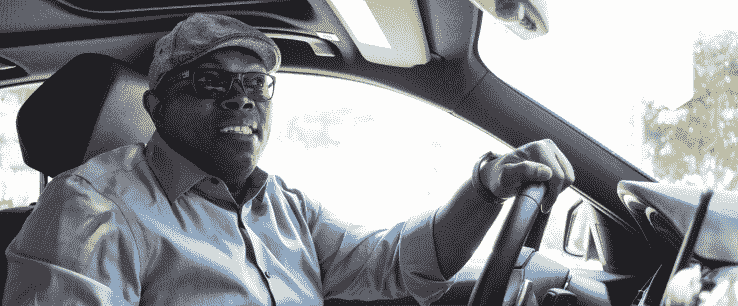

# Mystro 是一款旨在为优步和 Lyft 司机带来更多培根的应用 

> 原文：<https://web.archive.org/web/https://techcrunch.com/2017/08/02/mystro-is-an-app-that-wants-to-bring-in-more-bacon-for-uber-and-lyft-drivers/>

Mystro 希望通过一款应用程序，让优步和 Lyft 的司机每年多赚 33%的钱。

对于随叫随到的司机来说，这是很艰难的，如果他们想获得奖金或者只是带足够的钱回家付房租，路上的每一秒都很重要。但是最大化收益是有一点艺术的，新手需要一段时间来掌握它是如何工作的。互联网上有无数的文章和技巧可以帮助他们做到这一点，但 Mystro 的联合创始人兼在优步工作了三年的资深人士 Herb Coakley 希望从一开始就让路上的每个人都更容易和更安全。

他的应用程序根据每位司机设置的过滤器，帮助司机在最短的时间内连续选择最有利可图的行程。司机所要做的就是告诉应用程序他们准备好出发了，之后就是免提体验了。

Mystro 联合创始人赫伯·科克利

拥有物理学硕士学位，在成为优步司机之前，他一直在洛杉矶拍摄电影，他说他是在人生低谷时产生这个想法的。“当时我正在经历离婚，基本上陷入了一个相当艰难的境地，试图弄清楚我接下来要做什么。”

他在自己的车里睡觉，后来在一个朋友家，他看到了一个优步司机的广告。他很快就加入了，并很快意识到这份工作有多难。

“每个人都说要赚钱，你必须同时为(优步和 Lyft)开车，所以我这么做了，但我开始意识到在应用程序之间来回切换有多难，而且这似乎很不安全。你必须盯着路面，但要在应用程序之间切换，”他说。

Coakley 开始构思一个更好的系统，并询问可信的专家他如何才能做出无缝集成应用程序并实现利润最大化的东西，但每个人都告诉他，如果没有获得许可，就无法开发优步和 Lyft 的 API。

他知道这不太可能，但他还是搬到了旧金山，看看这里的一些开发人员是否能提供帮助。他们没有。Coakley 正要放弃时，他想到在 Craigslist 上登一则广告，看看是否有人能在那里帮助他。他在那里遇到了马特·拉查克。

Rajcok 提议使用 Android 的 [AccessibilityService](https://web.archive.org/web/20221209210150/https://developer.android.com/reference/android/accessibilityservice/AccessibilityService.html) ，而不是基于优步和 Lyft 的 API。这项服务用于安全地指导残疾人使用 Android 应用程序，并被证明是结合优步和 Lyft 驱动程序应用程序的良好来源。

当时，科克利和他的联合创始人德韦恩·肖(Dwayne Shaw)负担不起拉杰科或其他任何开发者的费用，但幸运的是，科克利把这个想法告诉了他的一名乘客、谷歌员工安德鲁·泰勒。泰勒认为这很好。此外，泰勒还碰巧兼职经营一家小型投资公司，并很快给科克利开了一张 10 万美元的支票来开发这款应用。

他用最初的投资雇佣了 Rajcok，将他的用户群扩大到 1 万多人，现在是 Y Combinator 最新一批创业公司的一员。

“过去的六个月是我一生中最奇怪的事情，”科克利在电话里告诉我。

Mystro 目前仅限于拥有安卓手机的司机。不过，科克利表示，他仍在寻找 iPhone 的变通办法，他已经联系了优步，并计划联系 Lyft，看看他们现在是否愿意与他合作。到目前为止，他还没有收到回复，他们总是有可能起诉或试图关闭他正在做的事情。

“我们让我们的律师检查了一下，我们真的做了很多工作，以确保我们在所有事情上都是正确的，”Coakley 说。但他希望优步和 Lyft 将看到他所做的事情是积极的。

“越安全，赚的钱越多，他们就越有可能留在这个平台上。这实际上对每个人都有帮助，”他说。

感兴趣的司机可以免费测试服务，每周最多 10 次。之后每月 12 美元，一年 99 美元。