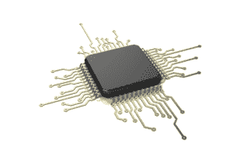

# Mythic 推出一款芯片，可在任何设备上实现计算机视觉和语音控制

> 原文：<https://web.archive.org/web/https://techcrunch.com/2017/03/22/mythic-launches-a-chip-to-enable-computer-vision-and-voice-control-on-any-device/>

对语音命令做出反应的硬件已经存在，可能现在就在你的手里或房子里。无论是智能手机、智能音箱还是可穿戴设备，它都必须连接到云才能提供答案。现在，一家名为 [Mythic](https://web.archive.org/web/20230130100805/http://www.isosemi.com/technology/) (原名 Isocline)的初创公司正在推出一款芯片和软件，将改变这一切，将语音控制、计算机视觉和其他类型的人工智能放入我们的本地设备，不需要云。

据首席执行官兼联合创始人迈克·亨利介绍，总部位于奥斯汀，办公室位于加利福尼亚州雷德伍德城的 Mythic 已经筹集了 930 万美元的风险投资，包括天使资本和 A 轮融资。Mythic 的 A 轮融资由 [Draper Fisher Jurvetson](https://web.archive.org/web/20230130100805/https://dfj.com/) 牵头， [Lux Capital](https://web.archive.org/web/20230130100805/http://www.luxcapital.com/) 、[Data collection](https://web.archive.org/web/20230130100805/http://dcvc.com/)和 [AME 云风险投资](https://web.archive.org/web/20230130100805/http://amecloudventures.com/)参与。DFJ 的 Steve Jurvetson 和 Lux Capital 的 Shahin Farshchi 已经加入了这家初创公司的董事会。

在首轮融资之前，Mythic 已经筹集了约 250 万美元的政府拨款。新的资金将帮助这家初创公司开始将其芯片商业化，这些芯片大约有一个小衬衫纽扣大小，并有专有软件使它们能够与其他处理器和内存一起工作。

*Mythic 的芯片使 AI 功能能够在任何设备上本地运行。*

DFJ 合伙人[Steve Jurvetson](https://web.archive.org/web/20230130100805/https://techcrunch.com/2015/09/28/brainiac-steve-juvertson-on-dfj-elon-musk-and-the-growing-divide-between-rich-and-poor/)是 SpaceX、Tesla 和 Nervana Systems(现为英特尔所有)的早期支持者，他说:

“Mythic 已经建立了一个深度学习或神经网络芯片，它以比我们今天拥有的任何产品都更低的价格、芯片尺寸和功耗水平来实现学习算法。

有了这个，你可以把机器智能放入烤面包机，或者 Roomba，安全摄像头，或者各种以前没有意义的设备，因为你需要持续的互联网连接才能让它有用。"

这位颇具影响力、自称“风投极客”的人认为，Mythic 的市场机会非常广泛。他预言，“工业物联网正在成为这个星球的感觉皮层。工业和企业客户希望利用它来进行检测和质量控制，只要他们有某种传感器节点，无论是摄像头、麦克风、温度传感器还是其他什么。”

Mythic 的技术灵感可以追溯到 2012 年，当时亨利和联合创始人兼首席技术官戴夫·菲克都从不同的实验室毕业，获得了计算机科学博士学位。朋友们打了一个早期的赌，深度神经网络和机器学习方法的软件开发最终将需要我们日常使用的设备和机器中更强大的计算资源。还没有人把它称为“人工智能”，但内部人士正在谈论深度学习，认为它是制造具有类似人类品质的设备的关键。

神话公司的首席执行官和联合创始人迈克·亨利。

这位首席执行官说，今天，这个赌注开始有回报了。“许多设备和应用程序接收了太多数据，无法发送到云中。比如想象一下无人机通过摄像头拍摄的多幅高分辨率图像。他们需要找到的只是涡轮机上的裂缝或干燥的农田。如果他们通过云处理所有数据，并用复杂的算法进行分析，他们会耗尽电池，不得不着陆。我们看到了在设备内部进行本地处理的机会。”

亨利表示，自 2016 年底结束首轮融资以来，该公司一直在积极招聘员工。它将继续这样做，同时争取潜在的试点客户。从长远来看，Mythic 的联合创始人希望将他们的技术带给制造自动驾驶汽车的汽车制造商。然而，这位首席执行官表示，消费电子产品、无人机和机器人公司往往会更快地从设计转向生产，最有可能成为 Mythic 的最早用户。