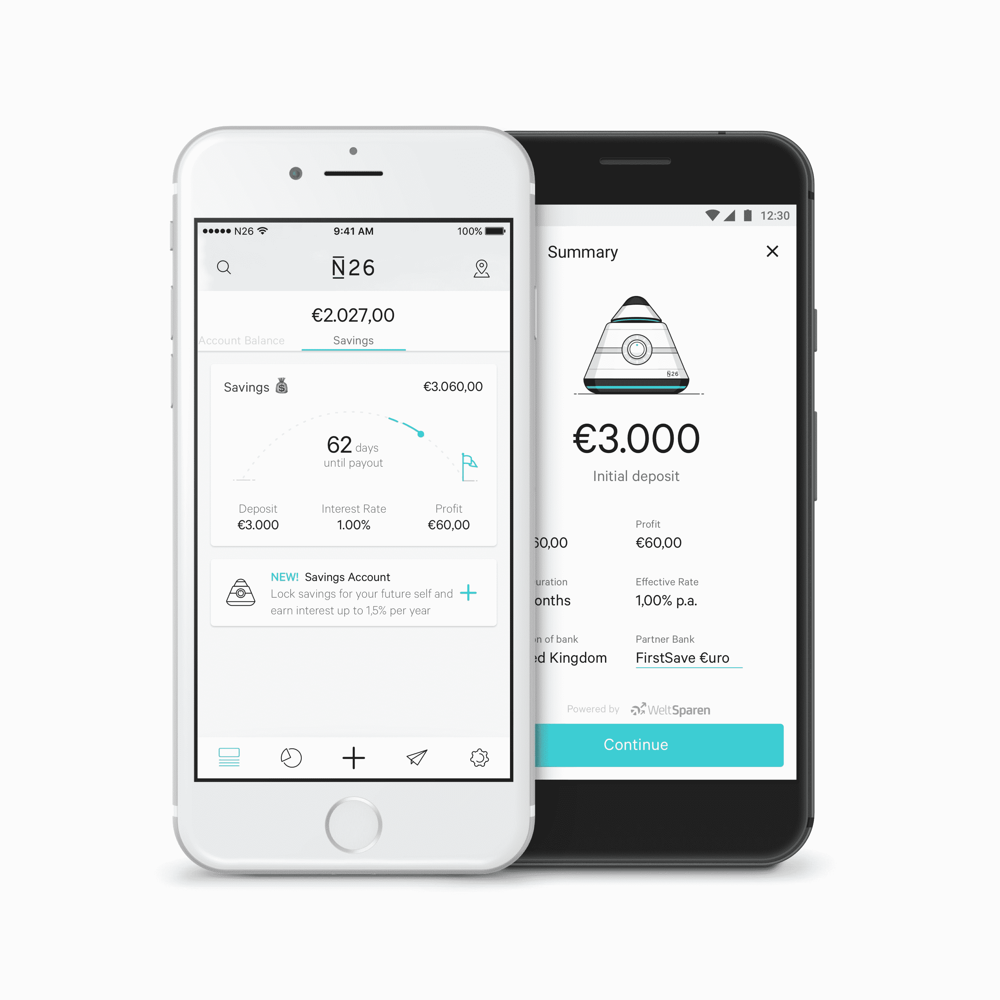

# N26 用葡萄干 推出储蓄账户

> 原文：<https://web.archive.org/web/https://techcrunch.com/2017/05/10/n26-launches-saving-accounts-with-raisin/>

# N26 推出葡萄干储蓄账户

N26 正在推出另一项功能，为欧洲客户打造一家现代化的零售银行。这一次，该公司与德国创业公司 [Raisin](https://web.archive.org/web/20230328185103/https://www.raisin.com/) 合作，也被称为 [WeltSparen](https://web.archive.org/web/20230328185103/https://www.weltsparen.de/) 。只需轻点几下，你就能为你不需要的钱开一个储蓄账户。

Raisin 本身并不建立储蓄账户。相反，该公司正与整个欧元区的金融机构合作，为您寻找最佳利率。所以你可以说你有€10，000 英镑，你愿意存几年。Raisin 可以在葡萄牙或奥地利找到一家银行，这样你就可以得到最优惠的利率。

但是 Raisin 也会为你开户，这样你就不用处理所有的文书工作了。利率取决于您的初始存款和选择的期限。N26 表示，你可以期待高达 1.5%的年利息。

作为欧盟的一部分，国家存款担保计划为您的所有存款提供担保，每家银行最高可达 10 万€。

N26 目前只在德国推出这项功能，但 Raisin 接受其他国家的客户。因此，今年晚些时候，你可以在其他国家看到这一功能。同样，如果你不想把钱卡在储蓄账户上，N26 将在今年晚些时候推出隔夜储蓄。

Raisin 构建了一个 API 来促进 N26 的集成。像往常一样，N26 希望为你的所有金融需求建立一个金融科技中心。这样，你就不必为了大多数功能而离开应用程序。

其他消息，N26 刚刚为意大利招聘了一名国家经理。未来将有专门的团队负责意大利市场以及储蓄、投资、透支等功能。

