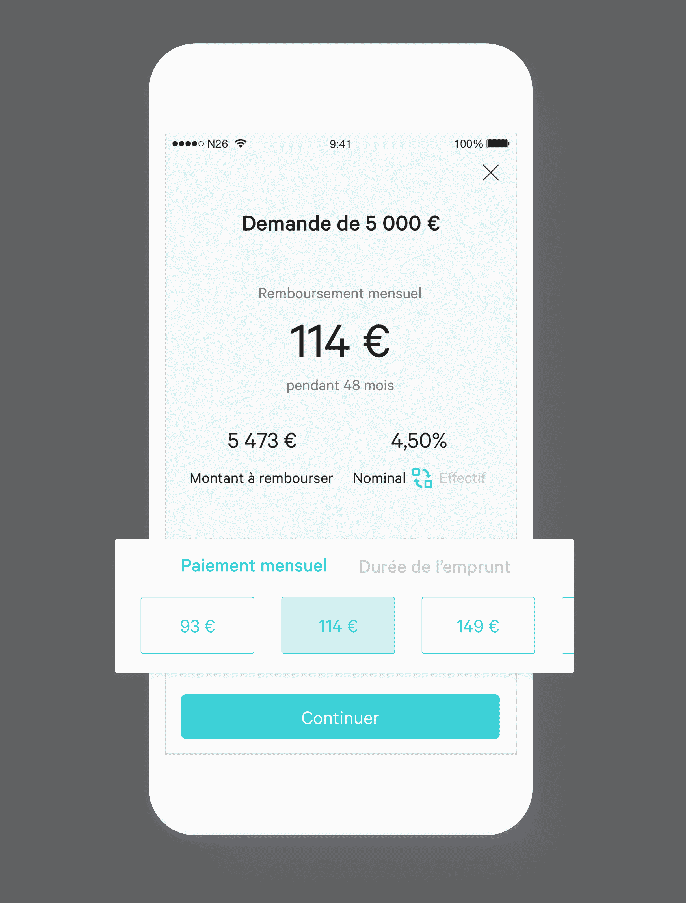

# N26 与优信合作在法国推出信贷服务 

> 原文：<https://web.archive.org/web/https://techcrunch.com/2017/12/11/n26-partners-with-younited-credit-to-launch-credit-offering-in-france/>

# N26 与优信合作在法国推出信贷服务

德国初创公司 [N26](https://web.archive.org/web/20221025222207/https://n26.com/) 现在在 [17 个欧洲国家](https://web.archive.org/web/20221025222207/https://beta.techcrunch.com/2016/12/06/n26-expands-its-bank-of-the-future-to-17-european-countries/)上线，但许多功能首先在德国推出，从未进入其他市场。这家初创公司正在慢慢将核心功能扩展到其他关键市场。这就是该公司与[联合信贷](https://web.archive.org/web/20221025222207/https://www.younited-credit.com/)合作在法国推出消费信贷的原因。

这与德国现有的信贷功能非常相似。在应用程序中，你滑动到信用标签，回答几个关于你自己的问题。你会说出你需要多少钱，如果你是单身或已婚，如果你是房主，等等。

过一会儿，应用程序会给你一个明确的报价，告诉你你借了多少钱，你最终总共要付多少钱，实际或名义利率以及你的月供。

你也可以通过调整还款过程的长度或每月愿意偿还的金额来调整你的信用额度。N26 并没有试图对你隐瞒什么。

如果你不熟悉 Younited Credit，该公司是欧洲领先的众筹平台。这家初创公司最近在最近一轮创始融资中筹集了近 5000 万美元。

在 Younited Credit 的网站上，消费者可以在 24 到 72 个月内从€借到 1，000 到€40，000 英镑的任何贷款，而无需与实际银行接洽。N26 用户可以不受任何限制地访问同一产品。

该平台将这些信用额度与其他愿意贷款的用户以及公司、养老基金、保险公司等进行匹配。而优信认为可以从零开始建立一个高效的信用评级体系。

N26 用户不必注册 Younited Credit 来借钱。所有事情都发生在 N26 应用程序中，使用的是 Younited Credit 的 API。我相信 N26 也会从每笔交易中抽取一小部分。

N26 最近与德国的 Auxmoney 合作，为更多的客户提供信贷服务。这是另一个信贷市场，它表明 N26 愿意与同一领域的多家公司合作，如果有意义的话。N26 希望建立一个全面的金融中心，这样你就可以通过 N26 应用购买各种新的金融产品。

