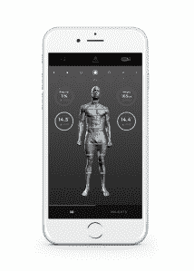

# Naked Labs 凭借人体扫描镜进入健身技术领域 

> 原文：<https://web.archive.org/web/https://techcrunch.com/2016/04/14/naked-labs-enters-the-fitness-tech-fray-with-body-scanning-mirror/>

如果你在镜子里的映像可以告诉你，让你的懒屁股回到健身房，会怎么样？我们有技术。

旧金山一家名为 [Naked Labs](https://web.archive.org/web/20221209125231/https://naked.fit/) 的初创公司今天开始接受 3d 人体扫描系统的预订。

首席执行官兼联合创始人[法尔哈德·法拉巴赫希安](https://web.archive.org/web/20221209125231/https://angel.co/farhad-farahbakhshian)表示，该公司的裸体 3D 健身追踪器是为那些希望用客观数据来衡量他们在一段时间内在身体健康目标上的进展的个人或家庭而设计的。

Farahbakhshian 是一名电气工程师，也是前动感单车教练，他观察到，许多超重的人并不认为自己超重，患有厌食症或食欲过盛等饮食失调症的人认为自己健康，因为他们体内没有足够的脂肪。

“眼睛在聚焦问题区域方面做得非常出色。如果你不小心的话，你会身体变形。而且很难保持动力。这向人们展示了他们真正的进步，或者说“赤裸裸的”真相，”他说。

该设备由一个连接互联网的全身镜和一个无线充电秤组成，前者可以插入普通插座，后者也可以像转盘一样旋转，让用户进行平滑扫描。

裸体手机应用程序将人体扫描显示为灰度 3D 图像。用户身体的精确、逼真的插图与应用程序中的数据一起出现，包括不同区域如何随着时间的推移而改善或下降。

这款应用帮助人们设定目标，如果他们的目标在当今健身和健康专家认为的健康范围内，就会提醒他们。

Naked 跟踪用户身体的指标包括他们的二头肌、小腿、大腿、臀部和腰部的对称性和周长，以及他们的体脂百分比、臀腰比和体重。

该系统采用[英特尔实感](https://web.archive.org/web/20221209125231/https://software.intel.com/en-us/realsense/home) 3D 深度传感器扫描身体，并采用英特尔四核处理器在大约 20 秒内获得高度精确的扫描。

该公司的目标是 20 秒的限制，因为这是人们在市场上已经上市的智能体重秤上称重所需的时间。

Naked Labs 的系统可以同时存储多达 6 个用户的数据。但是，如果你在家里有一个裸体实验室镜子和秤，任何访客都可以下载应用程序，用它进行一次扫描。

这位首席执行官表示，早期客户可以通过 [naked.fit](https://web.archive.org/web/20221209125231/http://naked.fit/) 以 499 美元的价格订购一套 Naked 的系统，但发货要到 2017 年 3 月才会开始。

该公司由法拉巴克希恩和首席运营官[埃德·斯卡特](https://web.archive.org/web/20221209125231/https://angel.co/edsclater)于 2015 年共同创立，已经从投资者那里筹集了一些种子资金，包括[新企业协会](https://web.archive.org/web/20221209125231/http://www.nea.com/about)、[三叶风险投资](https://web.archive.org/web/20221209125231/http://threeleafventures.com/)和 [Monstro 风险投资](https://web.archive.org/web/20221209125231/http://monstro.vc/)，但他们没有透露具体数额。

*更正:这篇文章的早期版本将 Ed Sclater 列为 Naked 的 CTO。他是首席运营官。*