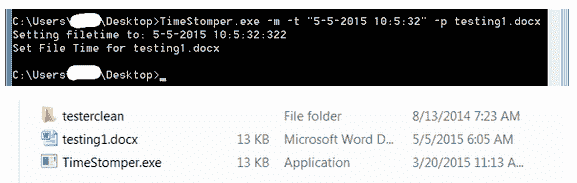
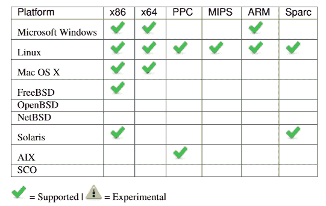

# 泄露的中情局黑客工具的名称和定义 

> 原文：<https://web.archive.org/web/https://techcrunch.com/2017/03/09/names-and-definitions-of-leaked-cia-hacking-tools/>

维基解密托管的“vault 7”据称从中央情报局计算机操作小组内部泄露的文件是行话、不完整信息和断开(或编辑)链接的混乱组合。这些信息很有趣，但是即使使用搜索功能，也很难找到许多术语的基本描述。所以为了方便大家，我浏览了一大堆文档，列出了尽可能多的 spook IT 提到的工具和技术。

如果有任何关于这个东西做什么的指示，我已经把它包括进来了，尽管其中一些只是基于被测试设备的有根据的猜测，来自他们开发者的评论等等。所有数据(如受影响的操作系统版本)都是我在泄露文件中找到的最新文件。图片也全部来自泄密。

我在每个列表的底部都加入了一些看起来很重要，但是没有实际信息的工具。我没有包括链接，因为项目和它们的描述通常分布在多个页面或 pdf 中。我也没有包括商业工具(比如 Lockheed Martin 的 DART 软件测试套件)或操作名称(比如 JQJHAIRPIECE ),它们似乎仅仅是其他工具的特定部署。

**这份名单绝不是全面或权威的**，泄露的文件也不应该被认为是中情局创造和使用的黑客工具的全面。我会更新它，因为我发现更多或东西是未编辑的。

#### 嵌入式开发部(EDB)

 这一分支致力于在 VoIP 电话、工作站等专用设备和电视等智能设备中植入植入物。他们做硬件和软件设计。

*   **翼龙**—“支持媒体复制的定制硬件解决方案”；它使用像 Raspberry Pi 这样的小型单板计算机从资产计算机中复制数据
*   **sparrow hawk**–键盘记录程序，适用于多种架构和基于 Unix 的平台
*   **DerStarke**–苹果电脑的引导级 rootkit 植入
*   **gyr falcon**–跟踪 OpenSSH 连接的客户端并收集密码、用户名和连接数据
*   **SnowyOwl**–使用 OpenSSH 会话向目标资产注入代码
*   **harpy eagle**–获得苹果 Airport Extreme 和 Time Capsule 访问权限的硬件专用工具
*   **bald eagle**——Unix 系统硬件抽象层的漏洞
*   **令人抓狂的耳语**——远程访问被先锋利用的设备
*   **CRUCIBLE**—“自动漏洞识别”工具
*   **yarn ball**——用于部署有效载荷和存储泄漏数据的隐蔽 USB 存储
*   **green packet**–路由器植入套件
*   quark matter——苹果电脑的另一个引导级 rootkit 植入
*   **哭泣的天使**–智能电视植入套件([我们单独写过](https://web.archive.org/web/20221128021444/https://beta.techcrunch.com/2017/03/07/recent-cia-leak-demonstrates-again-the-dangers-of-smart-tvs/)
*   **Hive**–用于 Windows 和 Unix 设置的基本植入套件，旨在“为其他全功能工具的部署提供初始立足点”
*   **Honeycomb**–用于来自诈骗或欺诈代理服务器的数据的服务器
*   **残酷竞争**–虚拟机系统显然是为了托管代理服务器以向其发送资产数据
*   **蜂刺**–用于 HTTP 连接的 iFrame 注入技术
*   **sont aran**–企图入侵西门子 OpenStage VoIP 电话
*   **秘密松鼠(SQRL)**–？？？

#### 远程开发处

没有太多关于 RDB 的数据；列出的唯一工具是用来访问安全数据库的，所以这是一个提示。

*   **um brage**——这个团队似乎已经收集了网络上正在使用的黑客工具和技术，并且还整理了黑客团队泄露的有用代码和文档——有助于黑客的开发或归属
*   **shoulder surfer**–用于从 Microsoft Exchange 数据库中提取数据的工具

#### 行动支助处

除了维护一些有用的通用实用程序之外，OSB 还为单个操作或资产创建定制解决方案，重点是折衷 Windows 机器和应用程序。

*   **时间践踏器**–用于修改文件上的时间戳，以使它们符合操作或资产的要求

*   **Munge Payload**–加密有效载荷和/或修改有效载荷以避免检测的工具
*   magic Mutt–看起来是一个恶意软件风格的 DLL 注入器和进程监视器
*   **Flash Bang**–突破 Internet Explorer 沙盒进程的劫持，然后提升目标机器上的权限
*   **Ricky bobby**–由 dll 和脚本组成的基本 Windows 植入程序，它将其信息发送到 listening post 服务器应用程序 Cal——是的，它们是 Talladega Nights 参考
*   **搏击俱乐部**–一组受感染的 VLC、WinRAR、TrueCrypt、Shamela 和 Microsoft Office 独立安装程序，它们部署了 RickyBobby 实例，用于放置在操作中使用的拇指驱动器上
*   **Melomy drive in**——劫持一个启动 RickyBobby 实例的 VLC DLL——不清楚是不是搏击俱乐部里的那个
*   **造雨者**——被入侵的便携式 VLC 播放器，当从用户的 USB 驱动器启动时，它秘密地从一台有空隙的计算机上收集文件
*   **随机应变**——一套可互操作的工具，用于从 Windows、Mac 或 Linux 机器上收集和过滤数据——具有与操作系统相对应的酒吧主题名称(Margarita、Dancefloor、Jukebox)
*   **基本位**–用于 Windows 机器的键盘记录器
*   **美食**——不完全是软件，但很明显是一个菜单，操作人员可以从中订购一个定制的操作工具——例如，一个在 Mac 上启动并搜索所有音频文件的假 PDF
*   **hammer drill**–CD/DVD 监控工具，当文件被写入光盘时，它也允许文件被破坏
*   **收税员**–？？？
*   **鬣狗跨栏**–？？？

#### 自动植入分支

AIB 似乎关心自动运行的植入物。其中许多都没有文档或描述，但有文件列表，揭示了一点他们的目的。

*   **青蛙王子**–完全集成的植入系统，包括命令和控制、监听站和植入软件
*   **Grasshopper**–高度可配置的工具，用于在 Windows 机器上放置各种植入物( **Cricket** 是相对的)
*   **卡特彼勒**–用于准备从安全运输系统获取的文件的工具
*   AntHill 似乎是一个用于已安装植入物的文件管理组件
*   吉布森似乎是指挥控制服务器和监听站的组成部分。
*   **Galleon**–一套导航主题脚本和工具，用于安全地将文件复制到目标计算机
*   **刺客**—?？？
*   **铁甲**—?？？
*   **坎迪芒廷**–？？？
*   **大黄蜂**–？？？
*   **瀑布**—?？？
*   **魔术表演**–？？？

#### 网络设备分支

这个分支完全是关于路由器和交换机的，从工业级设备到家用设备，所有这些都需要设备或类特定的利用和套件。泄露的内容主要包括高度技术性的测试结果和开发者说明，这些内容仅仅暗示了软件的功能。

*   **奶油煎饼卷**–用于 Linksys 设备的植入物
*   **wag 200g**–Linksys 路由器的植入安装程序，与煎饼卷一起工作
*   **Slasher**–似乎是一个端口监视器
*   **肉桂**–植入思科路由器
*   **伯爵茶**——另一个可能用于思科路由器的植入物
*   **aqua man**–植入基于 Linux 的系统，尤其可能是路由器(HGs 或家庭网关)
*   **Bumble**–植入惠普路由器
*   英仙座似乎是一个使用 PowerPC 架构的路由器的植入物
*   **Panda Poke**–针对华为路由器设备的“无凭证”利用(即不需要登录凭证)
*   **熊猫飞行**—华为设备的秘密隧道工具
*   **熊猫喷嚏**——用途不明，但与 PandaMitt、PandaScore 和其他产品一样属于熊猫套件
*   **ChimayRed**–用于攻击运行 RouterOS 的 MikroTik 路由器的漏洞，该漏洞允许在设备上安装有效负载
*   Felix 似乎是 MikroTik 路由器的监听站
*   **HG**–可能是 HunGrrr，用于访问远程网络设备的通用工具；在许多测试和项目中用作组件或步骤
*   布兹弗兹–？？？
*   **细胞溶解**-?？？
*   **Powerman**–？？？

#### 非分行特定项目

这些没有被列在任何特定的分支下，尽管有些提到在一个或另一个的管辖下，或者基于 EDB、NDB 等地的一个项目。

*   **after midnight**——似乎是一种 Windows 权限提升方案，使用一个 DLL 来获取另一个 DLL 的访问权限(一个“小妖精”)
*   **pack rat**–使用开源和商业软件创建和自动化监听站的工具
*   **roid rage**–适用于高达 5 的 Android 设备的植入/利用。X
*   **The.Net**–网络配置工具，在一组虚构的公司(保护伞公司、洗涤公司等)中模拟真实世界的互联网和内部网条件。)
*   **Philosoraptor**–不清楚，但“明确的目标”是展示新工具套件的商业价值，以及使用合法的操作软件产品进行自动化测试
*   **Marble Framework**–修改源文件的混淆工具，这样就无法追踪到开发人员或团队
*   北海巨妖似乎是任务管理和项目跟踪的组织工具
*   **flux wire**–承包商提供的分布式/网状网络工具(带有[丰富的文档](https://web.archive.org/web/20221128021444/https://wikileaks.org/ciav7p1/cms/files/Fluxwire_manual-3.5.0.pdf))，用于组织连接的资产，支持 9 个操作系统和 6 个架构

*   **茧**—?？？
*   **震颤**–？？？

#### iOS 特定的

 有些工具看似只针对移动端，但这些很大程度上是针对 iOS 设备的。

*   **Adderall**–从 iOS 设备中提取文件和内核缓存的工具
*   **elder piggy**–权限提升工具
*   **夜视**–读取并记录设备的内核内存
*   **night skies**–iOS 植入，通过 CrunchyLimeSkies 安装
*   **麦乐鸡**——iOS 植入物的任务控制实用程序
*   **HAMR**—“投掷”浏览器漏洞的框架
*   **dr boom**–用于 iOS 8.2 以上版本的单步植入安装程序

#### Android 专用

一些漏洞被提及，但被编辑，所以他们不在这里列出。

*   **AngerQuake** (更名为 anger management)——用于远程利用 Android 设备的 HAMR 相关插件的集合
*   **Orion**–Android 设备的远程利用
*   **free droid**–权限提升工具

本文将持续更新。您是否找到了这些工具的更多信息？在下面评论或者联系作者。