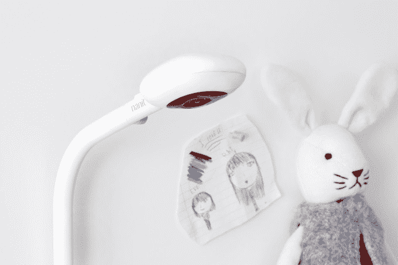
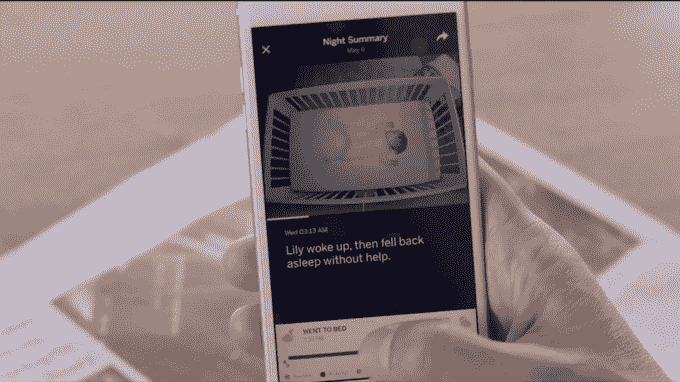
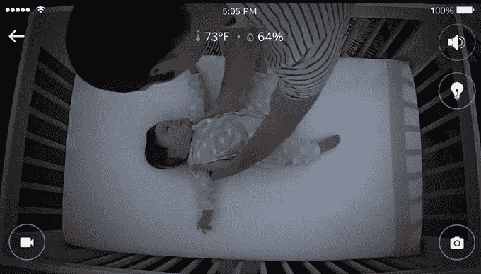

# Nanit 比您更了解宝宝的睡眠状况 

> 原文：<https://web.archive.org/web/https://techcrunch.com/2016/06/15/nanit-knows-more-about-how-your-baby-sleeps-than-you-do/>

如果一个简单的摄像头捕捉机器学习的数据可以告诉你一个人接近围栏的威胁级别，会怎么样？如果同样的相机和计算机组合可以对杂货店购物者的行为进行分类，并判断诸如购买意图、决策麻痹的存在以及识别所需产品的容易程度，会怎么样？在图像识别和处理能力进步的推动下，可以对人类行为进行分类而不仅仅是观察的智能相机可能是物联网的下一步。

Nanit 是这一领域的首批公司之一。阿萨夫·格雷泽博士自己也是一位家长，他和他的团队正在努力消除父母最繁重的任务之一的痛苦，确保他们的孩子晚上睡个好觉。

这台三盎司重的相机连接在一个 10.5 磅重的底座上，底座将相机悬挂在一个婴儿床上。与学术界有联系的高科技初创公司往往很难找到市场利基，并向普通消费者展示他们的技术。格雷泽经历了 200 多项设计，以确保他的产品与众不同。睡眠不足的父母不必担心设备充电或更换电池。他们只需将低压设备插入墙壁。

Nanit 应用程序具有可选的洞察力，可以直观地分析婴儿的睡眠模式，包括婴儿运动的热图。不幸的是，没有订阅，父母将只能从婴儿床使用 Nanit 进行直播视频。Nanit Insights 使用四个关键指标为父母生成可爱的彩色编码睡眠分数:睡眠模式、父母干预、睡眠开始时间和总睡眠时间。

从计算机科学的角度来看，Nanit 正在宣传机器学习的一个相当令人印象深刻的消费者应用。大多数空间中的变量数量会使行为分析几乎不可能。对 Nanit 团队来说幸运的是，几乎所有婴儿床床垫的尺寸都一样。这使得相机的参数可以标准化，这样计算机就可以将空间分解成可以精确分析的小块。

当父母第一次拆箱他们的 Nanit 婴儿监视器时，有一个简单的校准过程。一旦父母完成了这个过程，将相机放在支架上，他们就不必再回去调整系统了。

此外，Nanit 还包括一个方便的夜灯，白噪声发生器，自然声音发生器和电缆管理系统。除了睡眠，婴儿监视器还可以跟踪湿度、温度、声音和运动。

Nanit 的支持者包括来自前期风险投资的马克·苏斯特，以及来自 RRE、645 Ventures、雅各布技术学院、Flex 和杨致远的 AME 云风险投资公司的参与。迄今为止，该公司已经筹集了 660 万美元的种子资金。

智能婴儿监控领域仍然非常活跃。像 [Owlet](https://web.archive.org/web/20221208141401/https://www.crunchbase.com/organization/owlet#/entity) 、 [Mimo](https://web.archive.org/web/20221208141401/https://www.crunchbase.com/product/mimo-2#/entity) 和 [Sproutling](https://web.archive.org/web/20221208141401/https://www.crunchbase.com/organization/sproutling#/entity) 这样的公司生产婴儿可穿戴设备，但受到组件和传感器的限制。许多父母不愿意让他们的婴儿在衣服上戴上相当于苹果手表的东西。像 [Dropcam](https://web.archive.org/web/20221208141401/https://www.crunchbase.com/organization/dropcam#/entity) 这样的设备不会对行为进行分类。它们仅限于捕捉实时镜头和在另一个设备上生成像素表示。Nanit 的婴儿监视器非常强大，因为它可以在不添加物理传感器的情况下为设备添加新的分析功能。格雷泽的目标是继续提高洞察力，并致力于根据数据提供个性化的育儿建议。

虽然对行为科学感兴趣的人很容易发现 Nanit 的婴儿监视器令人兴奋，但质疑该设备不仅通知父母而且影响行为的能力至关重要。

关于 Nanit 如何影响最佳实践的一个早期想法源于它检测孩子醒来后重新入睡的能力。这种知识可以防止父母在不需要的时候冲到婴儿身边，只会进一步吵醒他们的孩子。

Nanit 将于今天开始通过直销电子商务进行[预购。该公司计划在美国制造第一批 15000 台设备，以缩短产品到达父母手中的时间。之后，该公司计划将生产转移到海外。](https://web.archive.org/web/20221208141401/https://www.nanit.com/)

预购价格为 279 美元，可选择订阅 50 美元的 Nanit Insights。预购期过后，该显示器的零售价将为 349 美元，订阅价格将提高到 100 美元。家长将有 30 天的时间来决定是否继续他们的年度订阅。