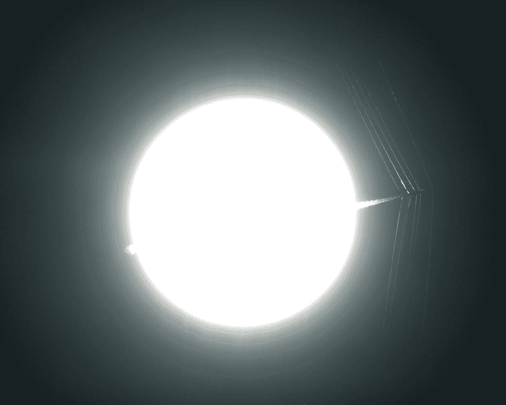
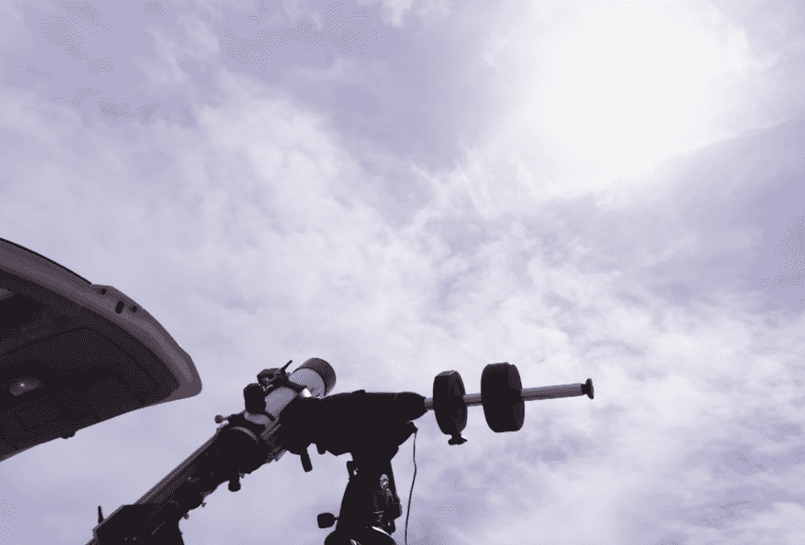

# 美国宇航局工程师盯着太阳看超音速飞行产生的冲击波 

> 原文：<https://web.archive.org/web/https://techcrunch.com/2017/12/18/nasa-engineers-stare-at-the-sun-to-see-shockwaves-from-supersonic-flight/>

在今年夏天的日食之前，美国宇航局一遍又一遍地警告我们不要直接盯着太阳看——但现在他们正在这么做。它的研究人员重新发明了一种超过一个世纪的摄影技术，[使用太阳本身作为背景](https://web.archive.org/web/20221025223552/https://www.nasa.gov/centers/armstrong/feature/NASA_advances_schlieren_imagery_for_supersonic_aircraft.html)，以便捕捉一种新的超音速喷气式飞机产生的冲击波。

[纹影成像](https://web.archive.org/web/20221025223552/https://en.wikipedia.org/wiki/Schlieren_imaging)是德国物理学家在 19 世纪发明的一种捕捉以超音速运动的物体的方法；它的基本工作原理是跟踪微小的扭曲，以获得均匀的背景照明，这种照明是在空气被经过的物体干扰时产生的。

结果是惊人的，你可能以前见过。但是传统的纹影成像在其范围和规模上受到限制；美国宇航局的“使用天体的背景定向纹影”(BOSCO)允许太阳本身被用作背景，不仅如此，它足够可靠，可以从 10，000 英尺高的追逐飞机上使用。

另一张来自 NASA 的纹影照片使用太阳边缘作为均匀的背景；BOSCO 使用光盘本身

以前用于观察飞行中飞机变形模式的面向背景的纹影成像技术是从上往下拍摄的，背景是一片毫无特色的风景，或者是从下往上拍摄的，使用太阳的边缘(如上图所示)。但是 BOSCO 将望远镜直接对准了太阳的圆盘，在它引起日偏食时捕捉到了飞机。

为了不被完全吹出，相机系统使用了“氢阿尔法过滤器”，它只让非常特定波长的光通过，这是由太阳以漂亮的颗粒状图案产生的。

你可以在这个视频中看到它的作用，它起到了双重作用，提醒你许多科学是在绝对不光彩但却令人敬畏的环境中完成的:

[https://web.archive.org/web/20221025223552if_/https://www.youtube.com/embed/0eimg8IMsGA?feature=oembed](https://web.archive.org/web/20221025223552if_/https://www.youtube.com/embed/0eimg8IMsGA?feature=oembed)

视频

多酷啊。(虽然我不得不说，从美学角度来说，电影摄影的平滑渐变更适合这种类型的图像。)

不要在家里尝试这个

不过，他们这样做不仅仅是为了好玩。BOSCO 是美国宇航局安静超音速技术计划的一部分，该计划旨在(你可能已经猜到了)制造一种超音速飞机，无论它去哪里都不会产生令人烦恼的音爆。这种飞行器可以帮助消费者重返超音速飞行，甚至可以走陆路。

然而，未来的低吊杆飞机可能会在 60，000 英尺左右飞行，但由于地面系统很难捕捉到如此高飞行的飞机的良好照片，该团队需要创造一些从空中创造这种图像的东西。

因此，最新的进展是部署了一种新的小型化 BOSCO，可以安装在追逐飞机的机翼吊舱中。这使得研究人员可以从近 10，000 英尺的高度捕捉图像，而目标飞机实际上是在目标高度飞行。

BOSCO 首席研究员迈克·希尔在美国宇航局的新闻发布会上说:“我们的主要目标是近距离观察图像，包括我们可以分辨出哪种冲击波结构。”“我们需要使用我们新的紧凑型相机系统，以便使用一个更小的系统来了解这些冲击波的图像质量。”

新的设置就是上面视频中测试的内容；你看到的飞行高度是 20，000 英尺，但随后的飞行高度是 15，000 英尺和 10，000 英尺，这证明该技术在空对空射击中可能遇到的范围内有效。

当然，从第二架飞机的机翼上清晰地拍摄一架超音速喷气式飞机本身就是一个重大挑战——但至少他们知道相机是工作的。