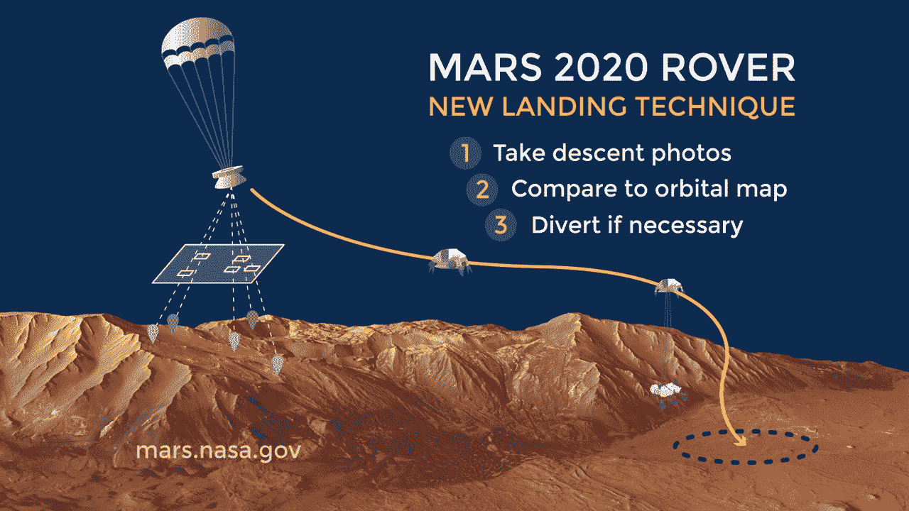

# 美国宇航局投入 4400 万美元用于低温技术和空中航天器回收

> 原文：<https://web.archive.org/web/https://techcrunch.com/2018/08/08/nasa-puts-44-million-towards-cryogenics-and-mid-air-spacecraft-retrieval/>

# 美国宇航局投入 4400 万美元用于低温技术和空中航天器回收

美国国家航空航天局宣布了一系列与几家美国航天公司的公私合作项目，总额高达 4400 万美元。蓝色起源(Blue Origin)、宇航机器人技术(Astrobotic Technology)、联合发射联盟(United Launch Alliance)等公司分别获得了高达 1000 万美元的资金，用于各种旨在安全高效地探索和利用太空的项目。

这 10 个奖项是授予美国宇航局称之为“临界点”的技术，这些技术非常有前途，但需要资金进行地面或飞行演示——换句话说，就是让它走出实验室。

ULA 是这里的大赢家，在三个项目中获得了 1390 万美元——1000 万美元将用于研究低温车辆流体管理系统，该系统可以简化和改进月球着陆器。其余的资金被分配给另一个用于长期任务的低温流体项目，以及一个“在从轨道速度返回地球的飞行器上展示高达 8000 磅的空中回收能力”的项目真的吗，最后一个是最便宜的？

蓝色起源已经获得了 1300 万美元，主要用于…另一个月球着陆器的低温流体管理系统。你可以看到美国宇航局的优先事项是什么——把靴子放在风化层上。剩下的钱将用于测试一套先进的传感器，这些传感器可以让登月变得更容易。该公司将在高达 100 公里的 New Shepard 车辆上测试这两个系统。

另一个 1000 万美元的大奖颁给了 Astrobotic Technology，该公司将像蓝色起源一样，致力于开发一种用于地形相对导航的传感器套件。它基本上是给飞行器的着陆装置增加了智能，因此它可以根据实际观察到的当地条件，自主改变其着陆位置，实施安全措施等等。

火星 2020 漫游车将使用自己的 TRN 系统，这里资助的系统将有所不同，可能更先进，但美国宇航局的这张 gif 图很好地说明了这项技术:

NASA 还选择了其他几个项目进行资助，你可以在合作公告页面找到它们，以及上述项目的更多技术细节。(自然，我的老同事艾伦·博伊尔在 GeekWire 的文章中有很多额外信息[。)](https://web.archive.org/web/20230329012425/https://www.geekwire.com/2018/blue-origins-lunar-lander-program-wins-share-nasas-tipping-point-tech-awards/)