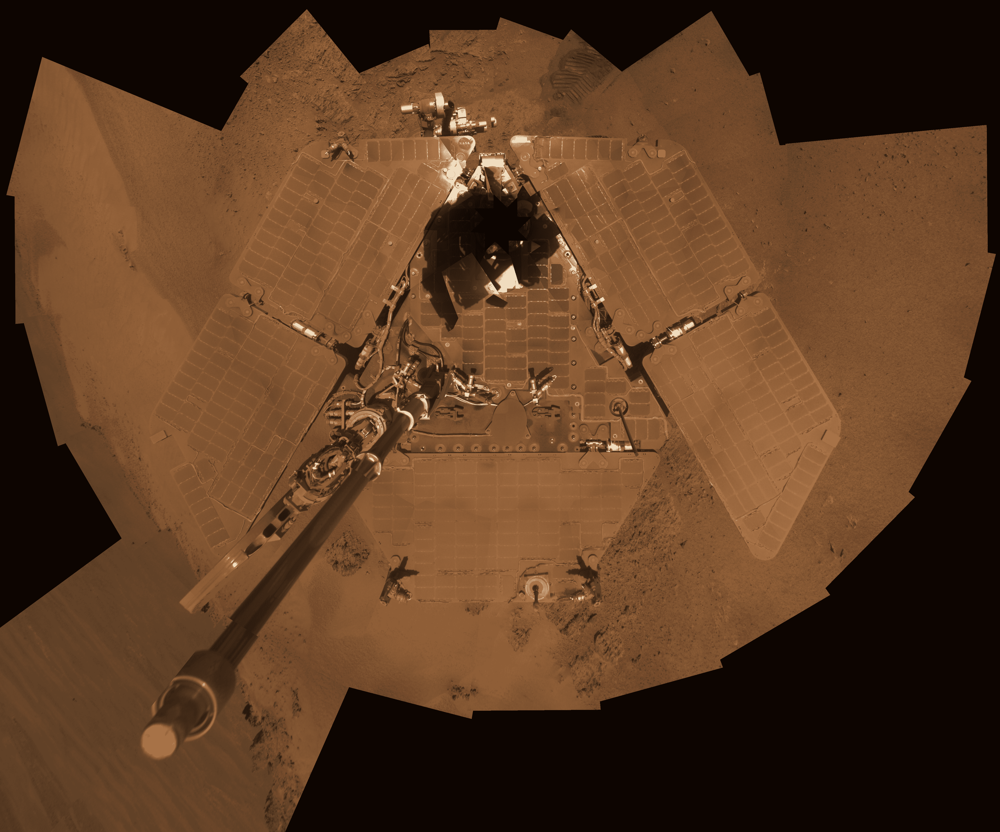
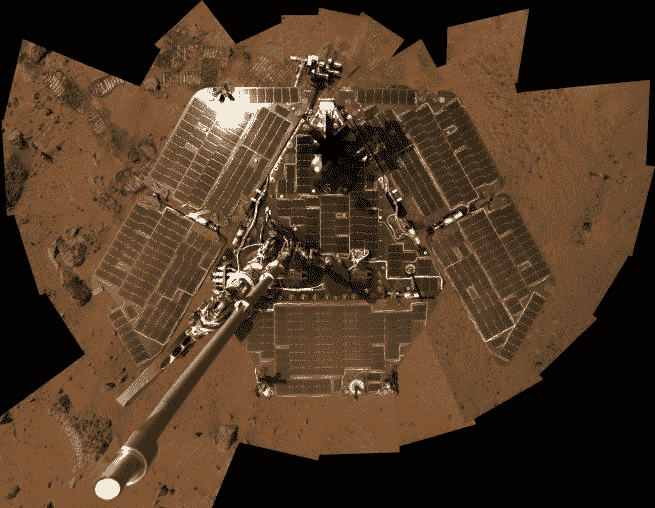

# NASA 火星车设计持续 90 天庆祝 12 周年

> 原文：<https://web.archive.org/web/http://techcrunch.com/2016/01/28/nasa-rover-designed-to-last-90-days-celebrates-12-year-anniversary/>

本周，美国宇航局的火星机遇号探测器庆祝了它在这颗红色星球上的 12 周年纪念。真正值得注意的是，火星车的设计只能运行大约 90 天。

由于不可预见的表面条件和一些创造性的软件变化，美国宇航局一直能够保持机遇号存活并运行至今。

在离开地球六个半月的旅程后，机遇号进入火星大气层，并于 2004 年 1 月使用降落伞、反推火箭和一个安全气囊安全着陆。

美国宇航局认为火星车只能在火星上正常工作 90 天的原因之一是因为火星上灰尘的极端水平。这些灰尘预计会在机遇号的太阳能电池板上堆积，最终，漫游者将无法接收电力。

火星离太阳的距离比地球远 50 %,即使没有尘埃，在火星上接收太阳能也是一个众所周知的挑战。美国宇航局将机遇号的太阳能电池板设计得尽可能宽，以便尽可能多地收集阳光。即便如此，机会的寿命是以天计算的，也许是以月计算，但肯定不是以年计算。

*机遇号的太阳能电池板覆盖着火星尘埃/图片由美国宇航局提供*

幸运的是，令人惊讶的事情发生了:每隔一段时间，旋转的空气柱，或“尘暴”，扫过漫游者，清除太阳能电池板上的灰尘涂层。

*机遇号火星车经过尘暴清理/图片由美国宇航局提供*

这对机遇号和操作它的美国宇航局团队来说是天赐良机。灰尘堆积将继续是一个挑战，但火星尘暴有助于保持火星车的灯光。

收集足够的太阳能并不是火星给 NASA 带来的唯一问题。在第一年，机遇号发现自己被一座沙丘轻微掩埋。美国宇航局喷气推进实验室的工程师和科学家用机遇号模型重现了这一场景，并确定了最终将使火星车自由的车轮旋转序列。

除了硬件问题，机遇号的软件这些年来也需要一些升级。美国宇航局不得不进行远程软件更新，以提高火星车的视觉探测、摄影和危险探测能力。

把一辆漫游车一路送到火星是昂贵的。这只是将人类送上太空的一小部分，但 NASA 仍然花费了 4 亿美元来建造机遇号并将其送上太空。从昂贵的漫游者身上挤出更多的科学知识，有助于 NASA 证明它花在那里的时间和金钱是值得的。

事实上，美国宇航局让漫游者运行了 12 年，这是一个工程和独创性的壮举，但是并不是每个人都同意美国宇航局应该让它继续运行。运营 Opportunity 每年要花费大约 1400 万美元，但它的能力已经不如从前了。

机遇号的两个科学仪器不再工作，它的关节偶尔会锁定，并且由于闪存的问题，它会经历一段时间的[健忘症](https://web.archive.org/web/20230326081617/http://www.space.com/28974-mars-rover-opportunity-memory-amnesia.html)。

即使如此，漫游者继续完成有用的科学工作。近年来，研究人员利用机遇号检查了一系列大型环形山，以便了解火星历史上更古老的地层。

火星车也是了解液态水在地球过去扮演的角色的关键之一，这将有助于科学家了解那里是否曾经存在过生命。令人印象深刻的是,“机遇号”已经创下了在另一个星球上旅行最远距离的记录，并继续发回以前从未见过的火星图像。

虽然它可能是在火星恶劣条件下度过十多年后的修复品，但它仍然是美国宇航局以及我们对火星的了解的重要资产。12 年后，机遇向前推进。