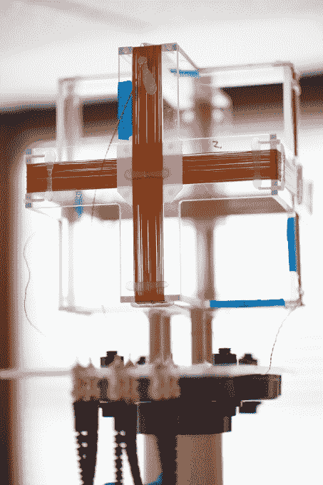

# 美国宇航局技术人员可以在全球定位系统无法到达的地方追踪消防员

> 原文：<https://web.archive.org/web/https://techcrunch.com/2016/12/19/nasa-tech-could-track-firefighters-where-gps-cant-reach/>

在火灾或灾区的混乱环境中，知道你的同事和急救人员在哪里是最重要的，但 GPS 和其他定位跟踪系统并不总是可靠的。美国宇航局喷气推进实验室的一个项目旨在通过一种跟踪器来解决这个问题，这种跟踪器依赖于一种完全不同的电磁现象。

GPS、Wi-Fi、蓝牙等传输方式都是依靠无线电波，无线电波在室内疯狂反弹，无法穿透很多结构。JPL 的 Darmindra Arumugam 和他的团队创建了一个系统，名为[用于应急响应人员的精确室内外导航和跟踪(指针)](https://web.archive.org/web/20221026001924/https://www.nasa.gov/feature/jpl/new-technology-could-help-track-firefighters-for-safety)，它依赖于所谓的准静态场。

磁场，比如你在磁铁或任何电子设备周围发现的磁场，范围有限，因为它们不会像波一样传播，但有些磁场只会受到墙壁等障碍物的轻微影响。在这些磁场中的东西会表现出可预测的效果——例如，当一块金属被放在磁铁的上方和右侧时，它会以某种方式排列，但当被放在下方和左侧时，它会以不同的方式排列。

阿鲁姆甘使用的准静态电磁场(之所以这么叫是因为它们不是完全静止的)实际上是由被跟踪的人身上的设备发出的；外面的接收器会探测到磁场，并能够准确地说出设备的位置，甚至它们面对的方向。这不仅可以帮助跟踪多个紧急救援人员，而且如果他们的发射器突然水平移动或以不安全的方式移动，还可以立即警告其他人。

这些磁场跨度达数百英尺——不足以在战场或海上使用，但足以覆盖办公室或倒塌建筑中的火灾。

 目前这种设备只有背包大小，但还只是原型；Arumugam 设计了该系统和所有重要的跟踪算法，最近以这种形式为国土安全部演示了它，国土安全部帮助支付了开发费用。但是计划是将它缩小到口袋大小，这是技术所不能阻止的。

DHS 的 Greg Price 在展示该技术的视频中说:“目前在第二阶段，发射器大约有鞋盒大小。”。“当我们进入第三阶段时，它将达到你可以放在手掌中的大小——所以开始考虑按钮或其他东西，可能在第一反应者的 PPE[个人防护设备]上。”

这并不是这项技术的唯一应用——正如你对 JPL 项目的期望，在大黑领域也有应用。

阿鲁姆甘在 JPL 的一次新闻发布会上说:“指针可以用于太空机器人学。”。“它可以用于跟踪地下隧道、洞穴或冰下的机器人。它们需要能够自己导航，而我们今天没有能够跟踪它们的传感器。对我们来说，这是一个为 NASA 和非 NASA 用途开发技术的绝佳机会。”

如果你对美国国家航空航天局及其分支机构创造的其他技术感到好奇，这些技术可能正在走向世界，请查看其出版物 [Spinoff](https://web.archive.org/web/20221026001924/https://spinoff.nasa.gov/) ，该出版物跟踪并描述了在商业和科学上取得成功的公司和发明。