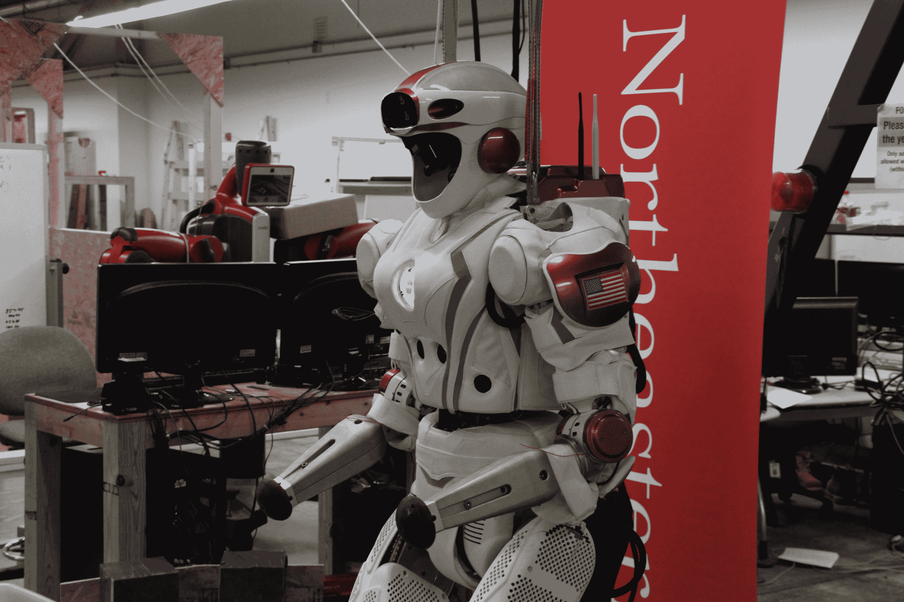

# 在马萨诸塞州的一个仓库里，美国宇航局的瓦尔基里机器人帮助奠定了火星定居的基础

> 原文：<https://web.archive.org/web/https://techcrunch.com/2017/03/18/nasa-valkyrie-robot/>

美国宇航局的瓦尔基里(R5)机器人永远不会摆脱地球的束缚。人形太空机器人注定要和我们一起在陆地上度过余生。但是就像之前的[机器人一样，这个 6 英尺高、290 磅重的机器代表着未来。](https://web.archive.org/web/20230316185555/https://techcrunch.com/2010/02/04/robonauts-are-go/)

她朝着人类殖民火星及更远的目标迈出了第一步，对于一个机器人来说，这是一个美好的梦想，目前它被拴在马萨诸塞州多雪的洛厄尔的一个仓库的天花板上，离波士顿有一个小时的车程。洛厄尔模型是美国宇航局生产的四个单元之一。航天局出于自己的目的保留了一个机器人，并将两个作为研究贷款提供给东北大学和附近的麻省理工学院，而第四个被苏格兰的爱丁堡大学获得。

东北大学在 2015 年获得了这个价值 200 万美元的机器人，当时电气和计算机工程教授 Taskin Padir 写了一份提案，概述了一项帮助美国宇航局测试其[太空机器人挑战赛](https://web.archive.org/web/20230316185555/https://www.nasa.gov/directorates/spacetech/centennial_challenges/space_robotics/index.html)硬件的计划，这是一项公开比赛，旨在帮助瓦尔克里的继任者为建立人类居住的敌对火星地形的重要任务做准备。

“他们已经完成了所有的硬件，我们正在开发这些高水平的能力，所以瓦尔基里不仅仅是移动四肢，”东北大学的博士生墨菲·旺西克说。"她可以自主地做决定，四处走动并完成任务."

总的来说，这对所有相关方来说都是一个非常理想的安排。东北大学和麻省理工学院获得了价值 200 万美元的最先进的太空机器人，美国宇航局将该平台的研究外包给渴望机器人和工程的学生。东北大学将其模型转移到[神经(新英格兰机器人验证和实验)中心](https://web.archive.org/web/20230316185555/http://nerve.uml.edu/)，这是一个由 UMass Lowell 运营的大型仓库，里面有大型障碍跑道，旨在测试测试机器人和无人机。

这是测试瓦尔基里的机载视觉系统和两足运动的理想环境，建立了拥挤和难以导航的表面，以模拟未来一代机器人有望在某一天遇到的太空舱和太空行走。目前，瓦尔基里依附于仓库脚手架——不是因为机器人无法独立站立，而是因为机器人的价格标签禁止团队承担任何不必要的风险。

这是一个苦乐参半的景象。这个亮白色的机器人看起来和人们想象的一模一样，是它的宇航员同胞的电子人翻版。代替它的眼睛的是一个长而黑的护目镜，里面有一个复杂的 3D 视觉系统，在它胸部的中间，一个美国宇航局的图标发出一种颜色来识别它的工作状态。在后面，一个背包装有一个大电池，保持系统运行。

瓦尔基里手，通常像其模块化身体的其余部分一样清晰，在我们访问之前，已经被替换为同等重量的假人版本，送回美国宇航局的约翰逊航天中心进行修复。当它们就位并完全运行时，它们能够操纵周围的环境，希望未来的版本有一天可以进行太空行走并参与其他任务，以使她的人类同行免受伤害。

她离科幻小说中的半机械人机器人还很远，但她仍然是一个令人印象深刻的机器。她的创作者和支持团队显然已经将她人性化，甚至根据一对大型致动器给她分配性别，这使得她的胸板在 NASA 标志的两侧伸出。

虽然关于按照我们自己的形象设计机器人是否明智存在一些持续的争论，但 Wonsick 解释说，当涉及到在空间站这样的环境中操作时，一个 6 英尺高的两足模型非常有意义，因为它是以人类为中心设计的。“开发一个看起来像我们的机器人的想法是，我们为自己建造了这个环境，”她说。“我们在最好的环境中工作，那么为什么长得像我们的机器人不能工作得最好呢？”

然而，她的下一个任务是太空机器人挑战。1 月下旬，比赛范围缩小到 20 支队伍，争夺 100 万美元的奖金。整个夏天，决赛选手将在一个虚拟的挑战场景中竞争，寻找瓦尔基里新登陆的红色星球。

“在不太遥远的未来，R5 已经随着人类任务之前的补给抵达火星，”美国宇航局的媒体材料中写道。“一夜之间，沙尘暴破坏了栖息地和太阳能电池阵列，并导致主要通信天线错位。R5 现在必须修复栖息地的空气泄漏，部署新的太阳能电池板，并调整通信天线。”

可悲的是，这是瓦尔基里有史以来最接近拜访我们的天体邻居的时刻。尽管如此，这仍然是一项重要的工作，即使机器人从未在她目前的仓库之外找到路。