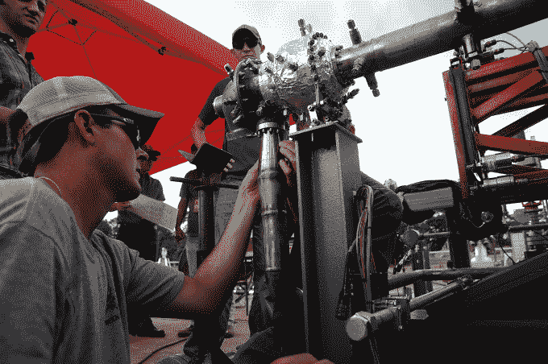
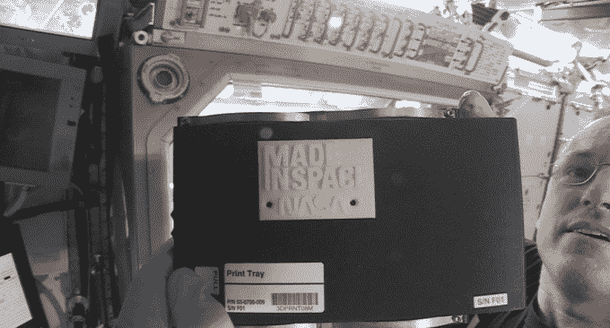

# 美国宇航局的 3D 打印火箭零件实际工作 

> 原文：<https://web.archive.org/web/https://techcrunch.com/2015/08/26/nasas-3d-printed-rocket-parts-actually-work/>

# 美国宇航局的 3D 打印火箭部件实际上可以工作

今天，美国国家航空航天局测试了一台 3D 打印的涡轮泵，这种泵用的零件比用其他方式制造的泵少 45%。这显然节省了时间和金钱，但是拜托…美国国家航空航天局正在缓慢地 3D 打印一整枚怪异的火箭。太酷了。

美国宇航局将火箭涡轮泵称为“有史以来最复杂的 3D 打印火箭发动机部件之一。”它经历了大约 15 次不同的测试，以模拟 35，000 的火箭推力会产生的力和环境。它的涡轮产生 2000 马力，大约是纳斯卡引擎马力的两倍。

我的意思是，这个东西*实际上*工作。我们生活在一个多么美好的世界。

对于美国宇航局来说，3D 打印正在成为其未来太空飞船设计的关键，正如马歇尔推进系统部门副经理玛丽·贝斯·科勒布尔解释的那样:

> 通过测试这种燃料泵和其他用添加剂制造的火箭部件，NASA 旨在降低使用全新工艺制造火箭发动机的风险和成本。

美国宇航局涡轮泵工程师之一尼克·凯斯解释说，这个特殊火箭部件的工作通常需要四年时间，但 3D 打印方法将时间缩短了一半。

看着他们把这东西踢得屁滚尿流:

[https://web.archive.org/web/20221005173631if_/https://www.youtube.com/embed/sVEPP0uHiJ8?feature=oembed](https://web.archive.org/web/20221005173631if_/https://www.youtube.com/embed/sVEPP0uHiJ8?feature=oembed)

视频

我们已经看到一名宇航员在宇宙飞船上使用的 [3D 打印机，但是有一天我们会看到一艘巨大的 3D 打印宇宙飞船里面打印出一个小小的 3D 打印宇宙飞船吗？考虑一下这个问题。](https://web.archive.org/web/20221005173631/https://beta.techcrunch.com/2014/11/25/this-is-the-first-thing-to-be-3d-printed-in-space/)

