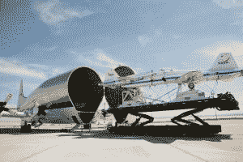
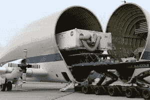
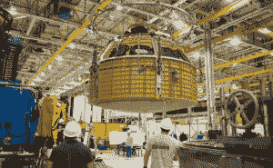

# 美国国家航空航天局的超级孔雀鱼让前往火星的宇宙飞船搭车 

> 原文：<https://web.archive.org/web/https://techcrunch.com/2016/02/01/nasas-super-guppy-gives-mars-bound-spacecraft-a-lift/>

今天，猎户座太空舱，美国国家航空航天局设计用来将人类带到火星的宇宙飞船，在肯尼迪航天中心开始了下一阶段的开发。不可思议的是，就在今天早上，那艘大型宇宙飞船还在美国宇航局位于新奥尔良的米丘德组装厂。

为了将猎户座从新奥尔良运送到卡纳维拉尔角，美国宇航局招募了他们的超级孔雀鱼飞机。超级孔雀鱼的货物区高 25 英尺，宽 25 英尺，长 111 英尺。这架巨型飞机可以运载超过 26 吨的货物，经常被美国宇航局用来在全国范围内运送大型部件，这些部件需要很长时间(或不可能)通过陆路或海路运输。

超级孔雀鱼的历史可以追溯到阿波罗计划。20 世纪 60 年代，它被用来将土星五号火箭的一部分从加利福尼亚运送到佛罗里达。美国国家航空航天局的另一个选择是通过巴拿马运河运送火箭级，这通常需要几周或几个月的时间。

*拥有两架超音速喷气机的超级孔雀鱼/图片由美国宇航局提供*

这架大型飞机还被用于运送美国宇航局的超音速喷气式飞机以及国际空间站的模块。最近，“超级孔雀鱼”被用来在 2013 年将猎户座的隔热板运送到佛罗里达州，这是同类产品中最大的一个。

*超级孔雀鱼中世界上最大的隔热板/图片由美国宇航局提供*

猎户座飞船虽然还没有完成，但已经是珍贵的货物了。这艘载人飞船是美国宇航局将人类送上火星任务的重要组成部分。最终，猎户座将搭载 4 名宇航员，在美国宇航局正在制造的火箭太空发射系统(SLS)上发射。

猎户座的早期版本于 2014 年 12 月进行了首飞。这项被称为探索飞行测试 1 (EFT-1)的任务将猎户座带到了地球表面以上 3600 英里的高度——比国际空间站的轨道远 15 倍以上。

EFT-1 任务测试了载人深空任务所需的基本功能。美国宇航局表示，需要来自 EFT-1 的数据来做出关键的猎户座设计决策，并验证现有的计算机模型。这也是 40 多年来第一个经过低地球轨道的载人太空舱。

https://youtu.be/u-iFUj7Jro4

在米丘德装配厂，工程师们最近完成了构成猎户座主要结构的压力容器。现在猎户座已经到达肯尼迪航天中心，压力容器将接受一系列测试来分析其结构完整性。

*NASA 米丘德装配厂的猎户座压力容器/图片由 NASA 提供*

最终，猎户座将配备必要的系统和子系统。所有这些都完成后，猎户座将进行第二次飞行(也是它在 SLS 上的第一次飞行)，目前计划在 2018 年进行。不幸的是，这是 EFT-1 的 4 年后，它帮助获得了许多公众对猎户座和美国宇航局火星之旅的支持。

公众舆论对任何 NASA 项目都至关重要，尤其是在政府更迭的情况下。发射是抓住公众注意力的一个很好的方式，但是当然重型发射是昂贵的，所以 NASA 必须有选择性。

假设美国宇航局的任务没有延迟或改变，猎户座的第一次载人任务将在 2023 年进行。美国宇航局希望在 2030 年代中期使用猎户座将人类送上火星。