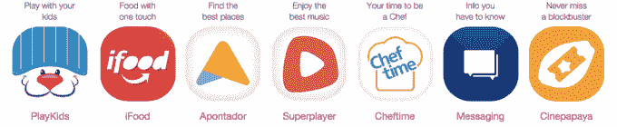

# Naspers 以 4000 万美元收购巴西移动集团 Movile 

> 原文：<https://web.archive.org/web/https://techcrunch.com/2015/04/17/naspers-drops-off-40-million-for-brazilian-mobile-conglomerate-movile/>

按需交付市场在 2015 年前四个月筹集的资金超过了 2014 年全年，最新的受益者是巴西移动应用和内容开发商 Movile。

该公司已经从南非技术投资者和媒体公司 Naspers ( [其其他投资包括全球科技巨头](https://web.archive.org/web/20221207013726/http://www.wsj.com/articles/naspers-offers-tencent-and-changeheard-on-the-street-1417511256)如中国的[腾讯](https://web.archive.org/web/20221207013726/http://tencent.com/en-us/index.shtml)，印度的 [Flipkart](https://web.archive.org/web/20221207013726/http://www.flipkart.com/) ，俄国的 [Mail.ru](https://web.archive.org/web/20221207013726/https://mail.ru/) 和拉丁美洲的 [OLX](https://web.archive.org/web/20221207013726/http://www.olx.com/) )获得了 4000 万美元的承诺。

Movile 最新的 4000 万美元融资使该公司的总承诺达到近 1 亿美元，几乎与全球竞争对手并驾齐驱。根据 CrunchBase 的数据，今年已经有大量资金投入到各种各样的快递公司，今年迄今为止总计达到 12.8 亿美元。

像 [Rocket Internet](https://web.archive.org/web/20221207013726/https://www.rocket-internet.com/) (德国的“创业工厂】)[这样的科技公司已经下了一些最大的赌注](https://web.archive.org/web/20221207013726/https://beta.techcrunch.com/2015/03/11/rocket-internet-ups-stake-in-foodpanda-and-delivery-hero-as-global-online-takeaway-group-gets-fatter/)，但风险投资公司也一直在交付领域大打出手。对 Instacart 等公司的投资表明，投资者认为这是一个可以带来回报的行业，insta cart 在去年年底筹集了 2.1 亿美元，Postmates 刚刚筹集了 3500 万美元。

“我们相信这是一个十亿美元的机会，”Movile 的首席执行官 Fabricio Bloisi 说。“每个人都将开始使用手机在 30 分钟到 1 小时内供应他们想要的东西。”

除了涌入的所有风险资金，Bloisi 还提到了由阿里巴巴、亚马逊和谷歌等最大的技术公司推出的送货服务。

在过去的几年里，Movile 仍然经营着成功的内容分发业务(主要是教育和娱乐应用以及儿童内容)，已经进行了 10 次收购，以增加交付服务。Bloisi 和他的投资者将线上到线下商务的趋势视为商业的未来。

“Movile 专注于本地商业和内容，”他说。“我们从 Naspers 筹集了这轮资金，我们希望在(线上到线下服务)方面的投资翻一番。”

目前，Movile 通过旗下的 iFood 和 Cinepapaya 子公司提供食品和门票配送服务，并通过过去两年的一系列收购提供配送物流和在线评论。在某些方面，它的扩张反映了其德国对手 Rocket Internet 的扩张。

“我们希望从电影扩展到其他垂直领域，我们希望去拉丁美洲，”Bloisi 说。“对我们来说，重要的是我们看到了当地商业的协同作用。一旦我们向用户出售食物，我们也可以出售门票，或者他们也可以购买杂货交付。我们 65%的食品销售是通过手机完成的。

而且，虽然现在的重点是在巴西进行整合，并进入拉丁美洲的其他地区，但 Movile 无疑从全球角度看待他们的战略。

“也许你看到了我们正在世界上进行一场粮食战争，”Bloisi 说。“还有其他球员，包括德国球员，试图在世界上击败我们。”

虽然这些大竞争对手无疑在某些市场制造了障碍，但这是一个大世界，Movile 的投资者认为仍有机会。

这是一个全球性的机会，我们会非常仔细地考虑我们的发展方向。Innova Capital 的合伙人维罗妮卡塞拉(Veronica Serra)表示:“当我们关注这些机会时，我们会看到哪些东西值得购买，哪些东西值得在内部发展。总的来说，你看的是大小和规模，以及市场上渗透最少的东西。这是一个敏感的话题，因为我们不想因为竞争而引起人们对我们的关注。