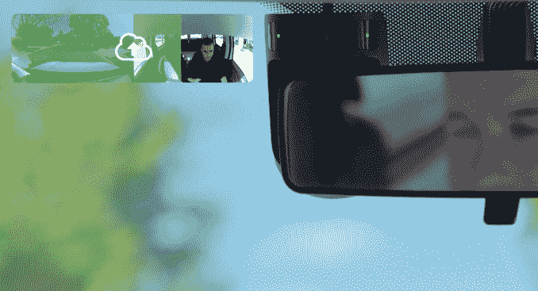

# Nauto 会在司机分心时实时通知他们 

> 原文：<https://web.archive.org/web/https://techcrunch.com/2018/06/05/nauto-will-notify-drivers-when-theyre-distracted-in-real-time/>

Nauto 是一家运输公司，旨在让人类司机更安全，并为所有类型的场景培训自动驾驶汽车，该公司刚刚推出了 Prevent。Nauto Prevent 旨在通过通知司机他们的眼睛离开道路太长时间来防止分心驾驶。

Nauto Prevent 的通知取决于多种因素，如你的眼睛离开道路多长时间，以及你开车的速度有多快。如果你已经分心超过五秒钟，并以每小时 60 英里的速度行驶，你会听到语音通知。但如果你继续走神，你会听到警报声。

Nauto 首席执行官斯特凡·赫克(Stefan Heck)告诉 TechCrunch 说:“我们设计了整个事情，真正专注于在不打扰的情况下保证司机的安全。”“我们希望帮助人类司机，而不仅仅是向老板告发他们。”

这项功能是在 Nauto 的旗舰产品之上，帮助公司更好地培训他们的商业司机。Nauto 的核心产品是一个双向摄像头，位于后视镜附近，用于监控驾驶员行为和路况。Nauto 利用计算机视觉和人工智能，为司机提供关于注意力分散和疲劳的见解和指导。有了 Prevent，如果司机分心、尾随或路上有其他潜在风险，他们现在会收到通知。

这个想法不仅仅是在司机做违法的事情时提醒他们，而是在存在实际风险时通知他们。

赫克说:“拿着手机或看着手机会让你容易被开罚单。”"但是如果你在红灯前停下来，风险就很低."

Nauto 的标价为 499 美元，每月定价为 39.95 美元，这取决于客户和市场。Nauto 目前没有透露 Prevent 的成本，也没有透露它有多少客户。Heck 告诉我的是，Nauto 在全国范围内拥有各种出租车、拼车、租赁、包裹递送和企业服务车队。

Nauto 正在推出 Prevent，希望在该行业实现自治之前，减少道路上的碰撞、事故和伤害。但一旦 autonomous 正式到来，Nauto 将准备好向公司提供其驾驶数据和真实世界的场景，即无人驾驶汽车可以从分心的司机那里期待什么，例如，闯红灯。Nauto 偶然发现的另一个用例涉及自动安全驾驶员，并帮助公司确保其驾驶员注意。

迄今为止，Nauto 已经从通用汽车风险投资公司、丰田 AI 风险投资公司和宝马 I Ventures 公司筹集了 1.739 亿美元。它最近的一轮融资发生在去年 7 月，当时它从软银和 Greylock 获得了 1.59 亿美元的 B 轮融资。