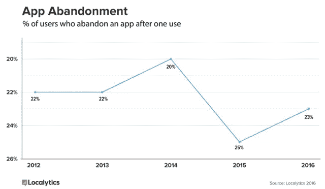
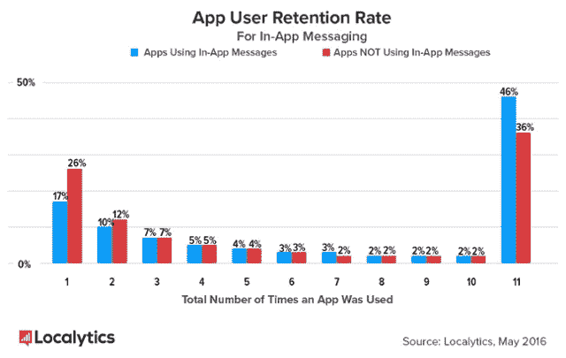

# 近四分之一的人在使用一次后就放弃了移动应用

> 原文：<https://web.archive.org/web/https://techcrunch.com/2016/05/31/nearly-1-in-4-people-abandon-mobile-apps-after-only-one-use/>

苹果的 iTunes 应用商店有超过 150 万个应用程序，Google Play 有超过 200 万个应用程序，但消费者设备上实际安装和使用的应用程序数量仍然很少。我们已经知道，人们[只定期与少数第三方应用](https://web.archive.org/web/20230311051818/https://techcrunch.com/2015/06/22/consumers-spend-85-of-time-on-smartphones-in-apps-but-only-5-apps-see-heavy-use/)互动，现在，根据[一项关于移动应用使用的新研究](https://web.archive.org/web/20230311051818/http://info.localytics.com/blog/23-of-users-abandon-an-app-after-one-use)，我们了解到大约四分之一的移动用户只使用一个应用一次。

根据分析公司 Localytics 的数据及其 37，000 个应用程序的用户群，用户留存率同比略有上升，从 2015 年的 34%上升到 2016 年的 38%。

然而，仅仅因为这一数字有所恢复，并不意味着这些数字是好的。相反，这表明 62%的用户使用一款应用的次数少于 11 次。

报告称，“这不是一个可持续的商业模式。”

如今，23%的人只运行一次应用程序——比去年有所改善，但只是略有改善。相比之下，2014 年只有 20%的用户放弃了应用。

在 iOS 上，用户留存率略有改善。仅打开应用程序的比例从去年的 26%下降到 24%，而返回应用程序 11 次或更多的比例从 2015 年的 32%上升到 36%。

[gallery ids="1329850，1329849，1329848"]

该报告还指出，尤其是处于增长中期的应用程序(每月活跃用户在 1.5 万至 5 万之间)，其保留率和放弃率上升幅度最大。这归因于这些应用程序对推送通知、应用内消息、电子邮件和评论的使用。虽然推送通知一直被认为是留住用户的一种方式，但应用内消息也有显著的影响——研究发现，这些消息将用户留存率提高了 46%。

17%的人只会在看到应用内消息时使用一次应用，但那些不使用消息的人会看到 26%的用户在一次会话后放弃应用。

虽然看到了一些小的改进，但总体数据令人不安，因为这对今天的应用程序开发人员意味着什么。此前还有一系列关于应用经济陷阱的报道，从[详述顶级应用开发商](https://web.archive.org/web/20230311051818/http://www.theverge.com/2016/3/2/11140928/app-store-economy-apple-android-pixite-bankruptcy)Pixite 去年收入下降三分之一的传奇故事，[到更详细地分析应用经济崩溃的原因，](https://web.archive.org/web/20230311051818/https://medium.com/swlh/mobile-app-developers-are-suffering-a5636c57d576#.9zq57hns9)列举了发现、磁盘空间不足、安装过程等问题。

就连投资者也在回避应用公司。正如 Union Square Ventures 的 Fred Wilson [在去年年底](https://web.archive.org/web/20230311051818/http://avc.com/2015/11/the-mobile-downturn-continued/)所写的那样，“建立面向消费者的移动公司并不容易。投资它们也不容易。”

好消息是——如果有的话——应用程序的问题引发了关于应用程序应该如何工作的新想法。

例如，谷歌正在考虑彻底改革整个安装过程，本月早些时候在 T2 的 I/O 活动上宣布推出“即时应用”。即时应用不再要求用户寻找、下载和安装应用，而是允许用户几乎立即启动应用，只需点击一个 URL。

但鉴于谷歌只是智能手机生态系统双头垄断的一半，苹果也需要考虑新的方法，否则就有可能失去开发者为其平台开发的兴趣。(到目前为止，它已经通过为开发者发布[新指南和操作指南](https://web.archive.org/web/20230311051818/https://techcrunch.com/2016/04/18/apple-rolls-out-a-new-app-store-developer-site-with-guides-and-videos-for-growing-app-businesses-2/)，以及在[欧洲](https://web.archive.org/web/20230311051818/https://techcrunch.com/2016/01/20/ios-app-development-center-italy-europe-naples/)和[印度](https://web.archive.org/web/20230311051818/https://techcrunch.com/2016/05/17/apple-is-opening-an-app-design-and-development-accelerator-in-india/)推出应用开发中心来解决这个问题。)

有一些早期的迹象表明，应用程序的低迷可能已经产生了一些影响—[现在发布的另一份新报告表明](https://web.archive.org/web/20230311051818/http://www.businessinsider.com/developers-have-cooled-on-apple-watch-2016-5)开发者对为 Apple Watch 或 tvOS 编写应用程序并不感兴趣，指出每 1000 个 iOS 应用程序中，就有 10 个 tvOS 应用程序和 1 个 Watch 应用程序发布。

当然，这些数字也分别与手表和苹果电视平台的覆盖范围有关。但早些时候的应用商店淘金热已经不复存在，因为从应用中赚钱变得更加困难，而且获取忠实用户的成本从 2014 年的 1.50 美元到 2.25 美元增长到去年的 2.50 美元，有时甚至高达 4.00 美元。