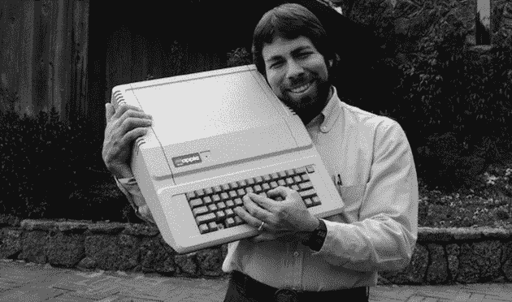

# 近 40 年后，史蒂夫·沃兹尼亚克仍在绞尽脑汁想办法让 Apple II 变得更好

> 原文：<https://web.archive.org/web/https://techcrunch.com/2014/11/04/nearly-40-years-later-steve-wozniak-still-brainstorms-ways-the-apple-ii-could-have-been-better/>

# 将近 40 年后，史蒂夫·沃兹尼亚克仍然在绞尽脑汁想办法让 Apple II 变得更好

Apple II 可能是个人电脑历史上最重要的系统之一，但这并不意味着它是完美的。将近 40 年后，史蒂夫·沃兹尼亚克仍然是 T2，他想出了一些本可以做得更好的方法。

这一细节来自沃兹和一位忠实的苹果一代复制专家迈克·w·T4 之间的一点交流

Mike(他拥有几乎可以肯定是世界上最详细的剩余 Apple I 系统注册表)注意到了 Apple I 设计中的一个小缺陷:电源的一个怪癖偶尔会使系统的内存“不可靠”所以他做了唯一合理的事情:他给沃兹发了邮件。

事实证明，沃兹不知道 Apple I 有这样的问题；当 I 快要出货的时候，苹果正在展示苹果 II，沃兹的注意力集中在那台机器上。

沃兹写道:

> 不过，如果我们苹果公司在销售大约 150 台 Apple I 时就意识到了这样一个问题，我们可以而且会很容易很快地纠正它。但是在大产品之前，我们没有对一个暂时的产品进行充分的测试。我们确实试图回购每一台苹果 I，以换取苹果 II。
> 
> 我们比任何人都幸运，事情进展顺利，足以满足我们的需求，完成我们的工作。

也许更有趣的是，沃兹仍然会在半夜醒来，想着他几十年前的设计本可以做得更好。在 Apple II 上:

> 今年的一个晚上，我在厄瓜多尔的基多醒来，想到了一个从 Apple II 中节省一两个芯片的方法，以及一个让 Apple II 的两种灰色不同(浅灰色和深灰色)的简单方法，但这已经晚了 38 年。它确实给了我一个很好的微笑，因为我知道改进这个设计有多难。

如果你想知道沃兹所说的“两种灰色”是什么意思，Apple II 可以显示 16 种不同的颜色。这 16 种颜色中有两种是不同深浅的灰色，至少在软件层面上是这样。但由于原始设计的限制，两种色调在实际展示时无法区分。一些 Apple II 模拟器会将它们显示为不同的颜色。

你可以在这里阅读沃兹的完整回复[。](https://web.archive.org/web/20230224131651/http://www.willegal.net/blog/?p=6023)