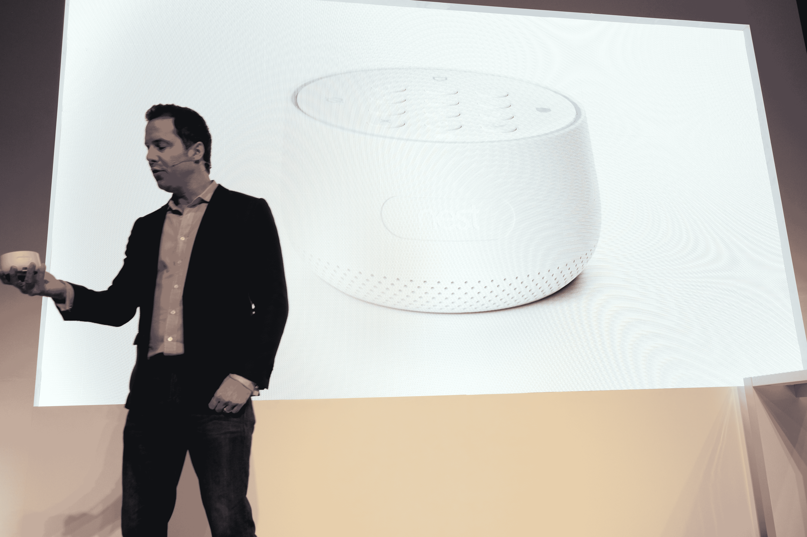

# Nest 发布售价 499 美元的 Nest Secure，这是其新的警报系统 

> 原文：<https://web.archive.org/web/https://techcrunch.com/2017/09/20/nest-announces-the-499-nest-secure-its-new-alarm-system/>

Nest 今天宣布了一系列新的安全产品，旨在保护您的家庭安全，防止窃贼和其他人进入。除了新的 Nest Cam IQ Outdoor，该公司还推出了新的全功能安全系统 Nest Secure。

该系统由三种硬件产品组成，这些产品也可以与该公司的摄像头集成:Nest Guard，带有备用电池和运动传感器的报警系统的中枢，以及 Nest Detect，一种检查门窗是否被打开的传感器。像竞争系统一样，这款警卫配备了警报器和备用手机(每月 5 美元)，以防你的 WiFi 出现故障。防护装置顶部还有一个标准键盘，用于启动系统。

还有 Nest 标签，这是一种 NFC 芯片，可以用来根据需要打开和关闭闹钟(或者，你当然也可以使用手机来实现这一功能)。这些芯片是为你的家庭成员或偶尔来访的客人准备的，你可以对它们进行编程，让它们只在特定的时间或一周中的特定时间和日期工作。你通过警卫的内置 NFC 阅读器把标签和中央系统连接起来。

与类似的系统一样，您可以在设置中添加多个 Nest 检测，以保护各种入口通道和窗口。Nest Detect 具有两年的电池寿命，磁力计，光传感器，加速度计，运动传感器和磁性开门检测。这里有一个很棒的特性，你可以按下 Nest Detect 上的一个按钮来关闭它。

[gallery ids="1545019，1545022，1545016"]

就像所有的 Nest 产品一样，我们不只是在谈论硬件，还包括一个全面的软件套件，它可以连接到 Nest 移动应用程序，在任何时候发生奇怪的事情时向你发出警报。如果出了事，你可以直接从 app 报警，但除此之外，你还可以添加 24/7 专业监控。不过，Nest 本身并没有这么做。它正在与莫尼合作，莫尼在这个行业有多年的经验。

同样值得注意的是，Nest 正在与第三方供应商及其智能锁合作。

带有一个巢守卫，两个巢检测和两个标签的巢安全启动包将花费 499 美元。单个巢检测将是 59 美元，标签是 25 美元。还会有 598 美元的 Nest Cam 户外套装。该系统将于 11 月在美国上市，2018 年初在欧洲和加拿大上市。

【T2