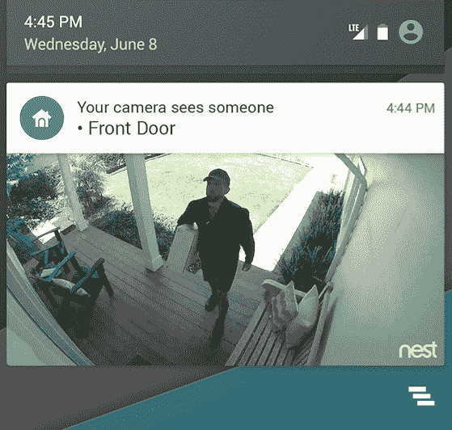
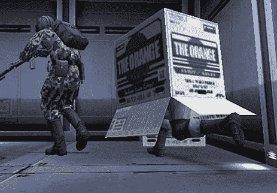

# 嵌套摄像头现在可以尝试检测在你房子周围移动的东西是否是人 

> 原文：<https://web.archive.org/web/https://techcrunch.com/2016/07/14/nest-cams-can-now-try-to-detect-if-that-thing-moving-around-your-house-is-a-person/>

# 嵌套摄像头现在可以尝试检测在你房子周围移动的东西是否是一个人

“客厅有动静！”你巢穴摄像头的通知上写着

哦不！！！！有人闯入吗？有人在偷你的金子吗？！

没有。这是你的 Roomba。或者你的狗。或者一只虫子飞过镜头。

最终，你要么把你的巢凸轮移动到一个运动较少的地方，禁用通知，或者只是对运动警报视而不见。

Nest 正试图通过引入一项新功能来解决这个问题，他们称之为“个人提醒”。当它检测到帧中的运动时，Nest 将开始在云中运行各种复杂的计算机视觉算法，试图确定所述运动是否是人的运动。一旦它认为它看到了一个人，它会给你发送通知。一旦*确定*是一个人，它就会给你发送另一个。

Nest 的个人提醒目前并不试图识别*谁*是一个人——只是它实际上是一个人。它将作为一个“人”事件记录在你的 Nest 应用程序的历史记录中，让你可以快速筛选相机拍摄的所有狗狗散步的片段。

取决于你有多注重隐私，这可能是事情开始变得有趣的地方。Nest 盲目地将你的视频储存在云中是一回事，它对所述视频实际包含的内容漠不关心。寻找基本运动是一件稍微不同的事情——在这一点上，你只是检查帧与帧之间的差异。从那里，就像 Nest 不久前所做的那样，你开始试图从驶过的汽车的眩光中过滤掉误报之类的东西……现在它正在分析视频中看起来像人的运动。

Nest 告诉我可以禁用个人提醒，但目前还不清楚这是否会阻止相关的计算机视觉算法针对视频运行/训练，或者它是否会停止发送通知。我已经要求更多的细节。

更新 : Nest 告诉我可以禁用通知，但算法会继续运行。

每一步都感觉比上一步有点困难，我不确定“太远”的标记在哪里。也许大多数担心类似事情的人一开始就不会使用基于云的视频安全系统。

新的人物提醒将于今年秋天开始推出——由于所有计算机视觉的东西都发生在云中，它应该可以与所有现有的嵌套摄像头和 Dropcams 一起工作

新算法大概没有检测到:超级狡猾的固体蛇。

