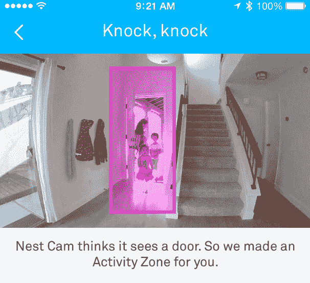

# 嵌套摄像头现在知道门是什么样子，并且可以自动监控它们 

> 原文：<https://web.archive.org/web/https://techcrunch.com/2017/02/14/nest-cams-now-know-what-a-door-looks-like-and-can-monitor-them-automatically/>

# 嵌套摄像头现在知道门是什么样子，并且可以自动监控它们

Nest 今天早上发布了一个新版本的 Nest 应用程序，它有一些新的技巧。

最值得注意的是，他们正在酝酿更多的计算机视觉智能。通过这次更新，Nest Aware(该公司的付费服务，每月 10 美元起，让你录制镜头，而不只是直播)将试图自动检测其视野内的门，并建议这些区域为“活动区”，可以有特殊的通知，如“你的客厅门口有动静”，而不是“你的客厅有动静”。

当然，你已经能够创建活动区域很多年了——这只是处理了一个更受欢迎的用例，这应该会导致更多的人(所有那些从来没有抽出时间自己画一个小盒子和/或忘记他们可以)实际使用它。

Nest Aware 在去年 7 月获得了第一个计算机视觉能力[，当时它学会了识别在你房间里移动的那个东西(可能)是不是人，并相应地通知你。](https://web.archive.org/web/20221224191209/https://techcrunch.com/2016/07/14/nest-cams-can-now-try-to-detect-if-that-thing-moving-around-your-house-is-a-person/)

同时，此次更新还带来了其他一些新功能:

*   当 Nest Aware 检测到运动时，iOS 10 和 Android 7 应用程序现在将接收动画预览通知，而不是静止(通常很小)的缩略图。
*   7.1 (Nougat)上的 Android 用户现在可以使用应用程序快捷方式直接从主屏幕跳转到应用程序的特定部分，允许你通过更少的点击跳转到特定相机的视图。
*   如果你有一个 Nest Protect 警报器，它能探测到烟雾，它会自动显示你所有 Nest 摄像头的视频