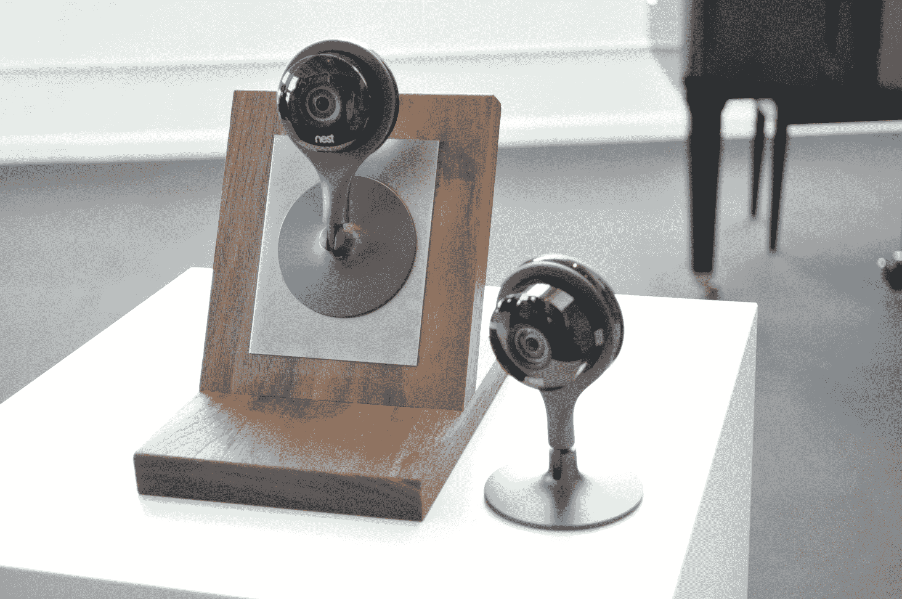
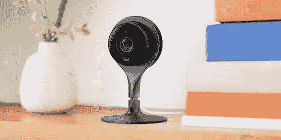
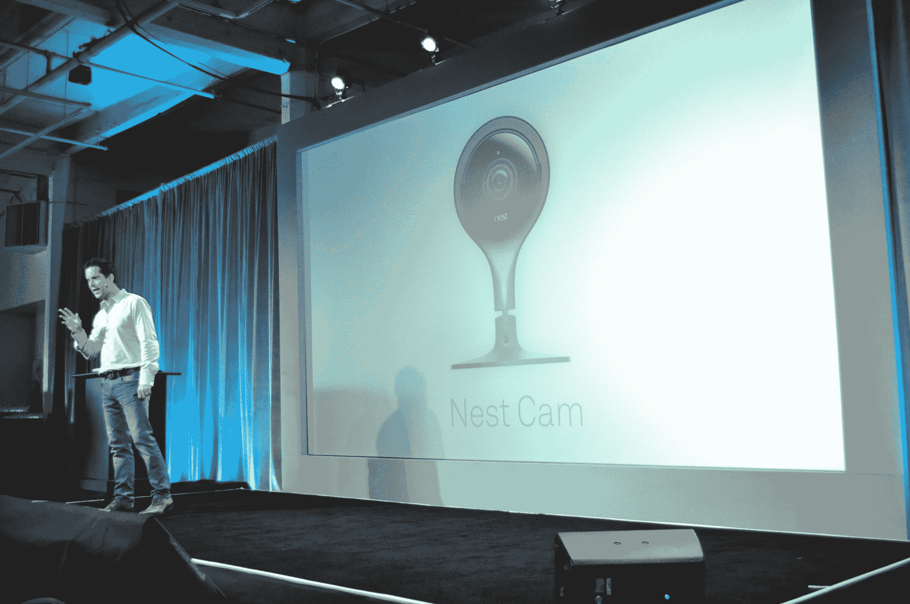

# Nest 推出一款相机:认识 Nest Cam 

> 原文：<https://web.archive.org/web/https://techcrunch.com/2015/06/17/nest-launches-a-camera-meet-the-nest-cam/>

# Nest 推出一款相机:认识一下 Nest Cam

还记得 [Nest 收购 Dropcam](https://web.archive.org/web/20230326125755/https://techcrunch.com/2014/06/20/google-and-nest-acquire-dropcam-for-555-million/) 的时候吗？这一购买的最初成果今天终于落下了:Nest 刚刚发布了 Nest Cam，一个类似于 Dropcam 的安全解决方案。

乍一看，Nest Cam 看起来像我们都已经知道的 Dropcam。乍一看…它…看起来还是像一个 Dropcam。它更加纤薄，曲线更加弯曲，但基本思想是一样的:一个超级简单、即插即用的 WiFi 安全摄像头。

但是里面是什么？

**这是我们目前所知的:**

*   1080p 视频(上次 Dropcam 是 720p)
*   它有一个内置三脚架
*   它的底座带有磁性，可以安装在冰箱上
*   8 个内置红外 led 用于夜视。
*   像 Dropcam 一样，Nest Cam 使用基于云的 DVR 来存储视频。唉，也像 Dropcam 一样，听起来(到目前为止)这是录制视频的唯一选择——这意味着如果你想录制和存储视频(而不仅仅是流媒体),除了设备成本外，你每年还要支付 100-300 美元。10 天的视频存档每月花费 10 美元；30 天的存档每月花费 30 美元
*   如果你愿意，你可以在家里混合使用 Nests Cams 和老式 Dropcams。它们都将出现在为 iOS 和 Android 新设计的 Nest 应用程序中。

Nest Cam 将于下周上市，售价 199 美元。

