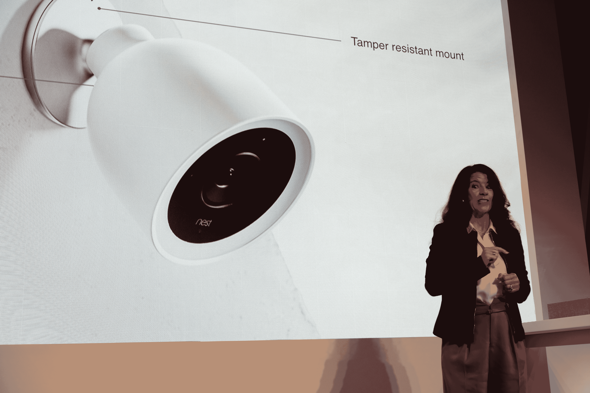

# Nest 推出新的 349 美元智能户外安全摄像机 

> 原文：<https://web.archive.org/web/https://techcrunch.com/2017/09/20/nest-launches-a-new-349-smart-outdoor-security-camera/>

# Nest 推出新的 349 美元智能户外安全摄像机

[Nest](https://web.archive.org/web/20221207155821/https://nest.com/) 今日公布了其今日最新相机:Nest Cam IQ outdoor。这款新的户外相机将该公司智能室内相机的功能带到了更坚固的户外版本。

正如 Nest 安全产品总经理 Michele Turner 今天在旧金山的一次活动中指出的那样，窃贼破门而入的首要方式就是打开一扇没锁的门。但是阻止他们的最重要的东西是一个安全摄像头。为了找到这一点，该公司实际上引入了职业窃贼，并与他们谈论他们的“工作”经历。

【T2

据该公司称，Nest Cam IQ Outdoor 是“当今市场上最强大的户外安全摄像机”像它的室内相机一样，这种加固和防风雨的版本也具有 Nest 的智能功能。例如，它会告诉你什么时候有人在你的车道上，或者你的家人什么时候回家。当然，通过内置扬声器，IQ Outdoor 可以让你直接与车道上的人交谈。

为了确保窃贼不能关掉它，摄像机直接插入你的电源和一个防篡改支架——尽管这可能也意味着安装它对大多数房主来说会有点麻烦。

这款相机售价 349 美元，目前已在美国和加拿大接受预订。它将于今年晚些时候开始在美国、加拿大和欧洲上市。

 