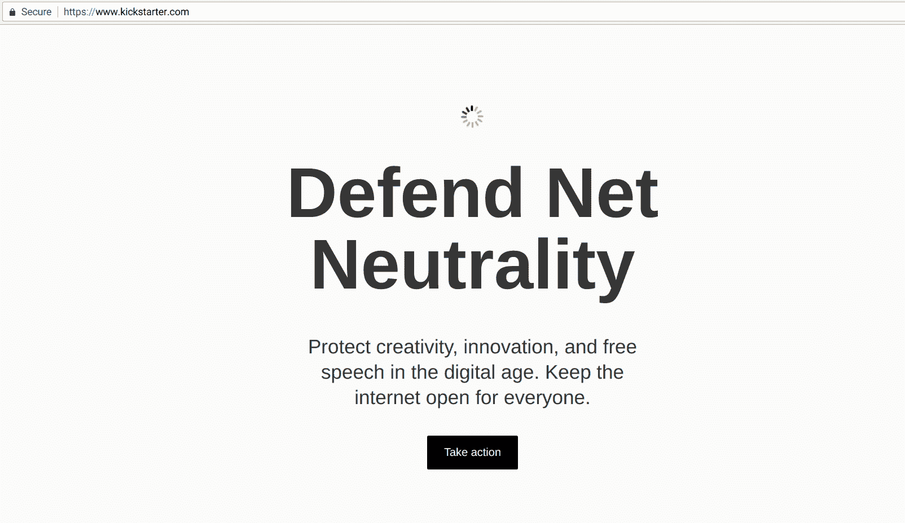

# 网络中立行动日激励数百万人为网络自由大声疾呼 

> 原文：<https://web.archive.org/web/https://techcrunch.com/2017/07/13/net-neutrality-day-of-action-spurs-millions-to-speak-out-for-online-freedoms/>

# 网络中立行动日激励数百万人为网络自由大声疾呼

昨天是被大肆宣传的“网络中立行动日”，这是一个在线抗议日，成千上万的网站、个人和服务呼吁关注 FCC 即将撤销的网络中立规则。事实证明，出席人数令人印象深刻。

昨天使用网络很难不遇到至少几个弹出窗口、网站接管和有趣的信息，所有这些都旨在让人们在网络中立辩论中发出自己的声音。

Tumblr、Twitter、网飞、Yelp、Kickstarter、Mozilla、Vimeo、Spotify、Airbnb、亚马逊、Reddit、Etsy、YouTube、Twitch 还有很多很多更多的人参与其中；我们把一些有趣的[收集到一个画廊里。](https://web.archive.org/web/20221210053554/https://beta.techcrunch.com/gallery/heres-what-a-bunch-of-companies-are-doing-for-the-net-neutrality-day-of-action/)

 广泛的曝光度和便捷的反馈机制(一些网站让你通过按键呼叫你的代表，其他网站代表你向 FCC 提交评论)使得[产生了大量的反应](https://web.archive.org/web/20221210053554/http://imgur.com/a/vYVet)。

根据需求进度，行动日的特色是:

*   向 FCC 提交 200 万条[意见](https://web.archive.org/web/20221210053554/https://beta.techcrunch.com/2017/04/27/how-to-comment-on-the-fccs-proposal-to-revoke-net-neutrality/)(将在未来几天提交，以免服务器不堪重负；[而且这次不方便下去](https://web.archive.org/web/20221210053554/https://beta.techcrunch.com/2017/07/10/wyden-schatz-letter-to-pai-net-neutrality-day-of-action/)
*   给国会的 500 万封电子邮件(同样间隔)
*   给代表打了 124，000 个电话
*   抗议者亲自参观了 20 个国会办公室，还采取了其他行动
*   数十位知名人士和政治家就这一问题发表了看法

当然，这场战斗远未获胜，正如 FCC 代表所说，该委员会不是一个民主国家，其成员没有义务满足公众的需求——无论这种需求有多强烈。

昨天是对我们已经实施的强有力的网络中立规则的强烈支持。如果你想了解更多关于它们存在的原因和反对它们的理由，请查看 TechCrunch 最近关于这个主题的一些文章: