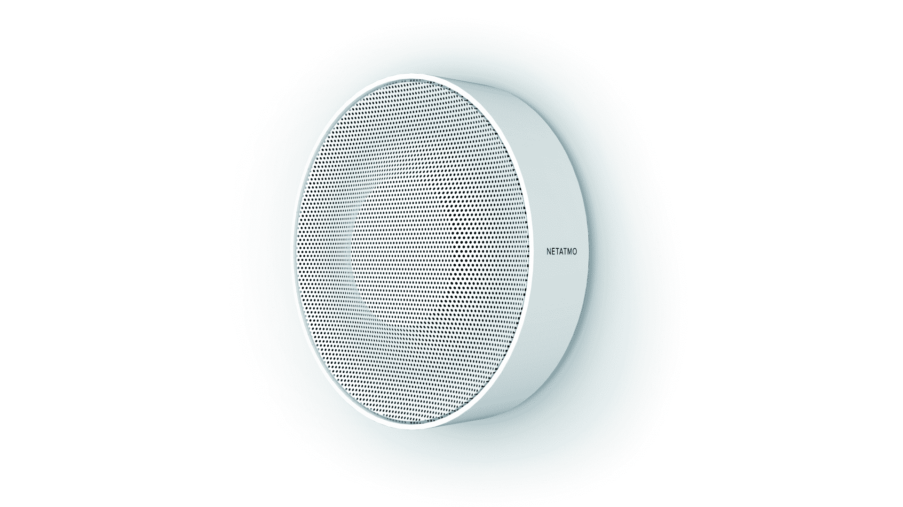

# Netatmo 正在努力实现智能家居 

> 原文：<https://web.archive.org/web/https://techcrunch.com/2017/01/03/netatmo-is-trying-really-hard-to-make-the-smart-home-happen/>

法国硬件公司 Netatmo 宣布了一系列面向家庭的新产品。有趣的是，其中一些产品超越了通常的连接灯泡和相机。凭借全新的方法和广泛的产品，Netatmo 正在缓慢但肯定地成为智能家居最突出的倡导者之一。让我们看看他们有什么。

首先，该公司将发布两款新的安全产品。除了[室内摄像机](https://web.archive.org/web/20221207204946/https://www.netatmo.com/product/security/welcome)、[室外摄像机](https://web.archive.org/web/20221207204946/https://beta.techcrunch.com/2016/10/17/become-that-nosy-neighbor-you-always-wanted-to-be-with-the-netatmo-presence/)和[门标签](https://web.archive.org/web/20221207204946/https://www.netatmo.com/product/security/welcome/tags)之外，Netatmo 还增加了一个连接的烟雾报警器和一个安全警报器，您可以将其与您的 Netatmo 欢迎摄像机配对。

烟雾报警器符合规定，比你一般的烟雾报警器要智能一点。它连接到您的无线网络，向您的手机发送警报。它可以与苹果 HomeKit 和 IFTTT 配合使用。更有趣的是，Netatmo 非常节省地使用电池，所以你可以在长达 10 年的时间里不用它。鉴于当局建议你每 10 年更换一次烟雾探测器，这是一个很好的功能。

安全警报器很简单。它使用蓝牙低能量与您的 Netatmo 欢迎摄像头进行通信，如果有陌生人，它会发出响亮的警报。你可以把它放在天花板上，这样就很难够到了。

其次，Netatmo 正在与知名品牌合作开发更具雄心的设备。“我们的战略是互联家庭。但有一些相关的功能我们不能卖给消费者，因为那些产品是直接卖给专业人士的，”Netatmo 创始人兼首席执行官弗雷德·波特告诉我。

这就是为什么该公司与现有品牌合作，连接你家中的一切。两个首批合伙人是 Velux 和 Legrand。

就开关和插座而言，罗格朗是世界的领导者。配有 Netatmo 开关和电源插座的新型 Céliane 将由 Legrand 销售，它将使您的电气安装更加智能。例如，你可以在门边安装一个无线总开关，这样你就可以关掉所有的灯，启动安全摄像头等等。这将使用亚马逊 Alexa、Siri 或 IFTTT 控制设备变得更加容易，因为你不需要所有电器的智能版本。

至于 Velux，该公司与 Netatmo 合作，推出了带有一系列传感器的联网窗口。如果天气变暖，窗户可以关上百叶窗。如果你刚洗完澡，窗户会自动打开。如果这是一个温暖的夏夜，外面实际上更冷，窗户会打开。我不确定具体原因，但我发现这个联网窗口比 95%的智能家居设备有趣得多。

所有设备将于 2017 年下半年发货，价格未披露。我仍然不完全相信智能家居会是一场革命。但如果发生这种情况，Netatmo 处于有利位置。

