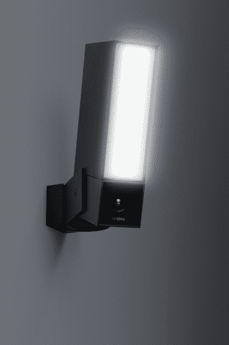

# Netatmo 让户外安全摄像头不那么恶心 

> 原文：<https://web.archive.org/web/https://techcrunch.com/2016/01/04/netatmo-makes-outdoor-security-cameras-suck-less/>

# Netatmo 让户外安全摄像头不那么烂

Netatmo 刚刚宣布了 Netatmo 的存在，这是一款新的智能户外安全摄像机，具有实际有用的功能。特别是，这个摄像头可以检测到你的车道上是否有车，是否有人在外面等着，或者是否有宠物在你的花园里跑来跑去。

摄像头连接到您的 Wi-Fi 网络，以便在您的手机上向您发送推送通知，这样您就可以看到您家门口正在发生的视频流。如果外面有一个人、一辆车或一只动物，它就会显示在你的通知屏幕上。

它的正上方还有一盏白色的大灯，兼作车道灯。如果你已经有一个户外灯，你可以用 Netatmo 来代替它。但是如果你想关掉强光，现场摄像机也可以拍摄红外视频。

一切都是可定制的。例如，当有人在你家门前时，你可以关闭通知并继续录制视频。它可以录制 1080p 视频，并将其存储在内置的 micro SD 卡中。没有订阅费，你的视频也不会出现在公司的服务器上。

虽然这款摄像机有许多潜在的使用案例，但它首先是一款安全摄像机。这也是一个很好的方法来知道送货人什么时候在你门前留下了一个包裹。或者你可以监控什么时候有人来打扫你的房子。当然，当你举办聚会时，如果声音大到听不到你的门铃，这也是一种宝贵的财富。

该产品将于 2016 年第三季度上市，价格未披露。该公司正在缓慢但稳步地为你的家庭打造一整套联网设备，从恒温器到气象站和室内摄像机。让我们看看 Netatmo 如何在未来让这些设备协同工作。

