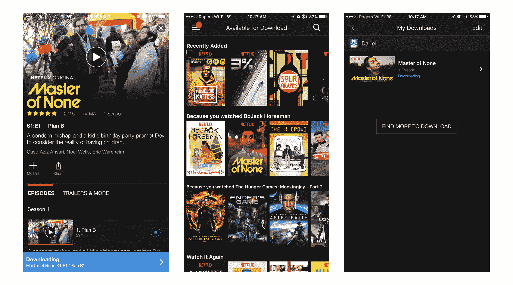

# 网飞增加了智能手机和平板电脑的离线观看功能

> 原文：<https://web.archive.org/web/https://techcrunch.com/2016/11/30/netflix-adds-offline-viewing-for-smartphones-and-tablets/>

# 网飞增加了智能手机和平板电脑的离线观看功能

网飞终于实现了用户从一开始就一直要求的东西；离线播放。流媒体公司[宣布](https://web.archive.org/web/20230225175652/https://media.netflix.com/en/company-blog/downloads-make-it-even-easier-to-watch-netflix-on-the-go)从周三开始，用户可以下载精选的网飞内容，在没有数据连接的时候使用。

网飞为精选的电影和电视节目增加了一个“下载”按钮，并计划在未来增加更多的可用标题。鉴于所涉及的更简单的许可安排，网飞可以理解地从其原创内容开始，该功能的发布名单包括*橙色是新的黑色*、*缉毒警察*和*皇冠*可通过下载离线播放。

对更新后的应用程序的快速调查显示，许多内容，无论是原创还是第一方的，都可以离线查看。这将因地区而异，但应该有足够的东西让你开始你的通勤或长途飞行。您还可以从两种不同的质量选项中进行选择，具体取决于您是要优先考虑视频质量还是设备存储空间。

该功能在 Android 和 iOS 智能手机和平板电脑上可用，前提是它们运行的是 iOS 8.0 或 Android 4.4.2 或更高版本。

[YouTube https://www.youtube.com/watch?v=H8L3mvXgHcw&w=680&h=383]