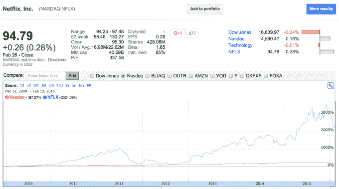

# 网飞和全球单一文化的产生

> 原文：<https://web.archive.org/web/https://techcrunch.com/2016/03/12/netflix-and-the-creation-of-global-monoculture/>

斯潘塞耶戈撰稿人

More posts by this contributor

[网飞](https://web.archive.org/web/20230316044218/https://www.netflix.com/)是一家不可思议的公司。

如果你在 2008 年大衰退最严重的时候投资了这家企业，并一直持有到今天，你的股份将是最初投资的 20 倍以上(这是公开市场上出现的值得风险投资的回报)。在此期间，该公司的表现超过纳斯达克整体 12 倍以上。令人震惊。

但是，尽管他们的财务表现惊人，但同样令人印象深刻的是他们产品执行的大胆和一致性。

成就包括:(1)引导他们从最初革命性的模拟 DVD 租赁业务过渡到数字订阅(还记得 Qwikster ？);(2)打破设备和平台孤岛，作为首批真正的 web 服务之一提供其内容；(3)首创了*质量*“原创内容”的概念，提升了消费者满意度、粘性、防御性和更强的长期运营利润；(4)推动消费者对流式视频保真度的期望…

虽然它的目录经常仍然缺少你正在寻找的特定电影，但该公司显然已经将自己确立为持续娱乐的源泉和那些寻求舒适后仰体验的人的合作伙伴(7500 万人！).

因此，当网飞在一月份的 CES上宣布其计划在一夜之间扩展到另外 130 个国家时，你可能会认为全世界的人都在街头庆祝。

然而，NPR 最近的一个故事叫做 *“网飞冷吗？肯尼亚当局威胁禁止流媒体网站"* 让我从不同的角度看待这家公司。这篇文章描述了肯尼亚消费者和当地娱乐业的反应。

一方面，当地消费者显得欣喜若狂。多年来，他们一直在寻找聪明的方法来挖掘网飞风格内容的“糖碗”。但该网站在国内的正式推出消除了访问的麻烦，让当地人感觉像是全球媒体社区对话的参与者。

iROKO 演员搜索

另一方面，那些参与制作本地内容的创意过程的人——比如演员、导演和制片人——则表示反对。他们担心网飞的内容、资本、技术和产品是如此强大，以至于他们在当地无法竞争国内消费者的兴趣。因此，本土的故事和情感将难以生存。

双方都有道理。

娱乐是美国最大的全球出口之一。也许这是因为我们是一个移民国家，所以最大程度上是相关的。也许它源于我们讲述的故事中的某种渴望。但不管原因是什么，网飞显然是一个至关重要的新基础设施，为我们的人才和商店的迁移铺平了道路。

在某种程度上，本地企业是全球讲故事的经济次优机制，尽管转型可能会很痛苦，但我支持网飞促进的市场效率。如果本地创意人员可以与网飞合作开发和分发他们的内容，而且成本更低、效率更高，那就太好了。

然而，我担心，第一个在网飞平台上获得成功的本地内容将是非本地内容，它们会吸引人们的想象力和注意力。

这些是现有的节目，如《毒枭》、《纸牌屋》，橙色是新的黑色。虽然这可能是网飞利润最大化的战略，但随着它继续向原创内容投入数十亿美元，我非常希望该公司能够深入到它所接触的当地国家和文化，以展示他们自己的故事。

虽然互联网把我们联系在一起，把我们团结在一起，但它也有可能助长一种帝国主义和单一文化。

在网飞之外，随着脸书、Twitter 甚至 Medium 等公司继续走向全球，它们应该努力保持独特的地方风味，让世界成为一个真正有趣的探索之地。

*免责声明:以上评论和观点是我个人的，不打算被解释为投资建议。*