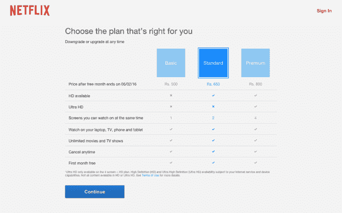

# 网飞在 130 个新国家推出，包括印度，但不包括中国 

> 原文：<https://web.archive.org/web/https://techcrunch.com/2016/01/06/netflix-finally-goes-global/>

# 网飞在 130 个新国家上市，包括印度，但不包括中国

美国电影流媒体巨头网飞刚刚放下锤子，在 130 个新国家开设了服务，包括印度和俄国——但关键是不包括中国。这些新市场将号称拥有 7000 万消费者的网飞带到了全球 190 多个国家。

[在 2016 年国际消费电子展上，该公司宣布了期待已久的进军印度的消息。嗯，它做到了，然后一些。此举出人意料，因为网飞近年来一直在慢慢扩大其覆盖范围，](https://web.archive.org/web/20230202204838/https://media.netflix.com/en/press-releases/netflix-is-now-available-around-the-world)[于 2015 年](https://web.archive.org/web/20230202204838/https://techcrunch.com/2015/03/23/netflix-australia-new-zealand/)首次进军亚太地区。

现在，它刚刚在世界上一些最大的国家开放了服务——包括印度、俄罗斯和印度尼西亚——就这样，实现了它之前宣传的积极的全球扩张计划。

去年有很多关于该公司是否会进入中国的猜测。据报道，网飞正在与阿里巴巴就潜在的合作关系进行谈判，但在阿里巴巴在中国推出自己的基于订阅的流媒体服务后，这种联盟似乎不太可能。尽管如此，网飞首席执行官雷德·哈斯汀斯表示，该公司希望在未来进入中国，根据 [Variety 的博客直播](https://web.archive.org/web/20230202204838/http://variety.com/2016/digital/news/netflix-ceo-reed-hastings-keynote-speech-at-ces-live-blog-1201672930/)该公司在 CES 上的新闻发布会。

如果你好奇的话，也有一些例外。网飞“由于美国政府对美国公司的限制，也不会出现在克里米亚、朝鲜和叙利亚，”该公司在官方声明中证实。

网飞在新市场的定价似乎与其美国成本一致。例如，在印度，基本的非高清单用户套餐起价为每月 500 印度卢比(约 7.49 美元)。网飞标准(高清和两个屏幕)和高级(超高清和四个并发屏幕)每月分别为 650 印度卢比(9.75 美元)和 800 印度卢比(11.99 美元)。

> 印度的网飞定价

我们仍在检查，但目前新市场的客户似乎只能通过信用卡和借记卡进行支付。看到网飞与移动运营商合作，向数亿没有信用卡，但可以通过运营商账单或其他支付方式支付的人开放其服务，这是完全合乎逻辑的。(这是一个已经由亚洲竞争对手运行的系统，如 iFlix(它正在筹集 1 . 5 亿美元来资助自己雄心勃勃的全球计划)和 HOOQ。)

